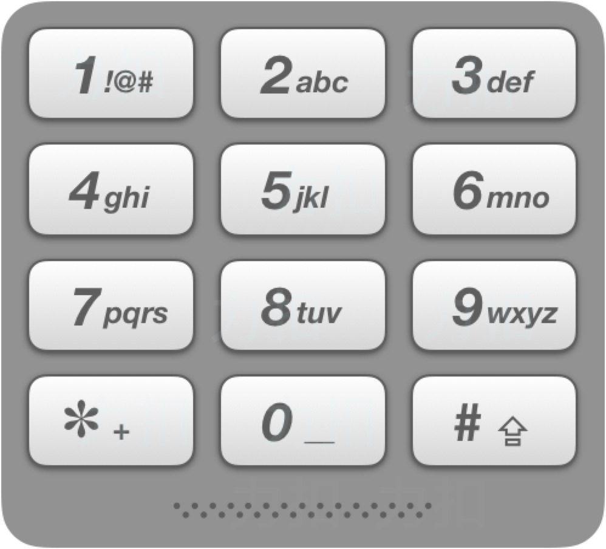

### 题目信息
给定一个仅包含数字2-9的字符串，返回所有它能表示的字母组合。

给出数字到字母的映射如下（与电话按键相同）。注意 1 不对应任何字母。

示例:

输入："23"
输出：["ad", "ae", "af", "bd", "be", "bf", "cd", "ce", "cf"].

### 解题方法
~~~java
class Solution {
    // 定义2-9对应的字母
    private Map<Character, String> map = new HashMap<Character, String>(){
        {
            put('2', "abc");
            put('3', "def");
            put('4', "ghi");
            put('5', "jkl");
            put('6', "mno");
            put('7', "pqrs");
            put('8', "tuv");
            put('9', "wxyz");
        }
    };

    public List<String> letterCombinations(String digits) {
        // 定义存放返回数据的集合
        List<String> res = new ArrayList();
        // 如果传入数据为null或空，返回空集合
        if(digits == null || digits.equals("")){
            return res;
        }
        // 递归调用
        dfs(digits, 0, new StringBuilder(), res);
        return res;
    }
    
    /**
     * digits 前台传递过来的字符串
     * index  定义当前循环到第几个字符的步长
     * str    返回结果的字符串，因为需要不停的拼接，所以用StringBuilder
     * res    存放返回结果的list
     **/
    public void dfs(String digits, int index, StringBuilder str, List<String> res){
        // 如果当前的步长等于前台传递的字符长度，则代表循环结束，保存到返回结果的list中
        if(index == digits.length()){
            res.add(str.toString()); 
        }else{
            // 取出当前步长的数字对应的字母，转换成char类型的数组
            char [] chatArray = map.get(digits.charAt(index)).toCharArray();
            // 遍历数组
            for(char c : chatArray){
                // 递归，拼接后面的数字对应的字符
                dfs(digits, index + 1, str.append(c), res);
                // 因为StringBuilder拼接了上一个字符，故需要截取掉
                str.deleteCharAt(str.length() - 1);
            }
        }
    }
}
~~~ 