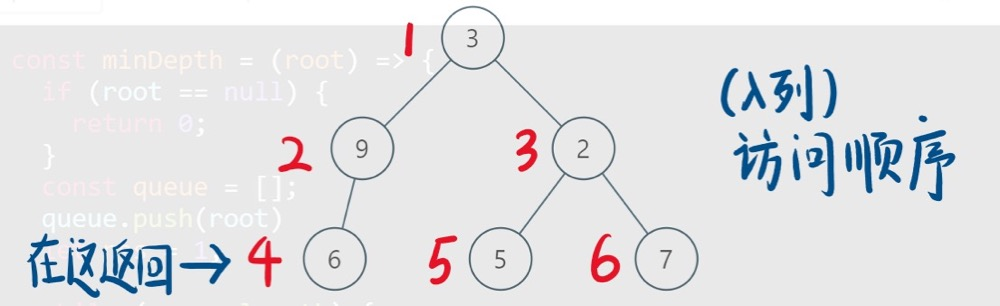
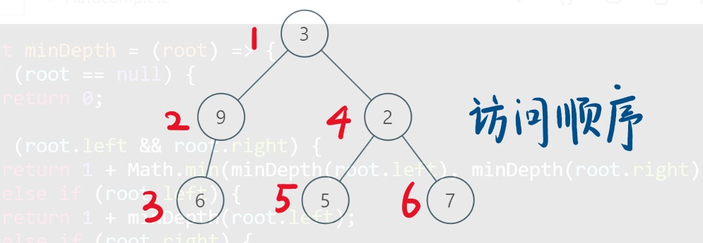

## 题目信息：
给定一个二叉树，找出其最小深度。

最小深度是从根节点到最近叶子节点的最短路径上的节点数量。

说明: 叶子节点是指没有子节点的节点。

示例:

给定二叉树 [3,9,20,null,null,15,7],
~~~
    3
   / \
  9  20
    /  \
   15   7
~~~
返回它的最小深度  2.

## 解题思路
#### 广度优先搜索
求树的最小深度，典型的广度优先搜索，找到第一个叶子节点，返回步长即可。

 

##### 代码实现
~~~java
/**
 * Definition for a binary tree node.
 * public class TreeNode {
 *     int val;
 *     TreeNode left;
 *     TreeNode right;
 *     TreeNode(int x) { val = x; }
 * }
 */
class Solution {
    public int minDepth(TreeNode root) {
    	// 如果为null，返回0
        if(root == null){
            return 0;
        }
        int result = 1;
        // 定义一个队列，保存同一高度树的节点
        Queue<TreeNode> q = new LinkedList<>();
        // 将根结点放入队列中
        q.offer(root);
        // 如果队列不为空，则一直循环下去
        while(!q.isEmpty()){
        	// 队列中数据的数量，表示同一级有多少个节点
            int size = q.size();
            // 循环队列中的数据，将同一高度的节点在一次while循环内消耗完
            for(int i = 0; i < size; i ++){
            	// 取出队列数据
                TreeNode t = q.poll();
                // 如果左右节点均为null，则该节点为叶子节点，最小深度出现，返回结果
                if(t.left == null && t.right == null){
                    return result;
                }
                // 如果左节点不为null，放入队列中
                if(t.left != null){
                    q.offer(t.left);
                }
                // 如果右节点不为null，放入队列中
                if(t.right != null){
                    q.offer(t.right);
                }
            }
            // 循环完当前深度所有的节点，没有找到需要的结果，深度+1
            result ++;
        }
        return result;
    }
}
~~~

##### 复杂度分析
* 时间复杂度：O(N)，其中 N 是树的节点数。对每个节点访问一次。

* 空间复杂度：O(N)，其中 N 是树的节点数。空间复杂度主要取决于队列的开销，队列中的元素个数不会超过树的节点数。

#### 深度优先搜索
本题除了使用广度优先搜索外，也可以使用深度优先搜素，遍历整棵树，记录最小深度。

 
##### 代码实现
~~~java
/**
 * Definition for a binary tree node.
 * public class TreeNode {
 *     int val;
 *     TreeNode left;
 *     TreeNode right;
 *     TreeNode(int x) { val = x; }
 * }
 */
class Solution {
    public int minDepth(TreeNode root) {
        // 如果当前节点为null，则返回0
        if(root == null){
            return 0;
        }
        // 如果当前节点左节点和右节点均为null，返回1
        if (root.left == null && root.right == null) {
            return 1;
        }
        // 定义int最大值，与当前深度比较，取最小值
        int result = Integer.MAX_VALUE;
        // 如果当前左节点不为null，递归判断其子节点
        if (root.left != null) {
            // 取最小的深度
            result = Math.min(minDepth(root.left), result);
        }

        // 如果当前右节点不为null，递归判断其子节点
        if (root.right != null) {
            // 取最小的深度
            result = Math.min(minDepth(root.right), result);
        }
        // 返回结果，结果为深度+1
        return result + 1;
    }
}
~~~
##### 复杂度分析
* 时间复杂度：O(N)，其中 N 是树的节点数。对每个节点访问一次。

* 空间复杂度：O(H)，其中 H 是树的高度。空间复杂度主要取决于递归时栈空间的开销，最坏情况下，树呈现链状，空间复杂度为 O(N)。平均情况下树的高度与节点数的对数正相关，空间复杂度为 O(logN)。