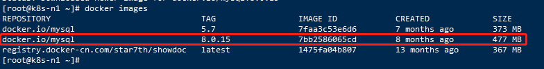
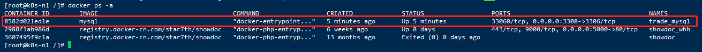
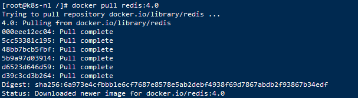
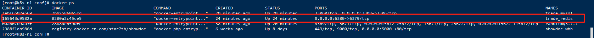
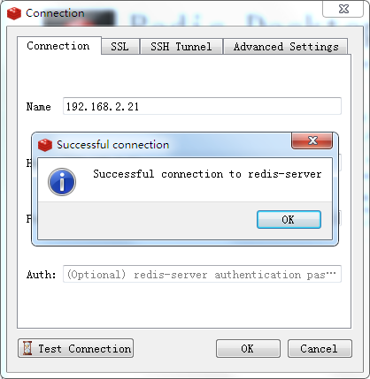
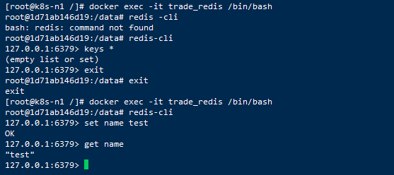
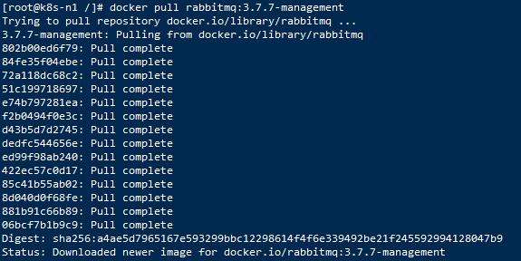
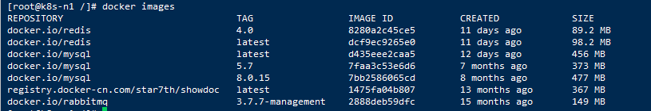
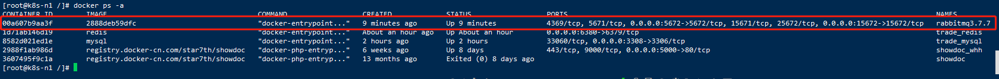
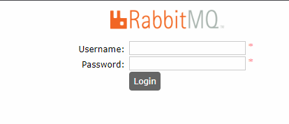

## Docker相关操作

### Docker 卸载

~~~
sudo apt-get remove docker docker-engine docker.io containerd runc
~~~

### Docker安装

#### 1、Docker 要求 
CentOS 系统的内核版本高于 3.10 ，先验证你的CentOS 版本是否支持 Docker 。
~~~
[root@k8s-n1 ~]# uname -r
3.10.0-693.el7.x86_64
~~~

#### 2、安装docker
~~~
yum -y install docker
~~~

#### 3、启动docker
~~~
systemctl start docker.service
~~~

#### 4、设置docker开机启动
~~~
systemctl enable docker.service
~~~

### Docker阿里云镜像加速
~~~
sudo mkdir -p /etc/docker
~~~

~~~
sudo tee /etc/docker/daemon.json <<-'EOF'
{
  "registry-mirrors": ["https://89d885cf.mirror.aliyuncs.com"]
}
EOF
~~~

~~~
sudo systemctl daemon-reload
sudo systemctl restart docker
~~~

## Docker安装相关软件

### Docker安装Mysql

#### 1、下载mysql镜像
~~~
下载最新版本：docker pull mysql
下载指定版本：docker pull mysql:8.0.15
~~~

~~~
[root@k8s-n1 ~]# docker pull mysql:8.0.15
~~~
如下图： 

#### 2、查看下载的mysql镜像
~~~
[root@k8s-n1 ~]# docker images
~~~
如下图： 

#### 3、创建目录
~~~
[root@k8s-n1 /]# mkdir -p /data/mysql/data /data/mysql/logs /data/mysql/conf
~~~

#### 4、启动docker里面的mysql镜像
~~~
[root@k8s-n1 /]# docker run  -p 3306:3306 --name mysql_8 -v /data/mysql/conf:/etc/mysql/conf.d -v /data/mysql/logs:/logs -v /data/mysql/data:/var/lib/mysql -e MYSQL_ROOT_PASSWORD=123456 -d 7bb2586065cd
~~~

忽略大小写：--lower_case_table_names=1，如果之前重启过，及得要把/data/mysql/data数据清除（一定要先备份，不然数据会丢失）
自动重启：--restart=always

参数说明： 
-v 挂载宿主机目录和 docker容器中的目录 
-d 后台运行 
-p 映射容器端口号和宿主机端口号 
-e 环境参数 
7bb2586065cd 镜像id（ IMAGE ID ）

查看容器启动情况
~~~
docker ps
~~~

如果mysql启动没有成功，查看mysql启动日志
~~~
[root@k8s-n1 mysql/]#  docker logs -f mysql_8
ERROR: mysqld failed while attempting to check config
command was: "mysqld --verbose --help"
mysqld: Can't read dir of '/etc/mysql/conf.d/' (OS errno 13 - Permission denied)
mysqld: [ERROR] Fatal error in defaults handling. Program aborted!
~~~
如果出现上图错误：   
~~~
[root@k8s-n1 /]# docker run --privileged=true -p 3306:3306 --name mysql_8 -v /data/mysql/conf:/etc/mysql/conf.d -v /data/mysql/logs:/logs -v /data/mysql/data:/var/lib/mysql -e MYSQL_ROOT_PASSWORD=123456 -d 7bb2586065cd
~~~
添加 **--privileged=true** 增加权限命令，启动成功。

此时启动已完成，在docker启动镜像时密码加密使用的是caching_sha2_password，
在服务器端启动默认使用mysql_native_password 加密的，
如需要使用外部工具连接，需要进入docker容器重置root密码。
详细操作如下：

#### 5、进入docker容器修改Mysql
~~~
[root@k8s-n1 mysql]# docker exec -it mysql_8 /bin/sh

# vim /var  

mysql> ALTER USER 'root'@'%' IDENTIFIED WITH mysql_native_password BY 'test001';
~~~

#### 6、安装成功
~~~
[root@k8s-n1 /]# docker ps
~~~
查看docker容器： 

Navicat连接： 

### docker安装Redis

#### 1、使用docker查看Redis版本信息
~~~
[root@k8s-n1 /]# docker search redis
~~~

#### 2、下载redis镜像
~~~
[root@k8s-n1 /]# docker pull redis:4.0
~~~
如下图： 

#### 3、查看下载镜像的镜像id
~~~
[root@k8s-n1 /]# docker images
~~~

#### 4、启动docker里的redis镜像
~~~
[root@k8s-n1 /]# docker run -itd --name redis_test -p 6379:6379 191c4017dcdd
~~~

参数说明： 
-p 6380:6379：映射容器服务的 6379 端口到宿主机的 6380 端口。外部可以直接通过宿主机ip:6380 访问到 Redis 的服务。 
8280a2c45ce5 镜像id（ IMAGE ID ）

如果启动redis后面需要加参数 使用以下命令：
~~~
[root@k8s-n1 /]# docker run -itd --name redis4.0 -p 6379:6379 191c4017dcdd redis-server --bind 0.0.0.0 --requirepass test001 --protected-mode no --daemonize no --appendonly yes
~~~

docker run -d --name trade_test -p 8997:8997 -it --network msnetwork --network-alias mstrade 
redis-server后面的代表使用以下参数配置，支持映射配置文件 
redis-server --bind 0.0.0.0 --protected-mode no --daemonize no --appendonly yes

使用映射的配置文件
~~~
[root@k8s-n1 /]# docker run -itd --name redis_test -p 6379:6379 -v /data/redis/redis.conf:/etc/redis/redis.conf 8280a2c45ce5 redis-server /etc/redis/redis.conf --appendonly yes
~~~
* -v 挂载外部文件/data/redis/redis.conf 到 /etc/redis/redis.conf
* redis-server /etc/redis/redis.conf 启动时使用能够该配置文件

#### 5、安装成功
~~~
[root@k8s-n1 /]# docker ps
~~~
* 查看docker容器： 

* RedisDesktopManager连接： 

#### 6、测试Redis
* 进入docker容器测试
~~~
$ docker exec -it redis_test /bin/bash

root@1d71ab146d19:/data# redis-cli

127.0.0.1:6379> set name test
OK
127.0.0.1:6379> get name
"test"
127.0.0.1:6379> 
~~~
* 容器内部测试： 

### docker下安装RabbitMQ

#### 1、docker拉取RabbitMQ镜像 
~~~
[root@k8s-n1 /]# docker pull rabbitmq:3.7.7-management
~~~
如下图： 

#### 2、创建挂载目录
~~~
[root@k8s-n1 /]# mkdir /mnt/rabbitMQ/data
~~~

#### 3、查看下载镜像的镜像id
~~~
[root@k8s-n1 /]# docker images
~~~

#### 4、启动docker里的RabbitMQ镜像
~~~
[root@k8s-n1 /]# docker run -d --name rabbitmq3.7.7 -p 5672:5672 -p 15672:15672 -v /mnt/rabbitMQ/data:/var/lib/rabbitmq --hostname myRabbit -e RABBITMQ_DEFAULT_VHOST=my_vhost  -e RABBITMQ_DEFAULT_USER=admin -e RABBITMQ_DEFAULT_PASS=admin 2888deb59dfc
~~~

参数说明： 
-d 后台运行容器； 
--name 指定容器名； 
-p 指定服务运行的端口（5672：应用访问端口；15672：控制台Web端口号）； 
-v 映射目录或文件； 
--hostname  主机名（RabbitMQ的一个重要注意事项是它根据所谓的 “节点名称” 存储数据，默认为主机名）； 
-e 指定环境变量；（RABBITMQ_DEFAULT_VHOST：默认虚拟机名；RABBITMQ_DEFAULT_USER：默认的用户名；RABBITMQ_DEFAULT_PASS：默认用户名的密码）

#### 5、启动成功
~~~
[root@k8s-n1 /]# docker ps
~~~
* 查看docker容器： 

* 浏览器访问 
用浏览器访问``http://192.168.2.21:15672`` 访问成功，表示RabbitMQ安装成功。

### docker下安装nginx
1、docker拉取nginx镜像

docker pull nginx:版本号, 拉取指定版本nginx或docker pull nginx,拉取最新版本 

2、目录、端口映射

目录映射： /data/deploy_honsupply_web/html:/usr/share/nginx/html

端口映射：8000:80

* 注 前端打包文件放在/data/deploy_honsupply_web/html目录下

3、启动nginx

只挂载html目录

~~~
docker run -d -p 80:80 -p 443:443 -v /data/maple/web:/usr/share/nginx/html --name nginx8998 --restart always f6d0b4767a6c
~~~

挂载html和conf配置

~~~
docker run -d -p 8998:80 -v /data/web:/usr/share/nginx/html -v /data/nginx/conf/nginx.conf:/etc/nginx/nginx.conf -v /data/nginx/conf.d:/etc/nginx/conf.d --name nginx8998 --restart always f6d0b4767a6c
~~~

挂载html和conf配置，且同时放开80端口和443端口

~~~
docker run -d -p 80:80 -p 443:443 -v /data/maple/web:/usr/share/nginx/html -v /data/maple/nginx.conf:/etc/nginx/nginx.conf -v /data/maple/conf.d:/etc/nginx/conf.d -v /data/maple/ssl:/etc/nginx/ssl --name nginx --restart always f0b8a9a54136
~~~
### SpringBoot项目打包成docker镜像

#### 创建Dockerfile文件，内容如下：

~~~
FROM openjdk:8-jdk-alpine
VOLUME /temp
EXPOSE 9001
ADD logistics-quote-1.0.0.jar logistics-quote.jar
ENTRYPOINT ["java","-jar","/logistics-quote.jar"]
~~~

#### 打成docker镜像

将jar包和Dockerfile放在服务器的统一目录下，执行命令：

~~~
docker build -t quote:1.0.0 .
~~~

执行docker images 可以查看到生成的镜像

#### docker 启动镜像

~~~
docker run -d --privileged=true --name maple-admin -p 6666:6666 d197d922b37c
~~~

docker run -d --privileged=true --name trade_test -p 9002:9001 imageId

docker run -d --name trade_test -p 8997:8997 -it --network ms-network --network-alias mstrade 

## 常见问题

### Docker容器内部无法访问宿主机网络(No Route to host)

* 关闭防火墙(局域网内推荐)
~~~
# centos 7
systemctl stop firewalld
~~~

* 在防火墙上开放指定端口
~~~
# 添加端口
firewall-cmd --zone=public --add-port=7001/tcp --permanent
firewall-cmd --reload
~~~

### 修改docker已启动的程序开机自启动
~~~
docker update mysql8.0 --restart=always
~~~

### Docker启动报错 : iptables failed

#### 错误信息
Error response from daemon: driver failed programming external connectivity on endpoint gloomy_kirch : iptables failed: iptables --wait -t nat -A DOCKER -p tcp -d 0/0 --dport 32810 -j DNAT --to-destination 172.17.0.2:80 ! -i docker0: iptables: No chain/target/match by that name.

#### 原因分析

在Docker Daemon服务启动之后, 修改了防火墙配置(修改/关闭等), 此时启动Docker容器会造成防火墙网络配置有问题。

#### 解决方案
~~~
# 先重启防火墙
systemctl restart firewalld
# 再重启Docker 服务
systemctl restart docker
~~~

### Docker挂载的目录, 在容器内无读写权限(Permission denied)

#### 环境&现象
CentOS 7.4 环境, 启动Docker时volume容器和宿主机的挂载目录, 但是在容器内部无权限对此目录进行操作

~~~
# 错误现象
ls: cannot open directory '.': Permission denied
~~~

#### 解决办法

* 关闭CentOS7中安全模块selinux
~~~
# 临时关闭selinux
setenforce 0

# 永久关闭selinux : SELINUX=disabled , 重启机器生效
vi /etc/selinux/config
~~~

* 运行容器时, 给容器增加特权
~~~
docker run -i -t -v /soft:/soft --privileged=true 637fe9ea94f0 /bin/bash
~~~

### docker删除
~~~
# 停止容器运行
docker stop containsId

# 删除容器
docker rm containsId

# 删除镜像
docker rmi imagesId
~~~

### 查看docker容器的内部ip
~~~
docker exec -it f3fa4a28609a /bin/bash

cat /etc/hosts
~~~

### 下载docker镜像里面的文件
~~~
docker cp [OPTIONS] CONTAINER:SRC_PATH DEST_PATH
~~~
[OPTIONS]:保持源目标中的链接，例：
~~~
docker cp ecef8319d2c8:/root/test.txt /root/
~~~

该命令的意思是将容器id为ecef8319d2c8的家目录（root）文件夹下的文件test.txt拷贝到当前操作系统（Linux）家目录（root）下。如果是win系统的话请替换为win下的合法路径（例如：D:/test.txt）。

### 上传文件到docker镜像里面
~~~
docker cp [OPTIONS] SRC_PATH|- CONTAINER:DEST_PATH
~~~
[OPTIONS]:保持源目标中的链接，例：
~~~
docker cp /root/test.txt ecef8319d2c8:/root/
~~~

docker cp /data/maple/default.conf 0d3d47824280:/etc/nginx/conf.d/

该命令的意思是将当前操作系统（Linux）家目录（root）下的文件test.txt拷贝到容器id为ecef8319d2c8的家目录（root）文件夹下。如果是win系统的话请替换为win下的合法路径（例如：D:/test.txt）。

### 将docker操作授权给普通用户
~~~
# 创建docker组
groupadd docker

# 将test1用户加入docker组
gpasswd -a test1 docker

# 更新用户组
newgrp docker
~~~

重启docker服务，然后使用test1用户就可以操作docker了

