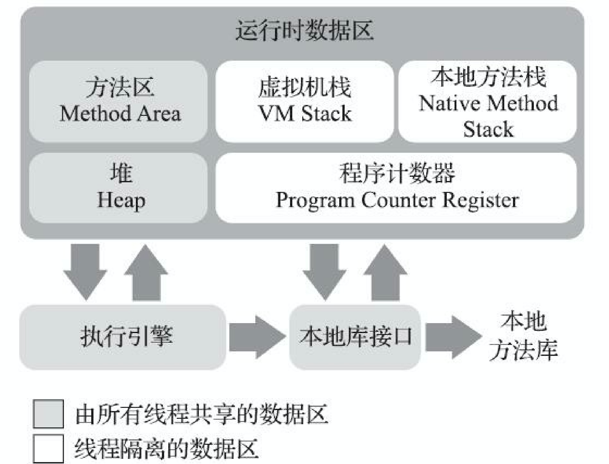

# 深入理解JAVA虚拟机（第三版）

## 自动内存管理

### JAVA内存区域与内存溢出异常

#### 运行时数据区域
   JAVA虚拟机在执行的JAVA程序的时候，会把它所管理的内存划分为若干个不同的区域。
这些区域有各自的用途，以及创建和销毁的时间，有的会随着虚拟机的启动一直存在，有的会随着用户线程的启动和结束而创建和销毁。
JAVA虚拟机包含的具体区域如下图所示：

 

##### 程序计数器
程序计数器是一块较小的的空间，他可以看作为程序所执行字节码的行号指示器。每个线程都有一个独立程序计数器，因此我们称这块区域为"线程私有"。

##### Java虚拟机栈
 
Java虚拟机栈也属于线程私有的，线程创建时创建，用于存储局部变量、操作数栈、动态连接、方法出口等数据。每一个方法的调用直至调用完毕，对应着一个入栈到出栈的过程。

局部变量表存放了编译器可预知的基本数据类型、引用类型、returnAddress类型。

##### 本地方法栈
与Java虚拟机栈类似，Java虚拟机栈是为虚拟机执行java方法（字节码）服务，本地方法栈是为虚拟机使用本地方法（Native）服务。

##### Java堆
Java堆虚拟机管理的最大的一块内存，是线程共享的一块区域，在虚拟机启动时创建。此内存主要目的就是存放对象实例，Java中几乎所有的对象实例都是堆上分配，随着逃逸分析技术的日益成熟，也有部分对象在栈上分配或标量替换。

Java堆的大小可以根据参数进行调整（-Xmx，-Xms），如果堆内存使用完毕，会抛出OutOfMemoryError异常。

##### 方法区
方法区是线程共享的一块区域，用于存储被虚拟机加载的类型信息、常量、静态变量、即时编译器编译产生的缓存数据等信息。

##### 运行时常量池
运行时常量池是方法区的一部。Class文件除了有累的版本信息、字段、方法、接口、等描述信息，还有一项信息时运行时常量池表，用于存放编译期生成的各种字面量与符号引用，这一部分信息是类加载后存放到方法区的运行时常量池的。

#### HotSpot虚拟机对象探秘

##### 对象创建
* 指针碰撞：在内存空间规整的，所有使用的内存放在一边，未使用的放在另一边，中间放一个指针指示内存是否使用，分配内存的时候，只是将指针
* 空闲列表
* TLA

