# MapleAdmin搭建

项目环境：
* JDK 8
* Mysql 8.0
* Redis 3.3
* SpringBoot 2.1.0.RELEASE
* mybatis-plus 3.1.0
* Maven 3.6.3
* node.js 10.14.1
* npm 6.5.0
* Vue 2.0
* IntelliJ IDEA 2018.3

## 1 搭建SpringBoot基础框架
前置依赖：
1. 装有java开发环境
2. 装有maven环境

### 1.1 创建SpringBoot项目
首先打开IDEA, 创建一个最基础的SpringBoot项目，详细步骤如下：

 (1) 选择File->New->Project...，如下图：
 

 (2) 选择Spring Initializr，选择对应的JDK 1.8的版本，默认地址Default(https://start.spring.io/)创建
 
 
 当然我们也可以直接在网页上创建，打开https://start.spring.io/网址对应的信息如下：
 
 
 (3) 填写项目对应的信息
 * Group：Maven坐标-项目组织唯一标识符
 * Artifact：Maven坐标-项目唯一标识符
 * Type：这里使用Maven管理项目
 * Language：语言选择Java
 * Packaging：打包方式，可以是jar或war形式
 * Java Version：Java版本，选择8
 * Version：项目版本号，根据自己喜好来，初始可以使用默认
 * Name：项目名称，通常和Artifact一致
 * Dependencies：项目描述
 * package：项目包结构，这里可以根据自己喜好定义
 
 
 (4) 选择Spring Boot的版本和需要引入的依赖，这里可以不做修改，等项目创建成功后，统一在pom.xml中配置
 
 
 (5) 选择项目保存的目录，点击Finish,项目创建完成
 

 (6) 修改项目的pom.xml文件中的<parent>为我们对应的版本信息
 ~~~
 <parent>
     <groupId>org.springframework.boot</groupId>
     <artifactId>spring-boot-starter-parent</artifactId>
     <version>2.1.0.RELEASE</version>
     <relativePath/> <!-- lookup parent from repository -->
 </parent>
 ~~~
 
完整pom.xml文件：
~~~xml
<?xml version="1.0" encoding="UTF-8"?>
 <project xmlns="http://maven.apache.org/POM/4.0.0" xmlns:xsi="http://www.w3.org/2001/XMLSchema-instance"
          xsi:schemaLocation="http://maven.apache.org/POM/4.0.0 https://maven.apache.org/xsd/maven-4.0.0.xsd">
     <modelVersion>4.0.0</modelVersion>
     <parent>
         <groupId>org.springframework.boot</groupId>
         <artifactId>spring-boot-starter-parent</artifactId>
         <version>2.1.0.RELEASE</version>
         <relativePath/> <!-- lookup parent from repository -->
     </parent>
     <groupId>com.maple</groupId>
     <artifactId>maple-demo</artifactId>
     <version>0.0.1-SNAPSHOT</version>
     <name>maple-demo</name>
     <description>Demo project for Spring Boot</description>
 
     <properties>
         <java.version>1.8</java.version>
     </properties>
 
     <dependencies>
         <dependency>
             <groupId>org.springframework.boot</groupId>
             <artifactId>spring-boot-starter</artifactId>
         </dependency>
 
         <dependency>
             <groupId>org.springframework.boot</groupId>
             <artifactId>spring-boot-starter-test</artifactId>
             <scope>test</scope>
             <exclusions>
                 <exclusion>
                     <groupId>org.junit.vintage</groupId>
                     <artifactId>junit-vintage-engine</artifactId>
                 </exclusion>
             </exclusions>
         </dependency>
     </dependencies>
 
     <build>
         <plugins>
             <plugin>
                 <groupId>org.springframework.boot</groupId>
                 <artifactId>spring-boot-maven-plugin</artifactId>
             </plugin>
         </plugins>
     </build>
 
</project>
~~~

 (7)等待项目下载依赖，此时SpringBoot项目差创建完成，对应的结构如下：
 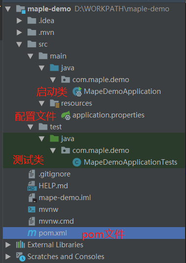

### 1.2 配置SpringBoot项目
(1) 接下来，我们配置一下我们创建的SpringBoot项目，这是一个web项目，首先我们需要引入web对应的jar包。

在pom.xml文件中添加对应的依赖：
~~~
<!-- 引入web相关 -->
<dependency>
    <groupId>org.springframework.boot</groupId>
    <artifactId>spring-boot-starter-web</artifactId>
</dependency>
~~~

完整pom.xml如下
~~~xml
<?xml version="1.0" encoding="UTF-8"?>
<project xmlns="http://maven.apache.org/POM/4.0.0" xmlns:xsi="http://www.w3.org/2001/XMLSchema-instance"
         xsi:schemaLocation="http://maven.apache.org/POM/4.0.0 https://maven.apache.org/xsd/maven-4.0.0.xsd">
    <modelVersion>4.0.0</modelVersion>
    <parent>
        <groupId>org.springframework.boot</groupId>
        <artifactId>spring-boot-starter-parent</artifactId>
        <version>2.1.0.RELEASE</version>
        <relativePath/> <!-- lookup parent from repository -->
    </parent>
    <groupId>com.maple</groupId>
    <artifactId>maple-demo</artifactId>
    <version>0.0.1-SNAPSHOT</version>
    <name>maple-demo</name>
    <description>Demo project for Spring Boot</description>

    <properties>
        <java.version>1.8</java.version>
    </properties>

    <dependencies>
        <dependency>
            <groupId>org.springframework.boot</groupId>
            <artifactId>spring-boot-starter</artifactId>
        </dependency>

        <dependency>
            <groupId>org.springframework.boot</groupId>
            <artifactId>spring-boot-starter-test</artifactId>
            <scope>test</scope>
            <exclusions>
                <exclusion>
                    <groupId>org.junit.vintage</groupId>
                    <artifactId>junit-vintage-engine</artifactId>
                </exclusion>
            </exclusions>
        </dependency>

        <!-- 引入web相关 -->
        <dependency>
            <groupId>org.springframework.boot</groupId>
            <artifactId>spring-boot-starter-web</artifactId>
        </dependency>

    </dependencies>

    <build>
        <plugins>
            <plugin>
                <groupId>org.springframework.boot</groupId>
                <artifactId>spring-boot-maven-plugin</artifactId>
            </plugin>
        </plugins>
    </build>

</project>
~~~

(2) 修改application.properties后缀为application.yml，添加启动的端口号：8888
~~~
server:
  port: 8888
~~~

(3) 修改MapeDemoApplicationTests.java文件，因为创建是高版本的SpringBoot，所以重新引入一下依赖。

### 1.3 启动SpringBoot项目
(1) 在com.maple.demo下创建TestController.java文件，用于测试项目启动
代码信息:
~~~java
package com.maple.demo;

import org.springframework.web.bind.annotation.GetMapping;
import org.springframework.web.bind.annotation.RestController;

/**
 * @author Maple
 * @date 2020/10/13 14:09
 **/
@RestController
public class TestController {

    @GetMapping(value = "test")
    public String test(){
        return "项目启动成功";
    }
}
~~~

(2) 启动项目

可以直接在启动类上进行启动，启动成功后，详情如下：
 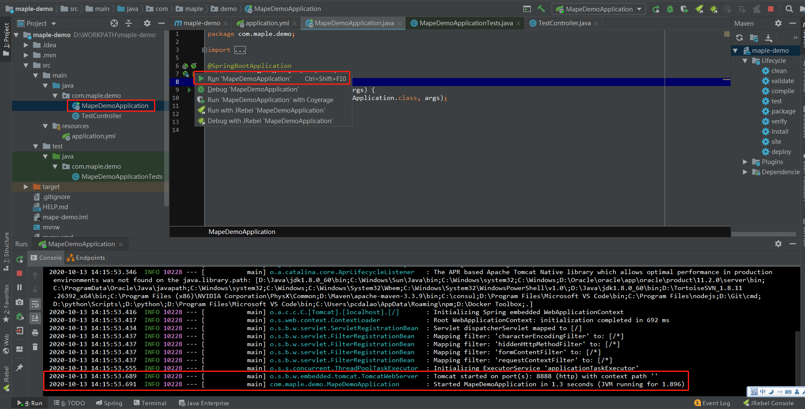

(3) 项目启动成功，在浏览器输入http://127.0.0.1:8888/test地址进行测试，返回结果如下：
 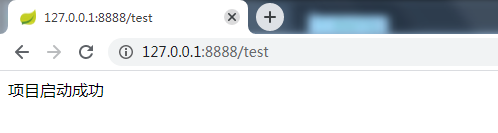

### 1.4 常用工具类
在我们日常开发中，我们肯定会用到各式各样的插件、工具。例如：链接数据库、使用Redis、导出Excel、生成Word等等，这些我们在后续会一一提到。

### 1.5 小结
本章主要介绍了如果搭建一个简单的Spring Boot项目，并启动项目，下一章我们将搭建一个Vue前端项目，并实现调用后台的接口。

## 2 搭建Vue基础框架

### 2.1 检查环境
前置依赖：
1. node.js (下载地址：https://nodejs.org/zh-cn/)
2. npm（npm是国外的镜像，速度比较慢，可以切换到淘宝镜像cnpm）
~~~
npm install -g cnpm –registry=https://registry.npm.taobao.org
~~~
即可安装npm镜像，以后再用到npm的地方直接用cnpm来代替就好了。

查看本地是否装有node.js和npm环境，如下图所示:
 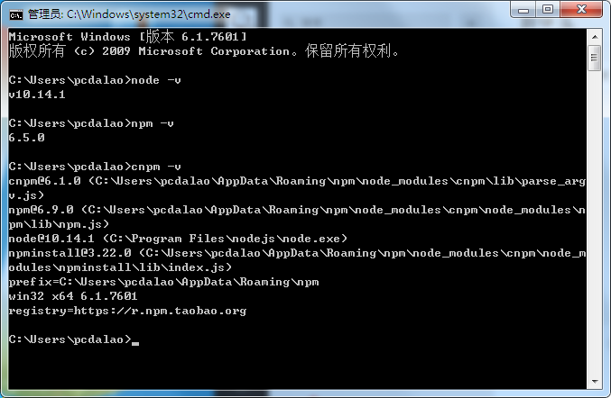

### 2.2 搭建vue项目环境
(1) 全局安装vue-cli
~~~
cnpm install --global vue-cli
~~~

(2) 进入你的项目目录，创建一个基于 webpack 模板的新项目, 添加项目名，会创建一个新的文件夹，如果不需要创建文件夹可以不用添加
~~~
vue init webpack 项目名
~~~
 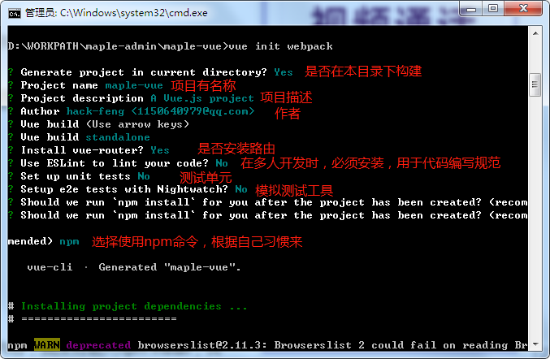
* cnpm install 安装依赖，上图中选择npm时，就已经执行npm install了，所以无需重复执行
* cnpm run dev 启动vue项目

(3) 启动vue项目

cmd进入到项目目录执行cnpm run dev启动项目，启动成功如下如所示

 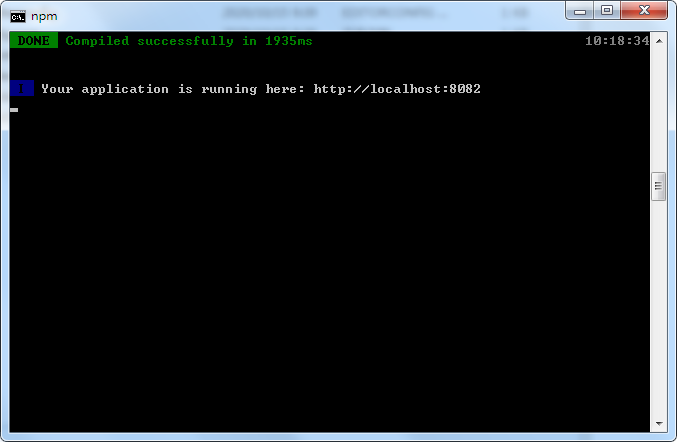
 
 打开浏览器，输入上图中的路径http://localhost:8082,，显示如下图，此时vue项目启动成功。

 

## 3 搭建用户中心

### 3.1 配置后台框架基础依赖
首先，项目中会使用到mysql、redis、mybatis-plus等等功能，接下来我们就一一讲解一下。

的完成pom.xml文件
~~~xml
<?xml version="1.0" encoding="UTF-8"?>
<project xmlns="http://maven.apache.org/POM/4.0.0" xmlns:xsi="http://www.w3.org/2001/XMLSchema-instance"
         xsi:schemaLocation="http://maven.apache.org/POM/4.0.0 https://maven.apache.org/xsd/maven-4.0.0.xsd">
    <modelVersion>4.0.0</modelVersion>
    <parent>
        <groupId>org.springframework.boot</groupId>
        <artifactId>spring-boot-starter-parent</artifactId>
        <version>2.1.0.RELEASE</version>
        <relativePath/> <!-- lookup parent from repository -->
    </parent>
    <groupId>com.maple</groupId>
    <artifactId>maple-demo</artifactId>
    <version>0.0.1-SNAPSHOT</version>
    <name>maple-demo</name>
    <description>Demo project for Spring Boot</description>

    <properties>
        <java-version>1.8</java-version>
        <lombok-version>1.16.18</lombok-version>
        <druid-version>1.0.29</druid-version>
        <mybatis-plus-version>3.1.0</mybatis-plus-version>
        <velocity-version>2.0</velocity-version>
        <swagger2-version>2.7.0</swagger2-version>
        <fastjson-version>1.2.39</fastjson-version>
        <mysql-connector-version>8.0.16</mysql-connector-version>
    </properties>

    <dependencies>
        <dependency>
            <groupId>org.springframework.boot</groupId>
            <artifactId>spring-boot-starter</artifactId>
        </dependency>

        <dependency>
            <groupId>org.springframework.boot</groupId>
            <artifactId>spring-boot-starter-test</artifactId>
            <scope>test</scope>
            <exclusions>
                <exclusion>
                    <groupId>org.junit.vintage</groupId>
                    <artifactId>junit-vintage-engine</artifactId>
                </exclusion>
            </exclusions>
        </dependency>

        <!-- 引入web相关 -->
        <dependency>
            <groupId>org.springframework.boot</groupId>
            <artifactId>spring-boot-starter-web</artifactId>
        </dependency>

        <!--使用Mysql数据库-->
        <dependency>
            <groupId>mysql</groupId>
            <artifactId>mysql-connector-java</artifactId>
            <version>${mysql-connector-version}</version>
        </dependency>
        <!--使用阿里巴巴druid数据库连接池-->
        <dependency>
            <groupId>com.alibaba</groupId>
            <artifactId>druid</artifactId>
            <version>${druid-version}</version>
        </dependency>

        <!-- mybatis-plus的依赖 -->
        <dependency>
            <groupId>com.baomidou</groupId>
            <artifactId>mybatis-plus-boot-starter</artifactId>
            <version>${mybatis-plus-version}</version>
        </dependency>
        <!-- mybatis-plus的自动生成代码插件 -->
        <dependency>
            <groupId>com.baomidou</groupId>
            <artifactId>mybatis-plus-generator</artifactId>
            <version>${mybatis-plus-version}</version>
        </dependency>
        <dependency>
            <groupId>org.apache.velocity</groupId>
            <artifactId>velocity-engine-core</artifactId>
            <version>${velocity-version}</version>
        </dependency>

        <!-- 引入redis依赖 -->
        <dependency>
            <groupId>org.springframework.boot</groupId>
            <artifactId>spring-boot-starter-data-redis</artifactId>
        </dependency>
        <!-- 引入redis数据连接池依赖 -->
        <dependency>
            <groupId>org.apache.commons</groupId>
            <artifactId>commons-pool2</artifactId>
        </dependency>

        <!--swagger2 集成接口文档管理-->
        <dependency>
            <groupId>io.springfox</groupId>
            <artifactId>springfox-swagger2</artifactId>
            <version>${swagger2-version}</version>
        </dependency>
        <dependency>
            <groupId>io.springfox</groupId>
            <artifactId>springfox-swagger-ui</artifactId>
            <version>${swagger2-version}</version>
        </dependency>

        <!--Lombok管理Getter/Setter/log等-->
        <dependency>
            <groupId>org.projectlombok</groupId>
            <artifactId>lombok</artifactId>
            <scope>provided</scope>
            <version>${lombok-version}</version>
        </dependency>

        <!-- 处理JSON -->
        <dependency>
            <groupId>com.alibaba</groupId>
            <artifactId>fastjson</artifactId>
            <version>${fastjson-version}</version>
        </dependency>
    </dependencies>

    <build>
        <plugins>
            <plugin>
                <groupId>org.springframework.boot</groupId>
                <artifactId>spring-boot-maven-plugin</artifactId>
            </plugin>
        </plugins>
    </build>
</project>
~~~

#### 3.1.1 引入Mysql配置

首先我们需要创建一个Mysql数据库maple，字符集选择utf8。这里我们使用的工具是Navicat Premium 11。当然其他工具都是一样，没有特使要求。
 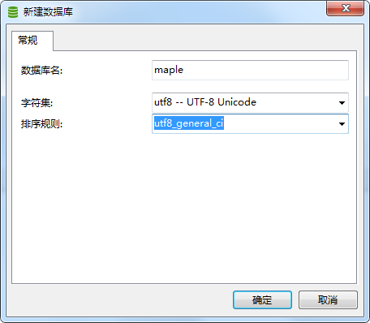

创建一张usc_user表，当然有很多字段我们可能暂且不需要，暂且保留：
~~~mysql
CREATE TABLE `usc_user` (
`id` bigint(20) NOT NULL AUTO_INCREMENT COMMENT '主键id' ,
`account` varchar(60) NOT NULL COMMENT '账号' ,
`name` varchar(60) NULL DEFAULT NULL COMMENT '名字' ,
`nick_name` varchar(255) NULL DEFAULT NULL COMMENT '昵称' ,
`password` varchar(60) NOT NULL COMMENT '密码' ,
`password_date` datetime NULL DEFAULT NULL COMMENT '密码设置日期' ,
`address` varchar(512) NULL DEFAULT NULL COMMENT '地址' ,
`birthday` datetime NULL DEFAULT NULL COMMENT '生日' ,
`sex` varchar(60) NULL DEFAULT NULL COMMENT '性别' ,
`mobile` varchar(60) NULL DEFAULT NULL COMMENT '手机' ,
`email` varchar(60) NULL DEFAULT NULL COMMENT '邮箱' ,
`comment` varchar(512) NULL DEFAULT NULL COMMENT '用户备注' ,
`picture` varchar(255) NULL DEFAULT NULL COMMENT '图片' ,
`org_id` bigint(20) NULL DEFAULT 0 COMMENT '所属组织机构ID' ,
`join_date` datetime NULL DEFAULT NULL COMMENT '入职时间' ,
`is_system` tinyint(1) NULL DEFAULT 0 COMMENT '是否系统内置用户（0：否，1：是）' ,
`create_id` bigint(20) NULL DEFAULT NULL COMMENT '创建人id' ,
`update_id` bigint(20) NULL DEFAULT 0 COMMENT '修改人id' ,
`create_time` datetime NULL DEFAULT NULL COMMENT '创建时间' ,
`update_time` datetime NULL DEFAULT NULL COMMENT '更新时间' ,
`create_name` varchar(60) NULL DEFAULT NULL COMMENT '创建人姓名' ,
`update_name` varchar(60) NULL DEFAULT NULL COMMENT '最后修改人姓名' ,
`is_deleted` tinyint(1) NULL DEFAULT 0 COMMENT '是否删除（0：未删除，1：已删除）' ,
`status` varchar(60) NULL DEFAULT NULL COMMENT '状态' ,
PRIMARY KEY (`id`),
UNIQUE INDEX `UK_ACCOUNT` (`account`) USING BTREE 
)
ENGINE=InnoDB
DEFAULT CHARACTER SET=utf8 COLLATE=utf8_general_ci
COMMENT='用户中心-用户信息表'
ROW_FORMAT=COMPACT;
~~~

创建好数据库后，配置我们项目的application.yml文件
~~~yml
spring:
  application:
    name: ld-edu
  # 配置数据库连接
  datasource:
    url: jdbc:mysql://127.0.0.1:3306/maple?useUnicode=yes&characterEncoding=UTF-8&useSSL=false&serverTimezone=UTC # 数据库连接地址及常用配置
    driverClassName: com.mysql.cj.jdbc.Driver # 数据库连接驱动
    username: root # 数据库用户
    password: 123456 # 数据库用户密码
    # 配置druid数据库连接池---------------------------------------
    type: com.alibaba.druid.pool.DruidDataSource
    initialSize: 5        # 初始化大小，最小，最大
    minIdle: 5
    maxActive: 20
    maxWait: 60000        # 配置获取连接等待超时的时间
    timeBetweenEvictionRunsMillis: 60000  # 配置间隔多久才进行一次检测，检测需要关闭的空闲连接，单位是毫秒
    minEvictableIdleTimeMillis: 300000    # 配置一个连接在池中最小生存的时间，单位是毫秒
    validationQuery: SELECT 'x'           # 校验SQL，Oracle配置 spring.datasource.validationQuery=SELECT 1 FROM DUAL，如果不配validationQuery项，则下面三项配置无用
    testWhileIdle: true
    testOnBorrow: false 
    testOnReturn: false
    poolPreparedStatements: true   # 打开PSCache，并且指定每个连接上PSCache的大小
    maxPoolPreparedStatementPerConnectionSize: 20
    filters: stat,wall,log4j       # 配置监控统计拦截的filters，去掉后监控界面sql无法统计，'wall'用于防火墙
    #connectionProperties: druid.stat.mergeSql=true;druid.stat.slowSqlMillis=5000  # 通过connectProperties属性来打开mergeSql功能；慢SQL记录
    useGlobalDataSourceStat: true  # 合并多个DruidDataSource的监控数据
~~~

至此，我们的数据库配置已经完成。接下来我们配置一下Mybatis-plus。

#### 3.1.2 引入MyBatis-Plus配置
##### 配置MyBatis-Plus
* MyBatis 是一款优秀的持久层框架，它支持自定义 SQL、存储过程以及高级映射。MyBatis 免除了几乎所有的 JDBC 代码以及设置参数和获取结果集的工作。MyBatis 可以通过简单的 XML 或注解来配置和映射原始类型、接口和 Java POJO（Plain Old Java Objects，普通老式 Java 对象）为数据库中的记录。
* MyBatis-Plus是基于MyBatis框架进一步的封装，增强了MyBatis的功能，只需简单配置，即可快速进行单表 CRUD 操作，从而节省大量时间，以及一些常用工具的封装。

* MyBatis中文文档地址：https://mybatis.org/mybatis-3/zh/index.html
* MyBatis-Plus官方地址：https://baomidou.com/

接下来我们就一起配置一下MyBatis-Plus：

> 这里我们会使用Mybatis-plus生成代码、分页、逻辑删除、常用字段自动注入数据等插件。

首先是application.yml
~~~
# 配置mybatis-plus的xml和bean的目录
mybatis-plus:
  mapper-locations: classpath:mapper/*.xml
  configuration:
    map-underscore-to-camel-case: true    # 开启驼峰功能
    log-impl: org.apache.ibatis.logging.stdout.StdOutImpl    # 日志打印功能
  global-config:  #逻辑删除配置
    db-config:
      logic-delete-value: 1 # 逻辑已删除值(默认为 1)
      logic-not-delete-value: 0 # 逻辑未删除值(默认为 0)
~~~

然后我们在com.maple.demo下创建config目录存放我们的系统配置，在config目录创建MybatisPlusConfig.java文件
~~~java
package com.maple.demo.config;

import com.alibaba.druid.support.http.StatViewServlet;
import com.baomidou.mybatisplus.core.handlers.MetaObjectHandler;
import com.baomidou.mybatisplus.core.injector.ISqlInjector;
import com.baomidou.mybatisplus.extension.injector.LogicSqlInjector;
import com.baomidou.mybatisplus.extension.plugins.PaginationInterceptor;
import org.apache.ibatis.reflection.MetaObject;
import org.mybatis.spring.annotation.MapperScan;
import org.springframework.boot.web.servlet.ServletRegistrationBean;
import org.springframework.context.annotation.Bean;
import org.springframework.context.annotation.Configuration;
import org.springframework.transaction.annotation.EnableTransactionManagement;

import java.util.Date;

/**
 * @author Maple
 */
@EnableTransactionManagement
@Configuration
@MapperScan("com.maple.demo.mapper")
public class MybatisPlusConfig implements MetaObjectHandler {

    /**
     * 分页插件
     */
    @Bean
    public PaginationInterceptor paginationInterceptor() {
        return new PaginationInterceptor();
    }

    /**
     * 配置逻辑删除
     */
    @Bean
    public ISqlInjector sqlInjector() {
        return new LogicSqlInjector();
    }

    /**
     * 新增时,自动填充数据
     */
    @Override
    public void insertFill(MetaObject metaObject) {
        this.setFieldValByName("isDeleted", false, metaObject);
        this.setFieldValByName("createId", 1L, metaObject);
        this.setFieldValByName("createName", "占位符", metaObject);
        this.setFieldValByName("createTime", new Date(), metaObject);
        this.setFieldValByName("updateId", 1L, metaObject);
        this.setFieldValByName("updateName", "占位符", metaObject);
        this.setFieldValByName("updateTime", new Date(), metaObject);
    }

    /**
     * 修改时，自动填充数据
     */
    @Override
    public void updateFill(MetaObject metaObject) {
        this.setFieldValByName("updateId", 1L, metaObject);
        this.setFieldValByName("updateName", "占位符", metaObject);
        this.setFieldValByName("updateTime", new Date(), metaObject);
    }

    /**
     * 配置druid监控服务器
     *
     * @return 返回监控注册的servlet对象
     */
    @Bean
    public ServletRegistrationBean statViewServlet() {
        ServletRegistrationBean servletRegistrationBean = new ServletRegistrationBean(new StatViewServlet(), "/druid/*");
        // 添加IP白名单
//        servletRegistrationBean.addInitParameter("allow", "192.168.25.125,127.0.0.1");
        // 添加IP黑名单，当白名单和黑名单重复时，黑名单优先级更高
//        servletRegistrationBean.addInitParameter("deny", "192.168.25.123");
        // 添加控制台管理用户
        servletRegistrationBean.addInitParameter("loginUsername", "druid");
        servletRegistrationBean.addInitParameter("loginPassword", "123456");
        // 是否能够重置数据
        servletRegistrationBean.addInitParameter("resetEnable", "false");
        return servletRegistrationBean;
    }
}
~~~
其中，createId、createName暂时使用占位符，后期结合登录后从JWT里面获取。

##### 配置自动生成代码插件
配置MyBatis-Plus代码生成工具，在com.maple.demo目录下创建util目录，用于存放工具类。然后创建Generator.java，代码如下
~~~java
package com.maple.demo.util;

import com.baomidou.mybatisplus.annotation.DbType;
import com.baomidou.mybatisplus.annotation.FieldFill;
import com.baomidou.mybatisplus.generator.AutoGenerator;
import com.baomidou.mybatisplus.generator.config.*;
import com.baomidou.mybatisplus.generator.config.converts.MySqlTypeConvert;
import com.baomidou.mybatisplus.generator.config.po.TableFill;
import com.baomidou.mybatisplus.generator.config.rules.DbColumnType;
import com.baomidou.mybatisplus.generator.config.rules.NamingStrategy;
import java.util.ArrayList;
import java.util.List;

/**
 * MyBatis-Plus代码生成工具
 * @author Maple
 * @date 2019/4/25
 */
public class Generator {

    public static void main(String[] args) {

        String auth = "Maple";
        String packageName = "com.maple.demo";
        String path = "D:";
        String url = "127.0.0.1:3306/maple";
        String username = "root";
        String password = "123456";
        generateTest(auth, packageName, path, url, username, password);
    }

    private static void generateTest(String auth, String packageName, String path,
                                     String url, String username, String password) {
        //全局配置
        GlobalConfig config = new GlobalConfig();
        //设置是否支持AR模式
        config.setActiveRecord(true)
                //设置生成代码的作者
                .setAuthor(auth)
                //设置输出代码的位置
                .setOutputDir(path)
                // XML 二级缓存
                .setEnableCache(false)
                // XML ResultMap
                .setBaseResultMap(true)
                // XML columList
                .setBaseColumnList(true)
                //.setKotlin(true) 是否生成 kotlin 代码
                // 是否使用Swagger2
                .setSwagger2(true)
                // 设置是否覆盖原来的代码
                .setFileOverride(false);

        //******************************数据源配置***************************************
        //数据库连接url
        String dbUrl = "jdbc:mysql://" + url + "?useUnicode=true&characterEncoding=UTF-8&useJDBCCompliantTimezoneShift=true&useLegacyDatetimeCode=false&serverTimezone=UTC";
        //数据源配置
        DataSourceConfig dataSourceConfig = new DataSourceConfig();
        //数据库类型 枚举
        dataSourceConfig.setDbType(DbType.MYSQL)
                //设置url
                .setUrl(dbUrl)
                //设置用户名
                .setUsername(username)
                //设置密码
                .setPassword(password)
                //设置数据库驱动
                .setDriverName("com.mysql.cj.jdbc.Driver")
                // 自定义数据库表字段类型转换【可选】
                .setTypeConvert(new MySqlTypeConvert() {
                    @Override
                    public DbColumnType processTypeConvert(GlobalConfig globalConfig, String fieldType) {
                        System.out.println("转换类型：" + fieldType);
                        //将数据库中datetime转换成date
                        String datetime = "datetime";
                        if (fieldType.toLowerCase().contains(datetime)) {
                            return DbColumnType.DATE;
                        }
                        return (DbColumnType) super.processTypeConvert(globalConfig, fieldType);
                    }
                });

        //******************************策略配置******************************************************
        // 自定义需要填充的字段 数据库中的字段
        List<TableFill> tableFillList = new ArrayList<>();
        tableFillList.add(new TableFill("update_id", FieldFill.INSERT_UPDATE));
        tableFillList.add(new TableFill("update_name", FieldFill.INSERT_UPDATE));
        tableFillList.add(new TableFill("update_time", FieldFill.INSERT_UPDATE));
        tableFillList.add(new TableFill("create_id", FieldFill.INSERT));
        tableFillList.add(new TableFill("create_name", FieldFill.INSERT));
        tableFillList.add(new TableFill("create_time", FieldFill.INSERT));
        tableFillList.add(new TableFill("is_deleted", FieldFill.INSERT));
        //策略配置
        StrategyConfig strategyConfig = new StrategyConfig();
        strategyConfig
                //全局大写命名是否开启
                .setCapitalMode(true)
                //【实体】是否为lombok模型
                .setEntityLombokModel(true)
                //表名生成策略  下划线转驼峰
                .setNaming(NamingStrategy.underline_to_camel)
                //生成的去掉前缀，可以配置多个
                .setTablePrefix("sys_","usc_","ld_","web_")
                //自动填充设置
                .setTableFillList(tableFillList)
                //逻辑删除字段配置
                .setLogicDeleteFieldName("is_deleted")
                .setRestControllerStyle(true)
                //修改替换成你需要的表名，多个表名传数组
                .setInclude(".*.");
        //集成注入设置
        //注入全局设置
        new AutoGenerator().setGlobalConfig(config)
                //注入数据源配置
                .setDataSource(dataSourceConfig)
                //注入策略配置
                .setStrategy(strategyConfig)
                //设置包名信息
                .setPackageInfo(
                        new PackageConfig()
                                //提取公共父级包名
                                .setParent(packageName)
                                //设置controller信息
                                .setController("controller")
                                //设置实体类信息
                                .setEntity("bean")
                                .setMapper("mapper")
                                .setXml("mapper")
                )
                //设置自定义模板
                .setTemplate(
                        new TemplateConfig()
                                //.setXml(null)//指定自定义模板路径, 位置：/resources/templates/entity2.java.ftl(或者是.vm)
                                //注意不要带上.ftl(或者是.vm), 会根据使用的模板引擎自动识别
                                // 自定义模板配置，模板可以参考源码 /mybatis-plus/src/main/resources/template 使用 copy
                                // 至您项目 src/main/resources/template 目录下，模板名称也可自定义如下配置：
                                // .setController("...");
                                // .setEntity("...");
                                // .setMapper("...");
                                // .setXml("...");
                                // .setService("...");
                                .setServiceImpl("templates/serviceImpl.java")
                )
                //开始执行代码生成
                .execute();
    }
}
~~~

配置完之后，我们修改一下对应的配置文件
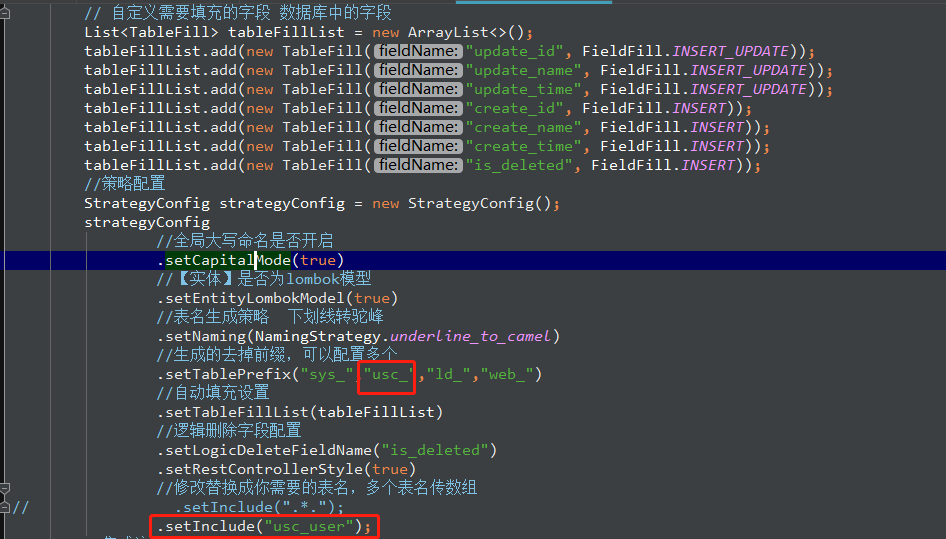

然后在该文件上右键，执行该Main方法
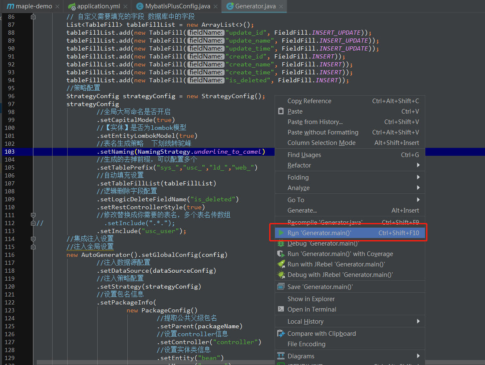
 
 然后会生成在D:下的com文件夹下，我们将代码复制到我们的项目中，此时的项目代码结构如下如：
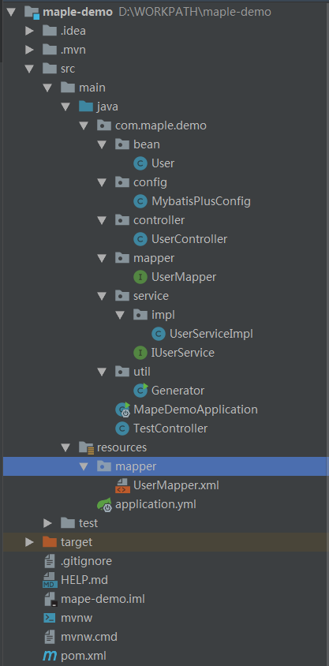

#### 3.1.3 引入Swagger2配置
##### 配置Swagger2
项目中会写很多接口，为了方便管理接口，以及和前端对接，我们使用Swagger2来生成这些接口文档。

下面让我们一起配置下：

首先我们在config目录下创建Swagger2Config.java文件，对应代码如下：
~~~java
package com.maple.demo.config;

import io.swagger.annotations.ApiOperation;
import org.springframework.context.annotation.Bean;
import org.springframework.context.annotation.Configuration;
import springfox.documentation.builders.ApiInfoBuilder;
import springfox.documentation.builders.RequestHandlerSelectors;
import springfox.documentation.service.*;
import springfox.documentation.spi.DocumentationType;
import springfox.documentation.spi.service.contexts.SecurityContext;
import springfox.documentation.spring.web.plugins.Docket;
import springfox.documentation.swagger2.annotations.EnableSwagger2;
import java.util.ArrayList;
import java.util.List;
import static springfox.documentation.builders.PathSelectors.regex;

/**
 * Swagger2接口文档管理
 * @author Maple
 * @date 2018/8/29
 */
@EnableSwagger2
@Configuration
public class Swagger2Config {

    /**
     * Swagger2参数详解
     *
     * '@Api'：修饰整个类，描述Controller的作用
     * '@ApiOperation'：描述一个类的一个方法，或者说一个接口
     * '@ApiParam'：单个参数描述@ApiModel：用对象来接收参数
     * '@ApiProperty'：用对象接收参数时，描述对象的一个字段
     * '@ApiResponse'：HTTP响应其中1个描述
     * '@ApiResponses'：HTTP响应整体描述
     * '@ApiIgnore'：使用该注解忽略这个API
     * '@ApiError'：发生错误返回的信息
     * '@ApiImplicitParam'：一个请求参数
     * '@ApiImplicitParams'：多个请求参数
     */
    private ApiInfo apiInfo() {
        return new ApiInfoBuilder()
                .title("用户服务接口开发文档")
                //创建人
                .contact(new Contact("笑小枫", "", "1150640979@qq.com"))
                .description("用户服务接口开发文档")
                .version("1.0")
                .build();
    }

    @Bean
    public Docket platformApi() {
        return new Docket(DocumentationType.SWAGGER_2).apiInfo(apiInfo()).forCodeGeneration(true)
                .select().apis(RequestHandlerSelectors.withMethodAnnotation(ApiOperation.class))
                .apis(RequestHandlerSelectors.any())
                .paths(regex("^.*(?<!error)$"))
                .build()
                // 配置登录token认证，方便后期添加登录功能后的接口测试
                .securitySchemes(securitySchemes())
                .securityContexts(securityContexts());
    }

    /**
     * 认证的token放在请求头header的Authorization里面
     */
    private List<ApiKey> securitySchemes() {
        List<ApiKey> apiKeyList= new ArrayList<>();
        apiKeyList.add(new ApiKey("Authorization", "Authorization", "header"));
        return apiKeyList;
    }

    private List<SecurityContext> securityContexts() {
        List<SecurityContext> securityContexts=new ArrayList<>();
        securityContexts.add(
                SecurityContext.builder()
                        .securityReferences(defaultAuth())
                        .forPaths(regex("^(?!auth).*$"))
                        .build());
        return securityContexts;
    }

    private List<SecurityReference> defaultAuth() {
        AuthorizationScope authorizationScope = new AuthorizationScope("global", "accessEverything");
        AuthorizationScope[] authorizationScopes = new AuthorizationScope[1];
        authorizationScopes[0] = authorizationScope;
        List<SecurityReference> securityReferences=new ArrayList<>();
        securityReferences.add(new SecurityReference("Authorization", authorizationScopes));
        return securityReferences;
    }
}
~~~

##### 配置swagger2-ui的汉化版
这样我们的Swagger2就配置好了，现在的ui界面是英文版，如果需要配置为中文版的，添加以下配置：

在resources目录下添加WEB-INF目录，然后在添加一层resources目录，创建swagger-ui.html文件，代码如下：
~~~html
<!DOCTYPE html>
<html>
<head>
    <meta charset="UTF-8">
    <title>Swagger UI</title>
    <link rel="icon" type="image/png" href="webjars/springfox-swagger-ui/images/favicon-32x32.png" sizes="32x32"/>
    <link rel="icon" type="image/png" href="webjars/springfox-swagger-ui/images/favicon-16x16.png" sizes="16x16"/>
    <link href='webjars/springfox-swagger-ui/css/typography.css' media='screen' rel='stylesheet' type='text/css'/>
    <link href='webjars/springfox-swagger-ui/css/reset.css' media='screen' rel='stylesheet' type='text/css'/>
    <link href='webjars/springfox-swagger-ui/css/screen.css' media='screen' rel='stylesheet' type='text/css'/>
    <link href='webjars/springfox-swagger-ui/css/reset.css' media='print' rel='stylesheet' type='text/css'/>
    <link href='webjars/springfox-swagger-ui/css/print.css' media='print' rel='stylesheet' type='text/css'/>

    
    
    
    
    
    
    
    
    
    
    
    
    
    

    
    <!-- 加入国际化的js -->
    
    
</head>

<body class="swagger-section">

    

        <a id="logo" href="http://swagger.io">swagger</a>
        <form id='api_selector'>
            

                <select id="select_baseUrl" name="select_baseUrl"/>
            

            
<input placeholder="http://example.com/api" id="input_baseUrl" name="baseUrl"
                                      type="text"/>

            

            
<a id="explore" class="header__btn" href="#" data-sw-translate>Explore</a>

        </form>
    

&nbsp;

</body>
</html>
~~~

##### 使用Swagger2测试Mysql和MyBatis-Plus
添加一个简单的用户添加、查询列表、查询详情的代码。

具体代码如下：

在util目录下添加R.java定义统一返回格式

R.java
~~~java
package com.maple.demo.util;

import lombok.*;
import lombok.experimental.Accessors;
import org.springframework.util.StringUtils;
import java.io.Serializable;

/**
 * 响应信息主体
 *
 * @param <T>
 * @author zhua
 */
@Builder
@ToString
@NoArgsConstructor
@Accessors(chain = true)
public class R<T> implements Serializable {
	private static final long serialVersionUID = 1L;

	/**
	 * 成功标记
	 */
	private static final Integer SUCCESS = 200;
	/**
	 * 失败标记
	 */
	private static final Integer FAIL = 500;

	@Getter
	@Setter
	private int code;

	@Getter
	@Setter
	private String msg;

	@Getter
	@Setter
	private T data;

	public static <T> R<T> ok() {
		return restResult(null, SUCCESS, null);
	}

	public static <T> R<T> ok(T data) {
		return restResult(data, SUCCESS, null);
	}

	public static <T> R<T> ok(T data, String msg) {
		return restResult(data, SUCCESS, msg);
	}

	public static <T> R<T> failed() {
		return restResult(null, FAIL, null);
	}

	public static <T> R<T> failed(String msg) {
		return restResult(null, FAIL, msg);
	}

	public static <T> R<T> failed(T data) {
		return restResult(data, FAIL, null);
	}

	public static <T> R<T> failed(T data, String msg) {
		return restResult(data, FAIL, msg);
	}
	public static <T> R<T> isOk(boolean isOk, String msg){
		if(isOk) {
			return restResult(null, SUCCESS, msg + "成功");
		} else {
			return restResult(null, FAIL, msg + "失败, 请重试");
		}
	}

	public static <T> R<T> result(int code, String msg, T data) {
		return restResult(data, code, msg);
	}

	private static <T> R<T> restResult(T data, int code, String msg) {
		R<T> apiResult = new R<>();
		apiResult.setCode(code);
		apiResult.setData(data);
		apiResult.setMsg(msg);
		if(StringUtils.isEmpty(msg)) {
			if(SUCCESS != code) {
				apiResult.setMsg("操作失败");
			} else {
				apiResult.setMsg("操作成功");
			}
		}
		return apiResult;
	}

	public R(int code, String msg, T data) {
		this.code = code;
		this.msg = msg;
		this.data = data;
	}
}
~~~

UserController.java
~~~java
package com.maple.demo.controller;

import com.baomidou.mybatisplus.core.metadata.IPage;
import com.maple.demo.bean.User;
import com.maple.demo.service.IUserService;
import com.maple.demo.util.R;
import io.swagger.annotations.Api;
import io.swagger.annotations.ApiOperation;
import org.springframework.beans.factory.annotation.Autowired;
import org.springframework.data.domain.Page;
import org.springframework.web.bind.annotation.GetMapping;
import org.springframework.web.bind.annotation.PostMapping;
import org.springframework.web.bind.annotation.RequestMapping;
import org.springframework.web.bind.annotation.RestController;

/**
 * 

 * 用户中心-用户信息表 前端控制器
 * 

 *
 * @author Maple
 * @since 2020-10-15
 */
@Api(tags = "用户中心-用户信息前端控制器")
@RestController
@RequestMapping("/user")
public class UserController {

    @Autowired
    private IUserService userService;

    @ApiOperation(value = "添加或修改用户信息")
    @GetMapping("saveOrUpdateUser")
    public R saveOrUpdateUser(User user){
        boolean isOk = userService.saveOrUpdateUser(user);
        return R.isOk(isOk, "操作");
    }

    @ApiOperation(value = "添加或修改用户信息")
    @GetMapping("selectById")
    public R selectById(long id){
        User user = userService.getById(id);
        user.setPassword(null);
        return R.ok(user);
    }

    @ApiOperation(value = "分页查询用户列表信息")
    @PostMapping("getListByPage")
    public R getListByPage(Page<User> page, User user){
        IPage<User> result = userService.getListByPage(page, user);
        return R.ok(result);
    }
}
~~~

IUserService.java
~~~java
package com.maple.demo.service;

import com.baomidou.mybatisplus.core.metadata.IPage;
import com.baomidou.mybatisplus.extension.service.IService;
import com.maple.demo.bean.User;
import org.springframework.data.domain.Page;

/**
 * 

 * 用户中心-用户信息表 服务类
 * 

 *
 * @author Maple
 * @since 2020-10-15
 */
public interface IUserService extends IService<User> {

    boolean saveOrUpdateUser(User user);

    IPage<User> getListByPage(Page<User> page, User user);
}
~~~

UserServiceImpl.java
~~~java
package com.maple.demo.service.impl;

import com.baomidou.mybatisplus.core.metadata.IPage;
import com.baomidou.mybatisplus.core.toolkit.StringUtils;
import com.baomidou.mybatisplus.extension.service.impl.ServiceImpl;
import com.maple.demo.bean.User;
import com.maple.demo.mapper.UserMapper;
import com.maple.demo.service.IUserService;
import org.apache.tomcat.util.security.MD5Encoder;
import org.springframework.data.domain.Page;
import org.springframework.stereotype.Service;

/**
 * 

 * 用户中心-用户信息表 服务实现类
 * 

 *
 * @author Maple
 * @since 2020-10-15
 */
@Service
public class UserServiceImpl extends ServiceImpl<UserMapper, User> implements IUserService {

    @Override
    public boolean saveOrUpdateUser(User user) {
        if(user.getId() == null){
            user.setIsSystem(false);
            user.setStatus("1");
            if (StringUtils.isEmpty(user.getPassword())) {
                throw new RuntimeException("密码不能为空");
            }
            user.setPassword(MD5Encoder.encode(user.getPassword().getBytes()));
            return this.baseMapper.insert(user) > 0;
        }else{
            if (StringUtils.isNotEmpty(user.getPassword())) {
                user.setPassword(MD5Encoder.encode(user.getPassword().getBytes()));
            } else {
                user.setPassword(null);
            }
            this.baseMapper.updateById(user);
            return true;
        }
    }

    @Override
    public IPage<User> getListByPage(Page<User> page, User user) {
        return this.baseMapper.getListByPage(page, user);
    }
}
~~~

UserMapper.java
~~~java
package com.maple.demo.mapper;

import com.baomidou.mybatisplus.core.mapper.BaseMapper;
import com.baomidou.mybatisplus.core.metadata.IPage;
import com.maple.demo.bean.User;
import org.apache.ibatis.annotations.Param;
import org.springframework.data.domain.Page;

/**
 * 

 * 用户中心-用户信息表 Mapper 接口
 * 

 *
 * @author Maple
 * @since 2020-10-15
 */
public interface UserMapper extends BaseMapper<User> {

    IPage<User> getListByPage(Page<User> page, @Param("user") User user);
}
~~~

UserMapper.xml
~~~xml
<?xml version="1.0" encoding="UTF-8"?>
<!DOCTYPE mapper PUBLIC "-//mybatis.org//DTD Mapper 3.0//EN" "http://mybatis.org/dtd/mybatis-3-mapper.dtd">
<mapper namespace="com.maple.demo.mapper.UserMapper">

    <!-- 通用查询映射结果 -->
    <resultMap id="BaseResultMap" type="com.maple.demo.bean.User">
        <id column="id" property="id" />
        <result column="account" property="account" />
        <result column="name" property="name" />
        <result column="nick_name" property="nickName" />
        <result column="password" property="password" />
        <result column="password_date" property="passwordDate" />
        <result column="address" property="address" />
        <result column="birthday" property="birthday" />
        <result column="sex" property="sex" />
        <result column="mobile" property="mobile" />
        <result column="email" property="email" />
        <result column="comment" property="comment" />
        <result column="picture" property="picture" />
        <result column="org_id" property="orgId" />
        <result column="join_date" property="joinDate" />
        <result column="is_system" property="isSystem" />
        <result column="create_id" property="createId" />
        <result column="update_id" property="updateId" />
        <result column="create_time" property="createTime" />
        <result column="update_time" property="updateTime" />
        <result column="create_name" property="createName" />
        <result column="update_name" property="updateName" />
        <result column="is_deleted" property="isDeleted" />
        <result column="status" property="status" />
    </resultMap>

    <!-- 通用查询结果列 -->
    <sql id="Base_Column_List">
        id, account, name, nick_name, password, password_date, address, birthday, sex, mobile, email, comment, picture, org_id, join_date, is_system, create_id, update_id, create_time, update_time, create_name, update_name, is_deleted, status
    </sql>
    <select id="getListByPage" resultType="com.maple.demo.bean.User">
        select
          *
        from usc_user
        where
          is_deleted = 0
          <if test="account != null and account != ''">
            and account like concat('%', #{user.account}, '%')
          </if>
    </select>

</mapper>
~~~

启动项目，访问http://127.0.0.1:8888/swagger-ui.html

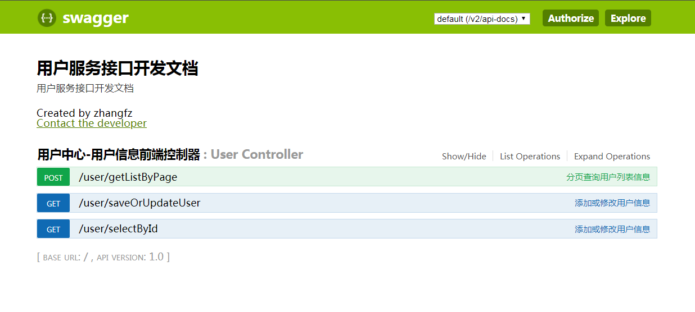

#### 3.1.4 引入Redis配置

### 3.2 配置前台框架基础依赖

### 3.3 用户管理

### 3.4 角色管理

### 3.5 组织机构管理

### 3.6 菜单管理

### 3.7 权限控制

### 

