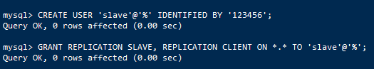
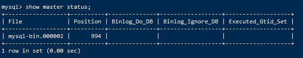
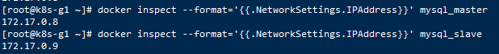
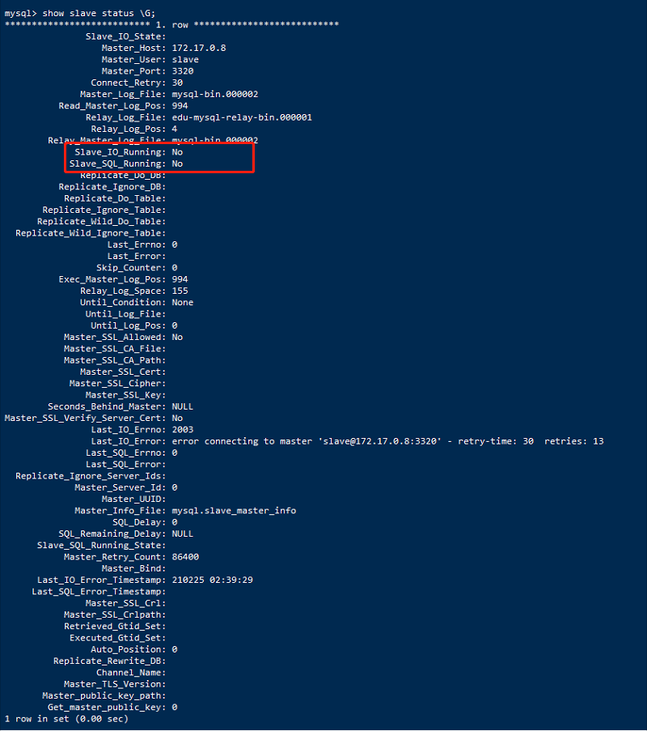
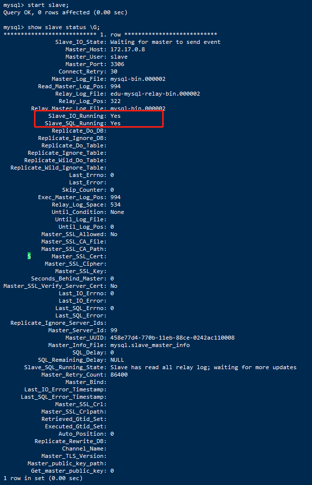
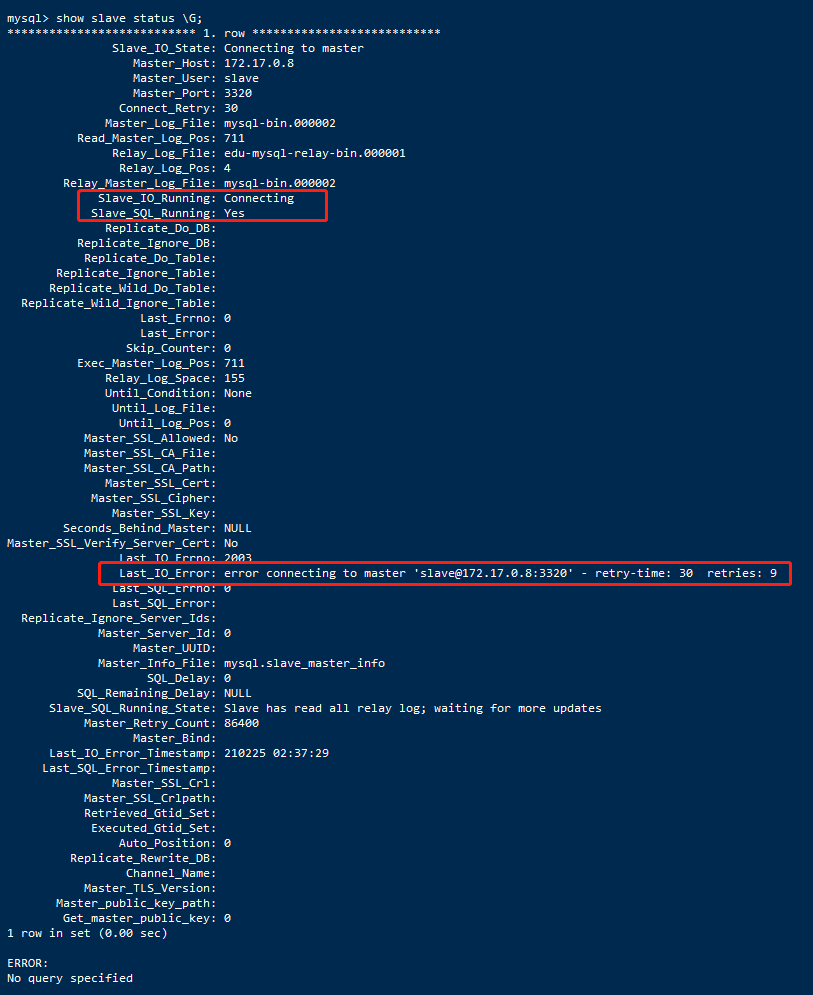
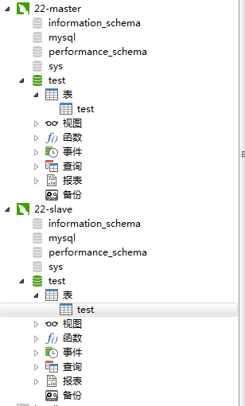

### mysql版本驱动
~~~
url: jdbc:mysql://localhost:3306/cloud-ida?useUnicode=true&characterEncoding=UTF-8&useJDBCCompliantTimezoneShift=true&useLegacyDatetimeCode=false&serverTimezone=UTC
~~~

mysql5.7:
~~~xml
<!-- pom -->
<dependency>
    <groupId>mysql</groupId>
    <artifactId>mysql-connector-java</artifactId>
    <version>5.1.41</version>
</dependency>

<!-- properties   driverClassName: com.mysql.jdbc.Driver-->
~~~

mysql8.0:
~~~xml
<!-- pom -->
<dependency>
    <groupId>mysql</groupId>
    <artifactId>mysql-connector-java</artifactId>
    <version>8.0.16</version>
</dependency>

<!-- properties   driverClassName: com.mysql.cj.jdbc.Driver -->
~~~

### 执行sql文件报`Data too long for column`错误
在sql文件的头上添加`/*!40101 SET NAMES utf8 */;

### 解决this is incompatible with sql_mode=only_full_group_by问题

~~~
       一、原理层面

       这个错误发生在mysql 5.7 版本及以上版本会出现的问题：

       mysql 5.7版本默认的sql配置是:sql_mode="ONLY_FULL_GROUP_BY"，这个配置严格执行了"SQL92标准"。

       很多从5.6升级到5.7时，为了语法兼容，大部分都会选择调整sql_mode，使其保持跟5.6一致，为了尽量兼容程序。

        

        二、sql层面

        在sql执行时，出现该原因：

        简单来说就是：输出的结果是叫target list，就是select后面跟着的字段，还有一个地方group by column，就是

        group by后面跟着的字段。由于开启了ONLY_FULL_GROUP_BY的设置，所以如果一个字段没有在target list 

        和group by字段中同时出现，或者是聚合函数的值的话，那么这条sql查询是被mysql认为非法的，会报错误。
~~~

> #### 一、查看sql_mode的语句如下
~~~
select @@GLOBAL.sql_mode;
~~~

> #### 二、解决方案-(推荐解决方案二)

* 解决方案一：sql语句暂时性修改sql_mode
 ~~~
 set @@GLOBAL.sql_mode='STRICT_TRANS_TABLES,NO_ZERO_IN_DATE,NO_ZERO_DATE,ERROR_FOR_DIVISION_BY_ZERO,NO_AUTO_CREATE_USER,NO_ENGINE_SUBSTITUTION'
 ~~~
 
>问题：

>重启mysql数据库服务之后，ONLY_FULL_GROUP_BY还会出现。

* 解决方案二：永久解决方案。

>需修改mysql配置文件，通过手动添加sql_mode的方式强制指定不需要ONLY_FULL_GROUP_BY属性，my.cnf位于etc文件夹下，vim下光标移到最后，添加如下：
~~~
sql_mode=STRICT_TRANS_TABLES,NO_ZERO_IN_DATE,NO_ZERO_DATE,ERROR_FOR_DIVISION_BY_ZERO,NO_AUTO_CREATE_USER,NO_ENGINE_SUBSTITUTION
~~~

重启mysql服务，顺利解决。

### mysql卡死的问题排查

查看发生死锁的业务对应的数据库，和innodb记录的死锁日志
~~~
show engine innodb status;
~~~

查看mysql当前进程
~~~
show full processlist; -- 查询全部当前进程;
show processlist;-- 只列出前100条

kill 99; -- 杀掉卡死的进程，99为卡死id
~~~

查看其他的状态
~~~
show status;

Aborted_clients 由于客户没有正确关闭连接已经死掉，已经放弃的连接数量。
Aborted_connects 尝试已经失败的MySQL服务器的连接的次数。
Connections 试图连接MySQL服务器的次数。
Created_tmp_tables 当执行语句时，已经被创造了的隐含临时表的数量。
Delayed_insert_threads 正在使用的延迟插入处理器线程的数量。
Delayed_writes 用INSERT DELAYED写入的行数。
Delayed_errors 用INSERT DELAYED写入的发生某些错误(可能重复键值)的行数。
Flush_commands 执行FLUSH命令的次数。
Handler_delete 请求从一张表中删除行的次数。
Handler_read_first 请求读入表中第一行的次数。
Handler_read_key 请求数字基于键读行。
Handler_read_next 请求读入基于一个键的一行的次数。
Handler_read_rnd 请求读入基于一个固定位置的一行的次数。
Handler_update 请求更新表中一行的次数。
Handler_write 请求向表中插入一行的次数。
Key_blocks_used 用于关键字缓存的块的数量。
Key_read_requests 请求从缓存读入一个键值的次数。
Key_reads 从磁盘物理读入一个键值的次数。
Key_write_requests 请求将一个关键字块写入缓存次数。
Key_writes 将一个键值块物理写入磁盘的次数。
Max_used_connections 同时使用的连接的最大数目。
Not_flushed_key_blocks 在键缓存中已经改变但是还没被清空到磁盘上的键块。
Not_flushed_delayed_rows 在INSERT DELAY队列中等待写入的行的数量。
Open_tables 打开表的数量。
Open_files 打开文件的数量。
Open_streams 打开流的数量(主要用于日志记载）
Opened_tables 已经打开的表的数量。
Questions 发往服务器的查询的数量。
Slow_queries 要花超过long_query_time时间的查询数量。
Threads_connected 当前打开的连接的数量。
Threads_running 不在睡眠的线程数量。
Uptime 服务器工作了多少秒。
~~~

### 修改mysql最大连接数，解决Can not connect to MySQL server. Too many connections”-mysql 1040错误

#### 问题

在使用MySQL数据库的时候，经常会遇到这么一个问题，就是“Can not connect to MySQL server. Too many connections”-mysql 1040错误，这是因为访问MySQL且还未释放的连接数目已经达到MySQL的上限。通常，mysql的最大连接数默认是100, 最大可以达到16384。

查看当前的最大连接数
~~~
show variables like 'max_connections';
~~~

#### 通过sql命令修改最大连接数

sql语句修改最大连接数，无需重启MySQL服务，但是重启mysql的时候会失效重置
~~~
set GLOBAL max_connections=300;
~~~

需注意的是，要通过root权限的mysql帐号才能操作，否则会报“1227 - Access denied; you need (at least one of) the SUPER privilege(s) for this operation”的错误。

#### 通过修改配置文件修改最大连接数

解决方式二：修改my.cnf

打开mysql的配置文件vim /etc/my.cnf，加入max_connections=300一行（如果有，直接修改值即可），然后重启服务：/etc/init.d/mysqld restart，此时生效。

#### 区别

1.通过修改配置文件，需要重启服务；而用命令修改，即时生效。

2.采用修改配置文件的方式，更稳定可靠。因为如果配置文件中有max_connections=100，再去用命令修改的话，一旦重启mysql服务后，会重新以配置文件中指定的连接数为准。

#### 总结

在修改最大连接数的时候会有这样一个疑问—这个值是不是越大越好，或者设置为多大才合适？这个参数的大小要综合很多因素来考虑，比如使用的平台所支持的线程库数量（windows只能支持到2048）、服务器的配置（特别是内存大小）、每个连接占用资源（内存和负载）的多少、系统需要的响应时间等。可以在global或session范围内修改这个参数。连接数的增加会带来很多连锁反应，需要在实际中避免由此引发的负面影响。希望本文大家使用mysql有所帮助。

### win10下安装Mysql5.7

https://jingyan.baidu.com/article/af9f5a2d16fa4d43150a4552.html

### 修改密码
~~~
ALTER USER USER() IDENTIFIED BY '123456';
~~~

### Host is not allowed to connect to this MySQL server解决方法

先说说这个错误，其实就是我们的MySQL不允许远程登录，所以远程登录失败了，解决方法如下：

1. 在装有MySQL的机器上登录MySQL mysql -u root -p密码
2. 执行use mysql;
3. 执行update user set host = '%' where user = 'root';这一句执行完可能会报错，不用管它。
4. 执行FLUSH PRIVILEGES;

经过上面4步，就可以解决这个问题了。
注: 第四步是刷新MySQL的权限相关表，一定不要忘了，我第一次的时候没有执行第四步，结果一直不成功，最后才找到这个原因。

### 修改忽略表名大小写

mysql数据库版本：8.0.15

/etc/my.cnf 文件，在[mysqld]节点下，加入一行：
~~~
lower_case_table_names=1
~~~

报错:

查看MySQL官方文档，有记录：
>lower_case_table_names can only be configured when initializing the
 server. Changing the lower_case_table_names setting after the server
 is initialized is prohibited.
 
只有在初始化的时候设置 lower_case_table_names=1才有效，此后无法更改，并且被禁止.

我这里用的是docker，删除容器，重新创建容器添加：--lower_case_table_names=1命令

~~~
docker run -p 3306:3306  --name mysql_8 -v /data/mysql/conf:/etc/mysql/conf.d -v /data/mysql/logs:/logs -v /data/mysql/data:/var/lib/mysql -e MYSQL_ROOT_PASSWORD=123456 -d 7bb2586065cd --lower_case_table_names=1
~~~

https://www.cnblogs.com/pekkle/p/12190229.html

### linux安装mysql 8.0

~~~

wget https://dev.mysql.com/get/Downloads/MySQL-8.0/mysql-8.0.20-linux-glibc2.12-x86_64.tar.xz

~~~

### Linux数据库备份脚本

前提：保存备份文件的服务器需要安装mysql，可以执行mysqldump命令

#### 脚本编写（mysql_dump.sh）
 脚本内容：注意一定要在unix环境下编写，如果在windows环境下重定向后文件名会出现问题。
 
 注意替换mysql安装的路径（/usr/local/mysql/bin/mysqldump）和文件保存的路径（/test/dump/）
~~~bash
#! /bin/bash
dump_name=sale_dump_`date +%Y%m%d%H%M%S`
dump_path="/test/dump"
# 判断存放文件目录是否存在
if [ ! -d $dump_path  ];then
  mkdir $dump_path
fi
# 数据库备份
echo $dump_name'备份开始'
/usr/local/mysql/bin/mysqldump -h 127.0.0.1 -P 3306 -u root -p123456 sale_21 > $dump_path/$dump_name
echo $dump_name'备份结束'
~~~

执行 sh mysql_dump.sh，便可以在/test/dump目录下发现备份的数据库文件了

#### 定时任务执行

使用linux的crontab命令定时执行备份数据的脚本
~~~
crontab -e
~~~

编辑定时任务，这里每分钟执行一次，编辑完保存即可
~~~
* * * * * /bin/sh /test/mysql_dump.sh
~~~

定时任务的执行最小单位为分钟，详情代表如下：
~~~
*    *    *    *    *
-    -    -    -    -
|    |    |    |    |
|    |    |    |    +----- 星期中星期几 (0 - 6) (星期天 为0)
|    |    |    +---------- 月份 (1 - 12) 
|    |    +--------------- 一个月中的第几天 (1 - 31)
|    +-------------------- 小时 (0 - 23)
+------------------------- 分钟 (0 - 59)
~~~

查看定时任务执行的日志：
~~~
tail -f /var/log/cron
~~~

### docker 下配置Mysql主从复制

#### docker下安装、启动mysql
docker下安装mysql 8.0.15
~~~
docker pull mysql:8.0.15
~~~

启动mysql-master，当作主库
~~~
docker run -p 3320:3306 --name mysql_master -e MYSQL_ROOT_PASSWORD=123456 -d 7bb2586065cd
~~~

进入docker容器修改Mysql
~~~
[root@k8s-n1 mysql]# docker exec -it mysql_master /bin/sh

# mysql -u root -p

mysql> ALTER USER 'root'@'%' IDENTIFIED WITH mysql_native_password BY 'test001';
~~~

启动mysql-slave，当作从库
~~~
docker run  -p 3321:3306 --name mysql_slave -e MYSQL_ROOT_PASSWORD=123456 -d 7bb2586065cd
~~~

进入docker容器修改Mysql
~~~
[root@k8s-n1 mysql]# docker exec -it mysql_slave /bin/sh

# mysql -u root -p

mysql> ALTER USER 'root'@'%' IDENTIFIED WITH mysql_native_password BY 'test001';
~~~

#### 配置Master(主)
~~~
[root@k8s-n1 mysql]# docker exec -it mysql_master /bin/sh
~~~

`cd /etc/mysql`切换到/etc/mysql目录下，然后`vi my.cnf`对my.cnf进行编辑。
此时会报出bash: `/bin/sh: 3: vi: not found`，需要我们在docker容器内部自行安装vim。
使用`apt-get install` vim命令安装vim

会出现如下问题：
~~~
Reading package lists... Done
Building dependency tree       
Reading state information... Done
E: Unable to locate package vim
~~~

执行`apt-get update`，然后再次执行`apt-get install vim`即可成功安装vim。
然后我们就可以使用vim编辑my.cnf，在my.cnf中添加

~~~
[mysqld]
## 同一局域网内注意要唯一
server-id=99  
## 开启二进制日志功能，可以随便取（关键）
log-bin=mysql-bin
~~~

下一步在Master数据库创建数据同步用户
~~~
CREATE USER 'slave'@'%' IDENTIFIED BY '123456';

ALTER USER 'slave'@'%' IDENTIFIED WITH mysql_native_password BY 'test001';
~~~

授予用户 slave REPLICATION SLAVE权限和REPLICATION CLIENT权限，用于在主从库之间同步数据。
~~~
GRANT REPLICATION SLAVE, REPLICATION CLIENT ON *.* TO 'slave'@'%';
~~~

#### 配置Slave(从)
和配置Master(主)一样，在Slave配置文件my.cnf中添加如下配置：
~~~
[mysqld]
## 设置server_id,注意要唯一
server-id=101  
## 开启二进制日志功能，以备Slave作为其它Slave的Master时使用
log-bin=mysql-slave-bin   
## relay_log配置中继日志
relay_log=edu-mysql-relay-bin  
~~~

配置完成后也需要重启mysql服务和docker容器，操作和配置Master(主)一致。

#### 链接Master(主)和Slave(从)

在Master进入mysql，执行`show master status;`

File和Position字段的值后面将会用到，在后面的操作完成之前，需要保证Master库不能做任何操作，否则将会引起状态变化，File和Position字段的值变化。

在Slave 中进入 mysql，执行
~~~
change master to master_host='172.17.0.8', master_user='slave', master_password='test001', master_port=3306, master_log_file='mysql-bin.000002', master_log_pos= 994, master_connect_retry=30;
~~~

* 命令说明

    master_host ：Master的地址，指的是容器的独立ip,可以通过docker inspect --format='{{.NetworkSettings.IPAddress}}' 容器名称|容器id查询容器的ip

    master_port：Master的端口号，指的是容器的端口号

    master_user：用于数据同步的用户

    master_password：用于同步的用户的密码

    master_log_file：指定 Slave 从哪个日志文件开始复制数据，即上文中提到的 File 字段的值

    master_log_pos：从哪个 Position 开始读，即上文中提到的 Position 字段的值

    master_connect_retry：如果连接失败，重试的时间间隔，单位是秒，默认是60秒

在Slave 中的mysql终端执行`show slave status \G;`用于查看主从同步状态。

* Slave_IO_Running：负责从库去主库读取二进制日志，并写入到从库的中继日志
* Slave_SQL_Running：负责将中继日志转换成SQL语句后执行

正常情况下，SlaveIORunning 和 SlaveSQLRunning 都是No，因为我们还没有开启主从复制过程。使用`start slave;`开启主从复制过程，然后再次查询主从同步状态`show slave status \G;`。

SlaveIORunning 和 SlaveSQLRunning 都是Yes，说明主从复制已经开启。此时可以测试数据同步是否成功。

#### 主从复制排错

使用start slave开启主从复制过程后，如果SlaveIORunning一直是Connecting，则说明主从复制一直处于连接状态，这种情况一般是下面几种原因造成的，我们可以根据 Last_IO_Error提示予以排除。

1、网络不通

    检查ip,端口,这里docker虽然映射出去的mysql端口是3320，但通过内网访问仍然是3306

2、密码不对

    检查是否创建用于同步的用户和用户密码是否正确

3、pos不对

    检查Master的 Position
    
#### 测试主从复制测试

在主库（master）创建test数据库，并添加test表，然后可以看到从库中也出现了对应的数据库和表

