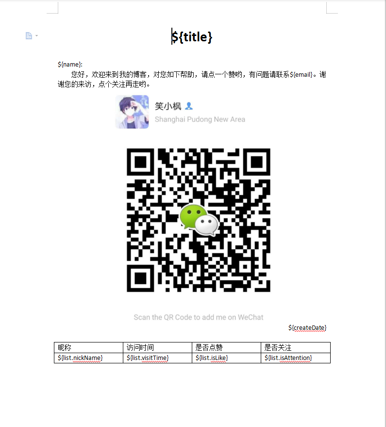
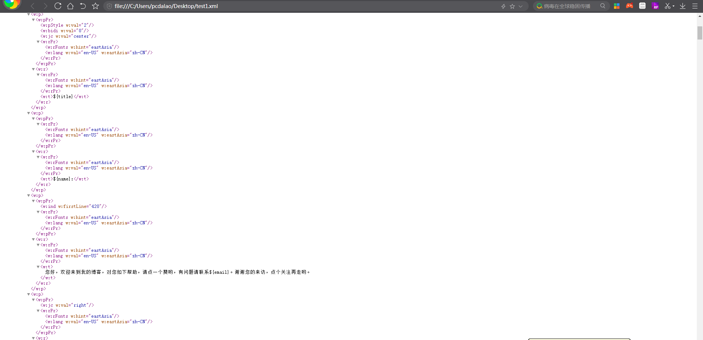
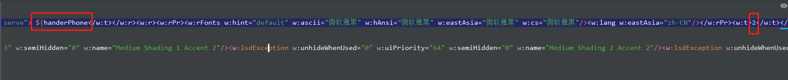
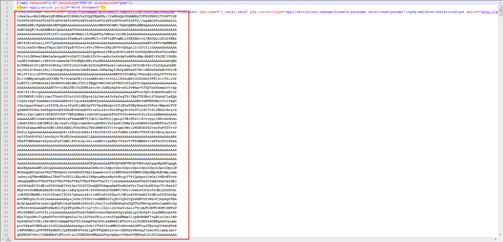
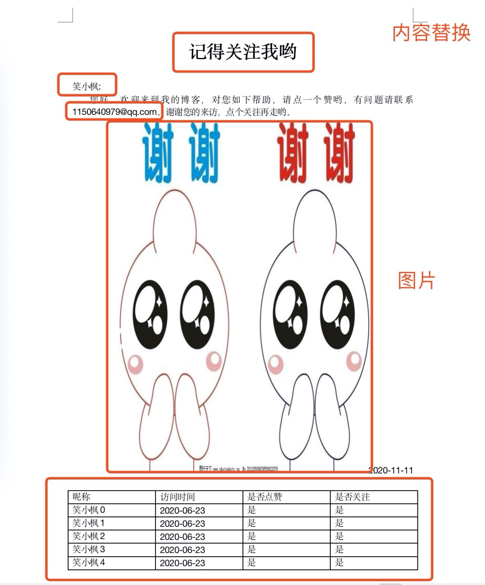

### 通过maven引入需要的依赖

~~~
<dependency>
    <groupId>org.freemarker</groupId>
    <artifactId>freemarker</artifactId>
    <version>2.3.23</version>
</dependency>
~~~

### 创建导出模版
#### 1、首先创建一个word模版文档，模版如下图

 
 
 word模版地址：(../images/exportword/01.jpg)
 
 注意word中的占位符的格式，就是freemaker的格式
 
 详细解释如下：
 
 * 文字处理：
 
 直接用${} 中间为替换的字段名。
 
 如果直接在word里面定义${title}，在转换成xml的时候有可能会被一些编码隔开，这个时候只需要用word打开xml，将这些内容重新输入一遍。
 
 可以用浏览器打开xml，检出自己定义的${}的内容是否都在一起，是否有被编码隔开的情况。
 
 * 图片处理：
 
 需要在word文档模版中插入图片
 
 将word转换成xml后，打开xml，会将我们的图片转换成长长的一段base64。
 
 我们把base64换成我们的${pic}就可以了，pic为字段名，可任意替换
 
 * 列表处理：
 
 需要在word文档模版中插入表格
 
 找到第二个`<w:tr>`，在其前面添加 <#list peopleList as list> 其中 peopleList是传入list的集合名称 list 是别名。
 
 参数取值为：${list.name}这样。
 
 在与`<w:tr>`配对的</w:tr>后面添加</#list>。 语法同freemaker的for循环语法
 
#### 创建ftl模板
将上述word文档另存为test.xml格式，另存完之后可以用浏览器打开test.xml文件，查看我们的占位符是否标准

注意：占位符有时候会发生被隔开的情况，如下图：

图片的替换同上面的说明，图片为一串长长的base64，如下图所示：

然后将文件放置resources/template/voice目录下，并将后缀名改为ftl。

放置在resource目录下即可，剩下的目录根据自己需求定制。注意要与WordUtil.java中的目录对应。

### 编写程序

#### 通用的导出工具类
~~~java
import freemarker.template.Configuration;
import freemarker.template.Template;
import freemarker.template.TemplateException;
import java.io.*;
import java.util.Map;

public class WordUtil {

    private final Configuration configuration;

    public WordUtil(){
        configuration = new Configuration();
        configuration.setDefaultEncoding("UTF-8");
    }

    public void createWord(Map<String,Object> dataMap, String templateName, String fileName){
        //模板文件所在路径
        configuration.setClassForTemplateLoading(this.getClass(), "/template/voice");
        Template t;
        try {
            //获取模板文件
            t = configuration.getTemplate(templateName);
        } catch (IOException e) {
            e.printStackTrace();
        }
        //导出文件
        File outFile = new File(fileName);
        try {
            Writer out = new BufferedWriter(new OutputStreamWriter(new FileOutputStream(outFile)));
            if (t != null) {
                //将填充数据填入模板文件并输出到目标文件
                t.process(dataMap, out);
            }
            out.close();
        } catch (IOException | TemplateException e1) {
            e1.printStackTrace();
        }
    }
}

~~~

#### 浏览器请求接口详情
~~~java
@RestController
@RequestMapping
public class VoiceInfoController{
    
    /**
     * 文字处理：
     *      直接用${} 中间为替换的字段名。
     *      如果直接在word里面定义${title}，在转换成xml的时候有可能会被一些编码隔开，这个时候只需要用word打开xml，将这些内容重新输入一遍。
     *      可以用浏览器打开xml，检出自己定义的${}的内容是否都在一起，是否有被编码隔开的情况。
     * 图片处理：
     *      需要在word文档模版中插入图片
     *      将word转换成xml后，打开xml，会将我们的图片转换成长长的一段base64。
     *      我们把base64换成我们的${pic}就可以了，pic为字段名，可任意替换
     * 列表处理：
     *      需要在word文档模版中插入表格
     *      找到第二个<w:tr>，在其前面添加 <#list peopleList as list> 其中 peopleList是传入list的集合名称 list 是别名。
     *      参数取值为：${list.name}这样。
     *      在与<w:tr>配对的</w:tr>后面添加</#list>。 语法同freemaker的for循环语法
     */
    @GetMapping("/exportWord")
    public Result exportWord(HttpServletRequest request, HttpServletResponse response) throws IOException{
        // 1.创建临时文件夹
        String rootPath = request.getSession().getServletContext().getRealPath("/");
        System.out.println(rootPath);
        String fileName = UUID.randomUUID().toString().replaceAll("-", "");

        // 处理图片信息，将图片转为base64字符串
        File imageFile = new File("D:\\Maple\\thanks.jpg");
        Base64.Encoder base64 = Base64.getEncoder();
        FileInputStream fis = new FileInputStream(imageFile);
        ByteArrayOutputStream bos = new ByteArrayOutputStream();
        byte[] b = new byte[1024];
        int n;
        while ((n = fis.read(b)) != -1)
        {
            bos.write(b, 0, n);
        }
        fis.close();
        bos.close();

        // 处理表格的数据信息
        List<Map<String, Object>> list = new ArrayList<>();
        for (int i = 0; i < 5; i++) {
            Map<String, Object> map = new HashMap<>();
            map.put("nickName", "笑小枫" + i);
            map.put("visitTime", DateUtil.parseDateToString(null, new Date()));
            map.put("isLike", "是");
            map.put("isAttention", "是");
            list.add(map);
        }

        // 加载word中的数据信息
        WordUtil word = new WordUtil();
        Map<String, Object> dataMap = new HashMap<>();
        dataMap.put("title", "记得关注我哟");
        dataMap.put("email", "1150640979@qq.com");
        dataMap.put("name", "笑小枫");
        dataMap.put("createDate", "2020-11-11");
        dataMap.put("pic", base64.encodeToString(bos.toByteArray()));
        dataMap.put("peopleList", list);
        word.createWord(dataMap, "testWord.ftl", rootPath + "/"+fileName+".doc");

        File file = new File(rootPath + "/"+fileName+".doc");
        InputStream fin = null;
        ServletOutputStream out = null;
        try {
            // 调用工具类的createDoc方法生成Word文档
            fin = new FileInputStream(file);

            String exportName = "测试word";
            //根据浏览器类型处理文件名称
            String agent = request.getHeader("USER-AGENT").toLowerCase();
            String firefox = "firefox";
            //若是火狐
            if (agent.contains(firefox)) {
                exportName = new String(exportName.getBytes(StandardCharsets.UTF_8), "ISO8859-1");
            } else {//其他浏览器
                exportName = java.net.URLEncoder.encode(exportName, "UTF-8");
            }

            response.setCharacterEncoding("utf-8");
            response.setContentType("application/msword");
            // 设置浏览器以下载的方式处理该文件名
            response.setHeader("Content-Disposition", "attachment;filename=".concat(String.valueOf(URLEncoder.encode(exportName + ".doc", "UTF-8"))));

            out = response.getOutputStream();
            // 缓冲区
            byte[] buffer = new byte[512];
            int bytesToRead;
            // 通过循环将读入的Word文件的内容输出到浏览器中
            while ((bytesToRead = fin.read(buffer)) != -1) {
                out.write(buffer, 0, bytesToRead);
            }
        } catch (IOException e) {
            e.printStackTrace();
        } finally {
            if (fin != null) {
                fin.close();
            }
            if (out != null) {
                out.close();
            }
            // 删除临时文件
            file.delete();
        }
        return Result.success();
    }
}
~~~

### 测试

在浏览器输入http://127.0.0.1:8003/exportWord便可以看到你的word出来了呦。

导出效果图如下：

> 本文到此结束了，后续文章会陆续更新，文档会同步在CSDN和GitHub保持同步更新。 
> 点个关注再走呗~~~
