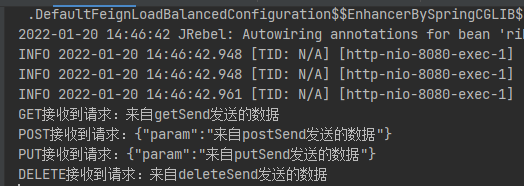

## HttpClient简介

HttpClient 是 Apache Jakarta Common 下的子项目，可以用来提供高效的、最新的、功能丰富的支持 HTTP 协议的客户端编程工具包，并且它支持 HTTP 协议最新的版本和建议。
超文本传输协议（HTTP）可能是当今Internet上使用的最重要的协议。
Web服务，支持网络的设备和网络计算的发展继续将HTTP协议的作用扩展到用户驱动的Web浏览器之外，同时增加了需要HTTP支持的应用程序的数量。
尽管java.net包提供了通过HTTP访问资源的基本功能，但它并未提供许多应用程序所需的完全灵活性或功能。
HttpClient旨在通过提供一个高效，最新且功能丰富的包来实现这一空白，该包实现了最新HTTP标准和建议的客户端。
HttpClient专为扩展而设计，同时为基本HTTP协议提供强大支持，HttpClient可能对构建支持HTTP的客户端应用程序（如Web浏览器，Web服务客户端或利用或扩展HTTP协议进行分布式通信的系统）感兴趣。

HttpClient 提供的主要的功能
1. 实现了所有 HTTP 的方法（GET,POST,PUT,DELETE 等）
2. 支持自动转向
3. 支持 HTTPS 协议
4. 支持代理服务器等

## HttpClient使用流程

1. 使用 HttpClient 发送请求、接收响应很简单，一般需要如下几步即可。
2. 创建 HttpClient 对象。
3. 创建请求方法的实例，并指定请求 URL。如果需要发送 GET 请求，创建 HttpGet 对象；如果需要发送 POST 请求，创建 HttpPost 对象。
4. 如果需要发送请求参数，可调用 HttpGet、HttpPost 共同的 setParams(HttpParams params) 方法来添加请求参数；对于 HttpPost 对象而言，也可调用 setEntity(HttpEntity entity) 方法来设置请求参数。
5. 调用 HttpClient 对象的 execute(HttpUriRequest request) 发送请求，该方法返回一个 HttpResponse。
6. 调用 HttpResponse 的 getAllHeaders()、getHeaders(String name) 等方法可获取服务器的响应头；调用 HttpResponse 的 getEntity() 方法可获取 HttpEntity 对象，该对象包装了服务器的响应内容。程序可通过该对象获取服务器的响应内容。
7. 释放连接。无论执行方法是否成功，都必须释放连接

## 简单的HttpClient使用示例
~~~
@Test
public void TestGet() throws IOException {

    String urlTest = "https://zhangfz.blog.csdn.net/article/details/122591052";
    // 1.创建httpclient
    CloseableHttpClient httpclient = HttpClients.createDefault();
    //2. 创建HttpGet
    HttpGet httpGetTest1 = new HttpGet(urlTest);
    // 3. 请求执行，获取响应
    CloseableHttpResponse response =  httpclient.execute(httpGetTest1);
    System.out.println(response);
    // 4.获取响应实体
    HttpEntity entityTest = response.getEntity();
    System.out.println(EntityUtils.toString(entityTest,"utf-8"));
    response.close();
    httpclient.close();
}
~~~

详细的操作请看下下面的工具类和测试代码

## HttpClientUtil工具类

普通的的请求直接调用`sendGet(String urlStr, List<HttpReqInfo> param)`即可

如果是https请求，需要默认信任ssl证书时，调用`sendGet(CloseableHttpClient httpClient, String urlStr, List<HttpReqInfo> param)`

`CloseableHttpClient httpClient` 传输工具类中的`getSslHttpsClient()`即可

详细源码如下：

~~~java
package com.xiaoxiaofeng;

import org.apache.http.HttpEntity;
import org.apache.http.NameValuePair;
import org.apache.http.client.config.RequestConfig;
import org.apache.http.client.entity.EntityBuilder;
import org.apache.http.client.methods.*;
import org.apache.http.client.utils.URLEncodedUtils;
import org.apache.http.conn.ssl.SSLConnectionSocketFactory;
import org.apache.http.conn.ssl.TrustStrategy;
import org.apache.http.entity.ContentType;
import org.apache.http.impl.client.CloseableHttpClient;
import org.apache.http.impl.client.HttpClients;
import org.apache.http.message.BasicNameValuePair;
import org.apache.http.protocol.HttpContext;
import org.apache.http.ssl.SSLContextBuilder;
import org.apache.http.util.EntityUtils;
import com.xiaoxiaofeng.HttpReqInfo;
import org.slf4j.Logger;
import org.slf4j.LoggerFactory;

import javax.net.ssl.SSLContext;
import java.io.IOException;
import java.nio.charset.StandardCharsets;
import java.security.GeneralSecurityException;
import java.util.ArrayList;
import java.util.List;

/**
 * @author 笑小枫
 */
public class HttpClientUtil {

    private HttpClientUtil() {

    }

    protected static final Logger logger = LoggerFactory.getLogger(HttpClientUtil.class);
    private static final String ERROR_MSG = "Exception :";

    /**
     * 取得默认连接客户端，默认获取连接，发送，读取为5分钟超时.
     *
     * @return 默认连接客户端
     */
    public static CloseableHttpClient getDefaultHttpClient() {
        return getCloseableHttpClient(false);
    }

    /**
     * 取得连接客户端，默认获取连接，发送，读取为5分钟超时.
     * 跳过ssl证书验证，为全信任
     *
     * @return 默认连接客户端
     */
    public static CloseableHttpClient getSslHttpsClient() {
        return getCloseableHttpClient(true);
    }

    /**
     * 取得连接客户端，默认获取连接，发送，读取为5分钟超时.
     *
     * @param isSsl 是否ssl证书验证，并信任跳过
     * @return 默认连接客户端
     */
    private static CloseableHttpClient getCloseableHttpClient(boolean isSsl) {
        CloseableHttpClient httpClient = null;
        RequestConfig requestConfig = RequestConfig.custom().setConnectionRequestTimeout(180000).setConnectTimeout(180000).setSocketTimeout(180000).build();
        try {
            if (isSsl) {
                httpClient = HttpClients.custom().setSSLSocketFactory(createSslConnSocketFactory()).setDefaultRequestConfig(requestConfig).build();
            } else {
                httpClient = HttpClients.custom().setDefaultRequestConfig(requestConfig).build();
            }

        } catch (Exception e) {
            logger.error(ERROR_MSG, e);
        }
        return httpClient;
    }

    /**
     * 发送GET请求
     *
     * @param urlStr 请求url
     * @param param  请求参数
     * @return 请求结果
     */
    public static String sendGet(String urlStr, List<HttpReqInfo> param) {
        return sendGet(getDefaultHttpClient(), urlStr, param);
    }

    /**
     * 发送GET请求(指定客户端)
     *
     * @param httpClient 客户端
     * @param urlStr     请求url
     * @param param      请求参数
     * @return 请求结果
     */
    public static String sendGet(CloseableHttpClient httpClient, String urlStr, List<HttpReqInfo> param) {
        return sendGetContext(httpClient, urlStr, param, null);
    }

    /**
     * 发送GET请求(指定客户端)
     *
     * @param httpClient  客户端
     * @param urlStr      请求url
     * @param param       请求参数
     * @param httpContext 请求http上下文
     * @return 请求结果
     */
    public static String sendGetContext(CloseableHttpClient httpClient, String urlStr, List<HttpReqInfo> param, HttpContext httpContext) {
        String result = "";

        try {
            CloseableHttpResponse httpResponse = sendGetContextRes(httpClient, urlStr, param, httpContext);
            result = consumeResponse(httpResponse);
        } catch (Exception e) {
            logger.error(ERROR_MSG, e);
        } finally {
            try {
                httpClient.close();
            } catch (IOException e) {
                logger.error(ERROR_MSG, e);
            }
        }

        return result;
    }

    /**
     * 发送GET请求(指定客户端)
     *
     * @param httpClient  客户端
     * @param urlStr      请求url
     * @param param       请求参数
     * @param httpContext 请求http上下文
     * @return 请求结果
     * @throws IOException 异常
     */
    public static CloseableHttpResponse sendGetContextRes(CloseableHttpClient httpClient,
                                                          String urlStr,
                                                          List<HttpReqInfo> param,
                                                          HttpContext httpContext) throws IOException {
        urlStr = generateUrlWithParam(urlStr, param);
        HttpGet httpGet = new HttpGet(urlStr);
        return httpClient.execute(httpGet, httpContext);
    }

    /**
     * JSON形式发送POST请求
     *
     * @param urlStr 请求url
     * @param json   json内容
     * @return 请求结果
     */
    public static String sendJsonPost(String urlStr, String json) {
        return sendJsonPostHeader(getDefaultHttpClient(), urlStr, json, null);
    }

    /**
     * JSON形式发送POST请求(指定客户端)
     *
     * @param httpClient 客户端
     * @param urlStr     请求url
     * @param json       json内容
     * @return 请求结果
     */
    public static String sendJsonPost(CloseableHttpClient httpClient, String urlStr, String json) {
        return sendJsonPostHeader(httpClient, urlStr, json, null);
    }

    /**
     * JSON形式发送POST请求(指定客户端、包含请求头)
     *
     * @param httpClient 客户端
     * @param urlStr     请求url
     * @param json       json内容
     * @param header     请求头
     * @return 请求结果
     */
    public static String sendJsonPostHeader(CloseableHttpClient httpClient, String urlStr, String json, List<HttpReqInfo> header) {
        return sendBodyPostHeaderContext(httpClient, urlStr, json, header, null);
    }

    /**
     * 发送POST请求(指定客户端、包含请求头)
     *
     * @param httpClient  客户端
     * @param urlStr      请求url
     * @param body        body内容
     * @param header      请求头
     * @param httpContext 请求http上下文
     * @return 请求结果
     */
    public static String sendBodyPostHeaderContext(CloseableHttpClient httpClient,
                                                   String urlStr,
                                                   String body,
                                                   List<HttpReqInfo> header,
                                                   HttpContext httpContext) {
        String result = "";
        try {
            CloseableHttpResponse httpResponse = sendBodyPostHeaderContextRes(httpClient, urlStr, body, header, httpContext);
            result = consumeResponse(httpResponse);
        } catch (Exception e) {
            logger.error(ERROR_MSG, e);
        } finally {
            try {
                httpClient.close();
            } catch (IOException e) {
                logger.error(ERROR_MSG, e);
            }
        }
        return result;
    }

    /**
     * 发送POST请求(指定客户端、包含请求头)
     *
     * @param httpClient  客户端
     * @param urlStr      请求url
     * @param body        body内容
     * @param header      请求头
     * @param httpContext 请求http上下文
     * @return 请求结果
     * @throws IOException 异常
     */
    public static CloseableHttpResponse sendBodyPostHeaderContextRes(CloseableHttpClient httpClient, String urlStr, String body, List<HttpReqInfo> header, HttpContext httpContext) throws IOException {
        EntityBuilder eb = EntityBuilder.create().setContentType(ContentType.APPLICATION_JSON).setText(body);
        HttpPost httpPost = new HttpPost(urlStr);
        if (header != null && !header.isEmpty()) {
            for (HttpReqInfo headerInfo : header) {
                if (!headerInfo.isHeader()) {
                    continue;
                }
                httpPost.addHeader(headerInfo.getParam(), headerInfo.getValue());
            }
        }
        httpPost.setEntity(eb.build());
        return httpClient.execute(httpPost, httpContext);
    }

    /**
     * JSON形式发送PUT请求
     *
     * @param urlStr 请求url
     * @param json   json内容
     * @return 请求结果
     */
    public static String sendJsonPut(String urlStr, String json) {
        return sendJsonPutHeader(getDefaultHttpClient(), urlStr, json, null);
    }

    /**
     * JSON形式发送PUT请求(指定客户端)
     *
     * @param httpClient 客户端
     * @param urlStr     请求url
     * @param json       json内容
     * @return 请求结果
     */
    public static String sendJsonPut(CloseableHttpClient httpClient, String urlStr, String json) {
        return sendJsonPutHeader(httpClient, urlStr, json, null);
    }

    /**
     * JSON形式发送PUT请求(指定客户端、包含请求头)
     *
     * @param httpClient 客户端
     * @param urlStr     请求url
     * @param json       json内容
     * @param header     请求头
     * @return 请求结果
     */
    public static String sendJsonPutHeader(CloseableHttpClient httpClient, String urlStr, String json, List<HttpReqInfo> header) {
        return sendBodyPutHeaderContext(httpClient, urlStr, json, header, null);
    }

    /**
     * 发送PUT请求(指定客户端、包含请求头)
     *
     * @param httpClient  客户端
     * @param urlStr      请求url
     * @param body        body内容
     * @param header      请求头
     * @param httpContext 请求http上下文
     * @return 请求结果
     */
    public static String sendBodyPutHeaderContext(CloseableHttpClient httpClient,
                                                  String urlStr,
                                                  String body,
                                                  List<HttpReqInfo> header,
                                                  HttpContext httpContext) {
        String result = "";
        try {
            CloseableHttpResponse httpResponse = sendBodyPutHeaderContextRes(httpClient, urlStr, body, header, httpContext);
            result = consumeResponse(httpResponse);
        } catch (Exception e) {
            logger.error(ERROR_MSG, e);
        } finally {
            try {
                httpClient.close();
            } catch (IOException e) {
                logger.error(ERROR_MSG, e);
            }
        }
        return result;
    }

    /**
     * 发送PUT请求(指定客户端、包含请求头)
     *
     * @param httpClient  客户端
     * @param urlStr      请求url
     * @param body        body内容
     * @param header      请求头
     * @param httpContext 请求http上下文
     * @return 请求结果
     * @throws IOException 异常
     */
    public static CloseableHttpResponse sendBodyPutHeaderContextRes(CloseableHttpClient httpClient,
                                                                    String urlStr,
                                                                    String body, List<HttpReqInfo> header,
                                                                    HttpContext httpContext) throws IOException {
        EntityBuilder eb = EntityBuilder.create().setContentType(ContentType.APPLICATION_JSON).setText(body);
        HttpPut httpPut = new HttpPut(urlStr);
        if (header != null && !header.isEmpty()) {
            for (HttpReqInfo headerInfo : header) {
                if (!headerInfo.isHeader()) {
                    continue;
                }
                httpPut.addHeader(headerInfo.getParam(), headerInfo.getValue());
            }
        }
        httpPut.setEntity(eb.build());
        return httpClient.execute(httpPut, httpContext);
    }

    /**
     * 发送DELETE请求
     *
     * @param urlStr 请求url
     * @param param  请求参数
     * @return 请求结果
     */
    public static String sendDelete(String urlStr, List<HttpReqInfo> param) {
        return sendDelete(getDefaultHttpClient(), urlStr, param);
    }

    /**
     * 发送GET请求(指定客户端)
     *
     * @param httpClient 客户端
     * @param urlStr     请求url
     * @param param      请求参数
     * @return 请求结果
     */
    public static String sendDelete(CloseableHttpClient httpClient, String urlStr, List<HttpReqInfo> param) {
        return sendDeleteContext(httpClient, urlStr, param, null);
    }

    /**
     * 发送GET请求(指定客户端)
     *
     * @param httpClient  客户端
     * @param urlStr      请求url
     * @param param       请求参数
     * @param httpContext 请求http上下文
     * @return 请求结果
     */
    public static String sendDeleteContext(CloseableHttpClient httpClient, String urlStr, List<HttpReqInfo> param, HttpContext httpContext) {
        String result = "";

        try {
            CloseableHttpResponse httpResponse = sendDeleteContextRes(httpClient, urlStr, param, httpContext);
            result = consumeResponse(httpResponse);
        } catch (Exception e) {
            logger.error(ERROR_MSG, e);
        } finally {
            try {
                httpClient.close();
            } catch (IOException e) {
                logger.error(ERROR_MSG, e);
            }
        }

        return result;
    }

    /**
     * 发送GET请求(指定客户端)
     *
     * @param httpClient  客户端
     * @param urlStr      请求url
     * @param param       请求参数
     * @param httpContext 请求http上下文
     * @return 请求结果
     * @throws IOException 异常
     */
    public static CloseableHttpResponse sendDeleteContextRes(CloseableHttpClient httpClient,
                                                             String urlStr,
                                                             List<HttpReqInfo> param,
                                                             HttpContext httpContext) throws IOException {
        urlStr = generateUrlWithParam(urlStr, param);
        HttpDelete httpDelete = new HttpDelete(urlStr);
        return httpClient.execute(httpDelete, httpContext);
    }

    /**
     * 生成完整url
     *
     * @param url   url
     * @param param 参数
     * @return 完整url
     */
    public static String generateUrlWithParam(String url, List<HttpReqInfo> param) {
        if (param == null || param.isEmpty()) {
            return url;
        }
        List<NameValuePair> nvpList = new ArrayList<>();
        for (HttpReqInfo reqInfo : param) {
            nvpList.add(new BasicNameValuePair(reqInfo.getParam(), reqInfo.getValue()));
        }
        return String.format("%s?%s", url, URLEncodedUtils.format(nvpList, StandardCharsets.UTF_8));
    }

    /**
     * 消费返回报文
     *
     * @param httpResponse 接口返回的结果
     * @return 解析后的结果
     * @throws IOException 异常信息
     */
    private static String consumeResponse(CloseableHttpResponse httpResponse) throws IOException {
        String result = "";
        try {
            // 获取响应实体
            HttpEntity entity = httpResponse.getEntity();
            if (entity != null) {
                result = EntityUtils.toString(entity, StandardCharsets.UTF_8);
            }
            EntityUtils.consume(entity);
        } finally {
            httpResponse.close();
        }
        return result;
    }

    /**
     * 创建SSL安全连接
     */
    private static SSLConnectionSocketFactory createSslConnSocketFactory() {
        SSLConnectionSocketFactory ssl = null;
        try {
            SSLContext sslContext = new SSLContextBuilder().loadTrustMaterial(null, (TrustStrategy) (chain, authType) -> true).build();
            ssl = new SSLConnectionSocketFactory(sslContext, (s, sslSession) -> Boolean.TRUE);
        } catch (GeneralSecurityException e) {
            e.printStackTrace();
        }
        return ssl;
    }
}
~~~

## 测试发送请求

~~~java
package com.xiaoxiaofeng;

import com.alibaba.fastjson.JSONObject;
import com.xiaoxiaofeng.HttpClientUtil;
import org.springframework.web.bind.annotation.GetMapping;
import org.springframework.web.bind.annotation.RequestMapping;
import org.springframework.web.bind.annotation.RestController;

import java.util.ArrayList;
import java.util.List;

/**
 * @author zhangfuzeng
 * @date 2022/1/20
 */
@RequestMapping("/send")
@RestController
public class TestSendController {

    private final String url = "http://127.0.0.1:8080";

    @GetMapping("/getSend")
    public void getSend() {
        List<HttpReqInfo> param = new ArrayList<>();
        HttpReqInfo httpReqInfo = new HttpReqInfo("param", "来自getSend发送的数据");
        param.add(httpReqInfo);
        HttpClientUtil.sendGet(url + "/receive/getReceive", param);
    }

    @GetMapping("/postSend")
    public void postSend() {
        JSONObject jsonObject = new JSONObject();
        jsonObject.put("param", "来自postSend发送的数据");
        HttpClientUtil.sendJsonPost(url + "/receive/postReceive", jsonObject.toJSONString());
    }

    @GetMapping("/putSend")
    public void putSend() {
        JSONObject jsonObject = new JSONObject();
        jsonObject.put("param", "来自putSend发送的数据");
        HttpClientUtil.sendJsonPut(url + "/receive/putReceive", jsonObject.toJSONString());
    }

    @GetMapping("/deleteSend")
    public void deleteSend() {
        List<HttpReqInfo> param = new ArrayList<>();
        HttpReqInfo httpReqInfo = new HttpReqInfo("param", "来自deleteSend发送的数据");
        param.add(httpReqInfo);
        HttpClientUtil.sendDelete(url + "/receive/deleteReceive", param);
    }
}

~~~

## 测试接收请求

~~~java
package com.xiaoxiaofeng;

import com.alibaba.fastjson.JSONObject;
import org.springframework.web.bind.annotation.*;

/**
 * @author zhangfuzeng
 * @date 2022/1/20
 */
@RestController
@RequestMapping("/receive")
public class TestReceiveController {
    @GetMapping("/getReceive")
    public void getReceive(String param) {
        System.out.println("GET接收到请求：" + param);
    }

    @PostMapping("/postReceive")
    public void postReceive(@RequestBody JSONObject json) {
        System.out.println("POST接收到请求：" + json.toJSONString());
    }

    @PutMapping("/putReceive")
    public void putReceive(@RequestBody JSONObject json) {
        System.out.println("PUT接收到请求：" + json.toJSONString());
    }

    @DeleteMapping("/deleteReceive")
    public void deleteReceive(String param) {
        System.out.println("DELETE接收到请求：" + param);
    }
}

~~~

## Get请求参数封装类

~~~java
package com.xiaoxiaofeng;

import lombok.Getter;
import lombok.Setter;

/**
 * @author Leeyc
 *
 */
@Getter
@Setter
public class HttpReqInfo {

    private boolean header;
    private boolean file;
    private String param;
    private String value;
    private String fileName;
    private byte[] data;

    public HttpReqInfo(String param, String value) {
        this.header = false;
        this.file = false;
        this.param = param;
        this.value = value;
    }

    public HttpReqInfo(String param, String fileName, byte[] data) {
        this.header = false;
        this.file = true;
        this.param = param;
        this.fileName = fileName;
        this.data = data;
    }

    public HttpReqInfo(String param, String value, boolean header) {
        this.header = header;
        this.file = false;
        this.param = param;
        this.value = value;
    }

}
~~~

测试结果如下：

