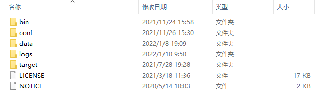

## 环境配置

* JDK8
* SpringBoot：2.3.12.RELEASE
* nacos：2.0.3

## 安装Nacos

下载地址：[https://github.com/alibaba/nacos/releases/tag/2.0.3](https://github.com/alibaba/nacos/releases/tag/2.0.3)

本文使用的是2.0.3版本

以下文章以windows系统为例：

下载后解压到对应的文件夹中，解压后目录如下：

在0.7版本之前，在单机模式时nacos使用嵌入式数据库实现数据的存储，不方便观察数据存储的基本情况。0.7版本增加了支持mysql数据源能力。我们此处采用mysql的方式：

在conf目录下找到nacos-mysql.sql文件，并在我们本地的数据库(需要安装mysql)中执行。

执行完脚本，生成数据库如下：

我们需要修改conf目录下的application.properties配置文件。连接我们自己的数据库

~~~
#*************** Config Module Related Configurations ***************#
### If use MySQL as datasource:
spring.datasource.platform=mysql

### Count of DB:
db.num=1

### Connect URL of DB:
db.url.0=jdbc:mysql://127.0.0.1:3306/nacos?characterEncoding=utf8&connectTimeout=1000&socketTimeout=3000&autoReconnect=true&useUnicode=true&useSSL=false&serverTimezone=UTC
db.user.0=root
db.password.0=Zhang123
~~~

到此，nacos在windows环境的下载与安装就完成了。

## 启动Nacos

在bin目录下，有启动nacos的startup.cmd文件，我们这边创建的是单机环境，所以使用单机版的启动命令

windows启动命令为`cmd startup.cmd -m standalone`

集群的启动命令为：`cmd startup.cmd -m cluster`

每次执行命令启动，显然不符合懒惰的我，我们简单封装一个脚本

创建一个windons的批处理文件`startstandalone.bat`，代码如下：

~~~bat
./startup.cmd -m standalone
~~~

创建后，放在和startup.cmd同一个目录下，然后双击执行`startstandalone.bat`文件就可以了。

到此，nacos就启动成功了。

## 配置Nacos

nacos服务启动后，访问如下网址：

http://127.0.0.1:8848/nacos/index.html#/login

用户名：nacos 密码：nacos

登录后可以以下页面（新建的应该是空的，我的这个进行过一些配置）

简单的说说，使用Nacos当配置中心的简单配置

在配置管理-配置列表进行新增配置，如下图所示：

点图中的加号，就可以创建对应的配置

根据项目需求，可以创建多个命名空间

创建后展示的效果如下：

## SpringBoot继承Nacos作为配置中心

首先创建一个SpringBoot项目，这里不做过多的赘述，详情可参考：

添加nacos配置

在pom.xml中引入依赖，注意，和alibaba Cloud的引入方式不同，这里只是单服务的SpringBoot项目

~~~
<dependency>
    <groupId>com.alibaba.boot</groupId>
    <artifactId>nacos-config-spring-boot-starter</artifactId>
    <version>0.2.10</version>
</dependency>
~~~

### 简单点的配置(不推荐)

在application.java的启动项上添加注解

~~~
@NacosPropertySource(dataId = "maple-admin", autoRefreshed = true)
~~~

在application.properties配置文件添加配置

~~~
spring.application.name=maple-admin
server.port=8888
nacos.config.server-addr=127.0.0.1:8848
nacos.config.namespace=dev
~~~

编写测试类

~~~java

import lombok.RequiredArgsConstructor;
import org.springframework.beans.factory.annotation.Value;
import org.springframework.web.bind.annotation.GetMapping;
import org.springframework.web.bind.annotation.RestController;

/**
 * @author 笑小枫
 * @date 2021/11/24
 */
@RestController
@RequiredArgsConstructor
public class DemoController {

    @Value("${test:bbb}")
    private String test;

    @GetMapping("/get")
    public String get() {
        return test;
    }
}
~~~

请求返回

### 详细的配置（推荐）

调整application.properties配置文件为application.yml(非必须操作，只是我比较喜欢用yml格式，可以忽略哈)

~~~yml
server:
  port: 8888

spring:
  application:
    name: maple-admin

nacos:
  config:
    bootstrap:
      # 开启预加载配置
      enable: true
    # nacos的ip地址和端口
    server-addr: 192.168.1.2:8848
    # nacos登录用户名
    username: nacos
    # nacos登录密码
    password: nacos
    # nacos命名空间id为 dev
    namespace: dev
    # 创建的配置的data-id，多个配置使用”,“隔开
    data-ids: maple-admin, maple-admin-mysql
    # 创建的配置的group
    group: DEFAULT_GROUP
    # 配置文件的后缀名
    type: YAML
    # 自动刷新配置
    auto-refresh: true
    # 长轮询的重试次数
    max-retry: 10
    # 重试间隔时间
    config-retry-time: 2000
    # 长轮询的超时时间
    config-long-poll-timeout: 46000
~~~

配置对应的nacos的配置如下图所示：

测试的方式同上，注意不同的namespace和data-ids

如果需要实时的刷新配置，可以使用`@NacosValue`注解，设置autoRefreshed=true，默认false

~~~
@NacosValue(value = "${test:bbb}",autoRefreshed = true)
~~~

## 写在最后

后续更多高级的使用，以及在项目中的实战，欢迎大家关注MapleAdmin的搭建

我是笑小枫，欢迎大家关注、点赞、吐槽~~~

