> 项目使用Spring Cloud 分布式框架，使用过程中，客户提出了购买物品时，调用库存微服务，使用库存后，调用支付微服务失败，库存数据未正常回滚，导致数据两边数据不一致的问题。因此决定引入阿里的分布式事务Seata。
本文边详细的介绍一下整合的过程，以及整合过程中遇到的问题。

* 项目使用到的框架版本
* SpringBoot : 1.5.13.RELEASE
* SpringCloud : Edgware.SR3
* SpringCloud Alibaba : 1.5.1.RELEASE
* mybatis-plus : 3.1.0
* druid : 1.1.12
* seata : 0.9.0
* mysql : 8.0

### 选择对应的版本

可以在 Github上spring-cloud-alibaba的开源项目找到SpringCloud对应的seata版本

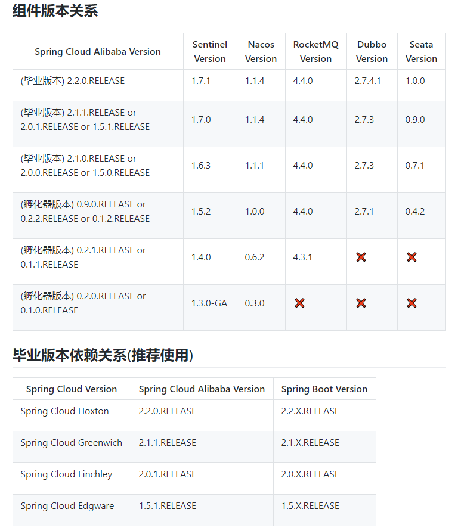

找到项目对应的版本后，下载对应的seata server，下载地址：https://github.com/seata/seata/releases

* windows下载 seata-server-0.9.0.zip
* Linux下载 seata-server-0.9.0.tar.gz

### 配置Seata Server服务

下载完对应的版本后， 将其解压。可以看到内容如下：

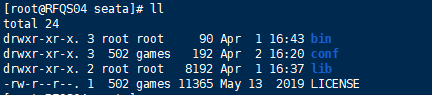

* bin：主要放置Seata server的启动文件
* conf：主要放置Seata server的配置文件和数据库表结构
* lib：主要放置一些依赖的jar包

conf的目录如下：

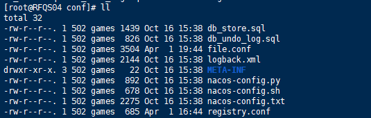

* db_undo_log.sql：初始化的数据库的表结构
* file.conf：Seata server的配置文件
* registry.conf：Seata server注册的配置文件

#### 修改conf下的registry.conf文件

~~~
registry {
  # file 、nacos 、eureka、redis、zk、consul、etcd3、sofa
  type = "eureka"  # 修改这里，这里我使用的时eureka注册中心，对应下面的eureka配置，其他的配置信息可删除

  nacos {
    serverAddr = "localhost"
    namespace = ""
    cluster = "default"
  }
  
  # 修改这里，因为上面用的是eureka，需要配置下面的eureka注册信息
  eureka {
    serviceUrl = "http://127.0.0.1:8761/eureka"
    application = "seata-server"
    weight = "1"
  }
  redis {
    serverAddr = "localhost:6379"
    db = "0"
  }
  zk {
    cluster = "default"
    serverAddr = "127.0.0.1:2181"
    session.timeout = 6000
    connect.timeout = 2000
  }
  consul {
    cluster = "default"
    serverAddr = "127.0.0.1:8500"
  }
  etcd3 {
    cluster = "default"
    serverAddr = "http://localhost:2379"
  }
  sofa {
    serverAddr = "127.0.0.1:9603"
    application = "default"
    region = "DEFAULT_ZONE"
    datacenter = "DefaultDataCenter"
    cluster = "default"
    group = "SEATA_GROUP"
    addressWaitTime = "3000"
  }
  file {
    name = "file.conf"
  }
}

config {
  # file、nacos 、apollo、zk、consul、etcd3
  type = "file" # 这里使用file的配置文件，其余的可以删除掉

  nacos {
    serverAddr = "localhost"
    namespace = ""
  }
  consul {
    serverAddr = "127.0.0.1:8500"
  }
  apollo {
    app.id = "seata-server"
    apollo.meta = "http://192.168.1.204:8801"
  }
  zk {
    serverAddr = "127.0.0.1:2181"
    session.timeout = 6000
    connect.timeout = 2000
  }
  etcd3 {
    serverAddr = "http://localhost:2379"
  }
  
  # 使用conf下的file.conf配置
  file {
    name = "file.conf"
  }
}
~~~

#### 修改conf下的file.conf文件
~~~
transport {
  # tcp udt unix-domain-socket
  type = "TCP"
  #NIO NATIVE
  server = "NIO"
  #enable heartbeat
  heartbeat = true
  #thread factory for netty
  thread-factory {
    boss-thread-prefix = "NettyBoss"
    worker-thread-prefix = "NettyServerNIOWorker"
    server-executor-thread-prefix = "NettyServerBizHandler"
    share-boss-worker = false
    client-selector-thread-prefix = "NettyClientSelector"
    client-selector-thread-size = 1
    client-worker-thread-prefix = "NettyClientWorkerThread"
    # netty boss thread size,will not be used for UDT
    boss-thread-size = 1
    #auto default pin or 8
    worker-thread-size = 8
  }
  shutdown {
    # when destroy server, wait seconds
    wait = 3
  }
  serialization = "seata"
  compressor = "none"
}
service {
  #vgroup->rgroup
  vgroup_mapping.my_test_tx_group = "seata-server"  # 修改这里，registry.conf文件里的eureka的application
  #only support single node
  default.grouplist = "127.0.0.1:8091" # 修改这里，这里是seata的默认端口号，启动的时候可以指定端口号，记得对应
  #degrade current not support
  enableDegrade = false
  #disable
  disable = false
  #unit ms,s,m,h,d represents milliseconds, seconds, minutes, hours, days, default permanent
  max.commit.retry.timeout = "-1"
  max.rollback.retry.timeout = "-1"
}

client {
  async.commit.buffer.limit = 10000
  lock {
    retry.internal = 10
    retry.times = 30
  }
  report.retry.count = 5
  tm.commit.retry.count = 1
  tm.rollback.retry.count = 1
}

## transaction log store
store {
  ## store mode: file、db
  mode = "file"  # 这里使用的是file

  ## file store
  file {
    dir = "sessionStore"

    # branch session size , if exceeded first try compress lockkey, still exceeded throws exceptions
    max-branch-session-size = 16384
    # globe session size , if exceeded throws exceptions
    max-global-session-size = 512
    # file buffer size , if exceeded allocate new buffer
    file-write-buffer-cache-size = 16384
    # when recover batch read size
    session.reload.read_size = 100
    # async, sync
    flush-disk-mode = async
  }

  ## database store
  db {
    ## the implement of javax.sql.DataSource, such as DruidDataSource(druid)/BasicDataSource(dbcp) etc.
    datasource = "druid"
    ## mysql/oracle/h2/oceanbase etc.
    db-type = "mysql"
    driver-class-name = "com.mysql.cj.jdbc.Driver"
    url = "jdbc:mysql://192.168.0.65:3306/core"
    user = "root"
    password = "123456"
    min-conn = 1
    max-conn = 3
    global.table = "global_table"
    branch.table = "branch_table"
    lock-table = "lock_table"
    query-limit = 100
  }
}
lock {
  ## the lock store mode: local、remote
  mode = "remote"

  local {
    ## store locks in user's database
  }

  remote {
    ## store locks in the seata's server
  }
}
recovery {
  #schedule committing retry period in milliseconds
  committing-retry-period = 1000
  #schedule asyn committing retry period in milliseconds
  asyn-committing-retry-period = 1000
  #schedule rollbacking retry period in milliseconds
  rollbacking-retry-period = 1000
  #schedule timeout retry period in milliseconds
  timeout-retry-period = 1000
}

transaction {
  undo.data.validation = true
  undo.log.serialization = "jackson"
  undo.log.save.days = 7
  #schedule delete expired undo_log in milliseconds
  undo.log.delete.period = 86400000
  undo.log.table = "undo_log"
}

## metrics settings
metrics {
  enabled = false
  registry-type = "compact"
  # multi exporters use comma divided
  exporter-list = "prometheus"
  exporter-prometheus-port = 9898
}

support {
  ## spring
  spring {
    # auto proxy the DataSource bean
    datasource.autoproxy = false
  }
}
~~~

#### 启动seata server服务

进入bin目录，如果使用的eureka，需要先启动eureka server注册中心，使用其他的，也需要先启动

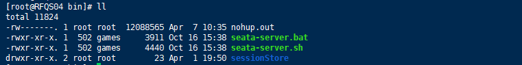

linux下启动seata server: -p 后面可以指定seata server启动的端口号

~~~
nohup sh seata-server.sh -p 8091 &
~~~

启动后可以看到

windows启动直接双击。

启动后查看eureka是否注册到eureka注册中心。

### 在系统服务中配置使用Seata

#### 1、首先通过maven引入seata依赖

在pom.xml的dependencyManagement下引用spring-cloud-alibaba
~~~xml
<!-- 引入seata依赖 -->
<dependencies>
    <dependency>
        <groupId>com.alibaba.cloud</groupId>
        <artifactId>spring-cloud-alibaba-seata</artifactId>
        <version>1.5.1.RELEASE</version>
    </dependency>
</dependencies>

<!-- 引入spring-cloud-alibaba-->
<dependencyManagement>
    <dependencies>
        <dependency>
            <groupId>com.alibaba.cloud</groupId>
            <artifactId>spring-cloud-alibaba-dependencies</artifactId>
            <version>1.5.1.RELEASE</version>
            <type>pom</type>
            <scope>import</scope>
        </dependency>
    <dependencies>
</dependencyManagement>
~~~

#### 2、对应的service需要在resources目录下添加registry.conf和file.conf文件
文件对应内容如下：

* registry.conf
~~~
registry {
  # file 、nacos 、eureka、redis、zk、consul、etcd3、sofa
  type = "eureka"

  eureka {
    serviceUrl = "http://127.0.0.1:8761/eureka"   # 注意这里，对应eureka注册中心
    application = "seata-server"                  # 注意这里，对应registry.conf文件里的eureka的application
    weight = "1"
  }
}

config {
  # file、nacos 、apollo、zk、consul、etcd3
  type = "file"

  file {
    name = "file.conf"
  }
}
~~~

* file.conf
~~~
transport {
  # tcp udt unix-domain-socket
  type = "TCP"
  #NIO NATIVE
  server = "NIO"
  #enable heartbeat
  heartbeat = true
  #thread factory for netty
  thread-factory {
    boss-thread-prefix = "NettyBoss"
    worker-thread-prefix = "NettyServerNIOWorker"
    server-executor-thread-prefix = "NettyServerBizHandler"
    share-boss-worker = false
    client-selector-thread-prefix = "NettyClientSelector"
    client-selector-thread-size = 1
    client-worker-thread-prefix = "NettyClientWorkerThread"
    # netty boss thread size,will not be used for UDT
    boss-thread-size = 1
    #auto default pin or 8
    worker-thread-size = 8
  }
  shutdown {
    # when destroy server, wait seconds
    wait = 3
  }
  serialization = "seata"
  compressor = "none"
}
service {
  #vgroup->rgroup
  vgroup_mapping.my_test_tx_group = "seata-server"   # 注意这里，对应registry.conf文件里的eureka的application
  #only support single node
  default.grouplist = "127.0.0.1:8761:8091"          # 修改这里，对应seata server的ip和端口号
  #degrade current not support
  enableDegrade = false
  #disable
  disable = false
}

client {
  async.commit.buffer.limit = 10000
  lock {
    retry.internal = 10
    retry.times = 30
  }
  report.retry.count = 5
  tm.commit.retry.count = 1
  tm.rollback.retry.count = 1
}
transaction {
  undo.data.validation = true
  undo.log.serialization = "jackson"
  undo.log.save.days = 7
  #schedule delete expired undo_log in milliseconds
  undo.log.delete.period = 86400000
  undo.log.table = "undo_log"
}

support {
  ## spring
  spring {
    # auto proxy the DataSource bean
    datasource.autoproxy = false
  }
}
~~~

#### 3、修改对应微服务下的application.yml配置文件
~~~
spring:
   cloud:
     alibaba:
       seata:
         tx-service-group: my_test_tx_group
~~~

#### 4、创建数据库undo_log表
在每个业务库中创建以下数据库表，表明可以修改，修改后记得修改对应的配置
~~~sql
-- the table to store seata xid data
-- 0.7.0+ add context
-- you must to init this sql for you business databese. the seata server not need it.
-- 此脚本必须初始化在你当前的业务数据库中，用于AT 模式XID记录。与server端无关（注：业务数据库）
-- 注意此处0.3.0+ 增加唯一索引 ux_undo_log
drop table `undo_log`;
CREATE TABLE `undo_log` (
  `id` bigint(20) NOT NULL AUTO_INCREMENT,
  `branch_id` bigint(20) NOT NULL,
  `xid` varchar(100) NOT NULL,
  `context` varchar(128) NOT NULL,
  `rollback_info` longblob NOT NULL,
  `log_status` int(11) NOT NULL,
  `log_created` datetime NOT NULL,
  `log_modified` datetime NOT NULL,
  `ext` varchar(100) DEFAULT NULL,
  PRIMARY KEY (`id`),
  UNIQUE KEY `ux_undo_log` (`xid`,`branch_id`)
) ENGINE=InnoDB AUTO_INCREMENT=1 DEFAULT CHARSET=utf8;
~~~

#### 5、将数据源交于druid自动配置（必须）

禁用Springboot的dataSources自动装配，在启动项添加以下配置
~~~
@SpringBootApplication(exclude = DataSourceAutoConfiguration.class)
~~~

创建dataSources数据源控制：DataSourceConfig.java
~~~java
import com.alibaba.druid.pool.DruidDataSource;
import com.baomidou.mybatisplus.autoconfigure.MybatisPlusProperties;
import com.baomidou.mybatisplus.core.MybatisConfiguration;
import com.baomidou.mybatisplus.core.config.GlobalConfig;
import com.baomidou.mybatisplus.extension.injector.LogicSqlInjector;
import com.baomidou.mybatisplus.extension.plugins.PaginationInterceptor;
import com.baomidou.mybatisplus.extension.spring.MybatisSqlSessionFactoryBean;
import io.seata.rm.datasource.DataSourceProxy;
import org.apache.ibatis.logging.stdout.StdOutImpl;
import org.apache.ibatis.plugin.Interceptor;
import org.apache.ibatis.session.SqlSessionFactory;
import org.apache.ibatis.type.JdbcType;
import org.mybatis.spring.transaction.SpringManagedTransactionFactory;
import org.springframework.boot.context.properties.ConfigurationProperties;
import org.springframework.context.annotation.Bean;
import org.springframework.context.annotation.Configuration;
import org.springframework.context.annotation.Primary;
import org.springframework.core.io.support.PathMatchingResourcePatternResolver;
import javax.sql.DataSource;

@Configuration
public class DataSourceConfig {

    @Bean
    @ConfigurationProperties(prefix = "spring.datasource")
    public DataSource druidDataSource(){
        DruidDataSource druidDataSource = new DruidDataSource();
        return druidDataSource;
    }

    @Primary
    @Bean("dataSource")
    public DataSourceProxy dataSource(DataSource druidDataSource){
        return new DataSourceProxy(druidDataSource);
    }

    @Bean
    public SqlSessionFactory sqlSessionFactory(DataSourceProxy dataSourceProxy)throws Exception{
        MybatisSqlSessionFactoryBean sqlSessionFactoryBean = new MybatisSqlSessionFactoryBean();

        // 配置mybatis-plus的分页
        PaginationInterceptor paginationInterceptor = new PaginationInterceptor();
        Interceptor[] plugins = {paginationInterceptor};
        sqlSessionFactoryBean.setPlugins(plugins);

        sqlSessionFactoryBean.setDataSource(dataSourceProxy);
        sqlSessionFactoryBean.setMapperLocations(new PathMatchingResourcePatternResolver()
                .getResources("classpath*:/mapper/*.xml"));
        // 配置spring的本地事务
        sqlSessionFactoryBean.setTransactionFactory(new SpringManagedTransactionFactory());

        // 配置mybatis-plus的逻辑删除
        sqlSessionFactoryBean.setGlobalConfig(new GlobalConfig().setSqlInjector(new LogicSqlInjector()));

        // 配置mybatis-plus的log打印
        MybatisConfiguration cfg = new MybatisConfiguration();
        cfg.setJdbcTypeForNull(JdbcType.NULL);
        cfg.setMapUnderscoreToCamelCase(true);
        cfg.setCacheEnabled(false);
        cfg.setLogImpl(StdOutImpl.class);
        sqlSessionFactoryBean.setConfiguration(cfg);

        return sqlSessionFactoryBean.getObject();
    }
}
~~~

### 编写测试用例
准备两个测试的微服务（cloud-iqs，cloud-usc），这里只是测试效果用，实际根据业务需求来。

编写controller：
~~~
@ApiOperation("test seata, flag为1，正常提交  为2：cloud-iqs失败， 为3：cloud-usc失败")
@GetMapping("/testSeata")
public R testSeata(int flag){
    purOrderService.testSeata(flag);
    return R.ok();
}
~~~

编写service：
~~~
// seata分布式无使用GlobalTransactional注解
@GlobalTransactional
@Override
public void testSeata(int flag) {
    System.out.println(RootContext.getXID());
    TransExpense transExpense = new TransExpense();
    transExpense.setType("111");
    transExpenseMapper.insert(transExpense);

    // 通过fegin调用cloud-usc
    R r =  uscFeginClient.testSeata(flag);

    if(r.getCode() != 200){
        throw new RuntimeException(r.getMsg());
    }

    if(flag == 2){
        throw new RuntimeException("cloud-iqs fail");
    }
}
~~~

编写fegin：
~~~
@GetMapping(value = "user/testSeata", consumes = MediaType.ALL_VALUE)
R testSeata(@RequestParam("flag") int flag);
~~~

编写fegin调用的controller：
~~~
@ApiOperation(value = "testSeata")
@GetMapping(value = "testSeata")
public R testSeata(int flag){
    System.out.println("----------------------------------------------------user");
    User user = new User();
    user.setAccount(new Date().toString());
    user.setPassword("22222222222");
    userService.save(user);

    if(flag == 3){
        throw new RuntimeException("cloud-usc fail");
    }
    return R.ok();
}
~~~

### 测试seata分布式事务

#### 模拟cloud-iqs失败
使用swagger2调用

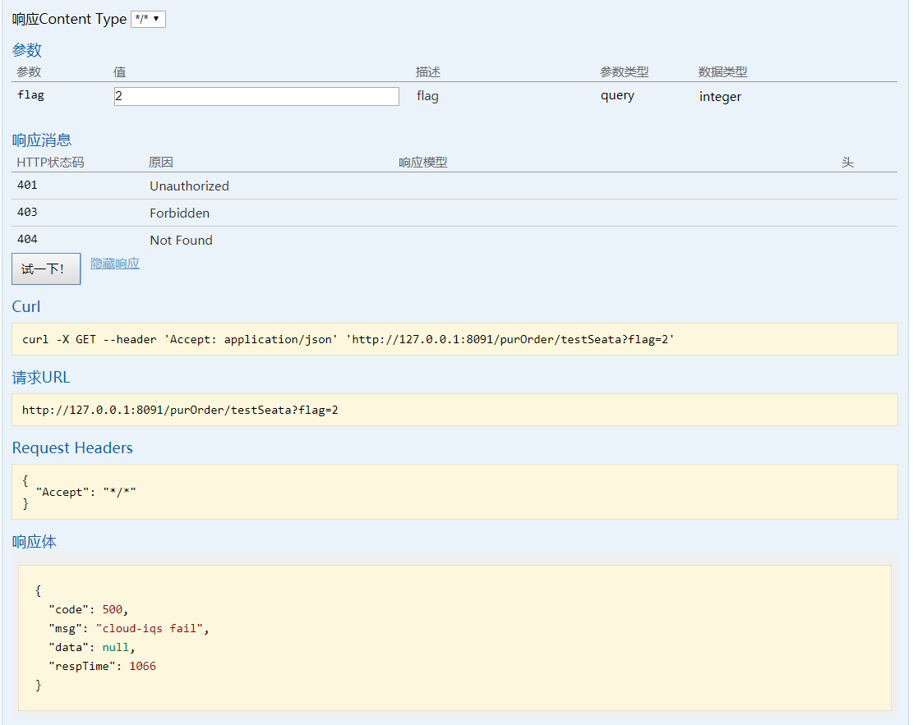

查看数据库对应表结构：

usc库：

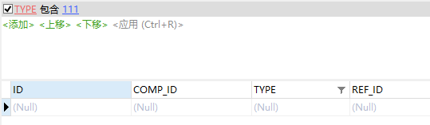

iqs库：
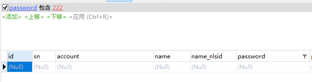

#### 模拟cloud-usc失败
使用swagger2调用

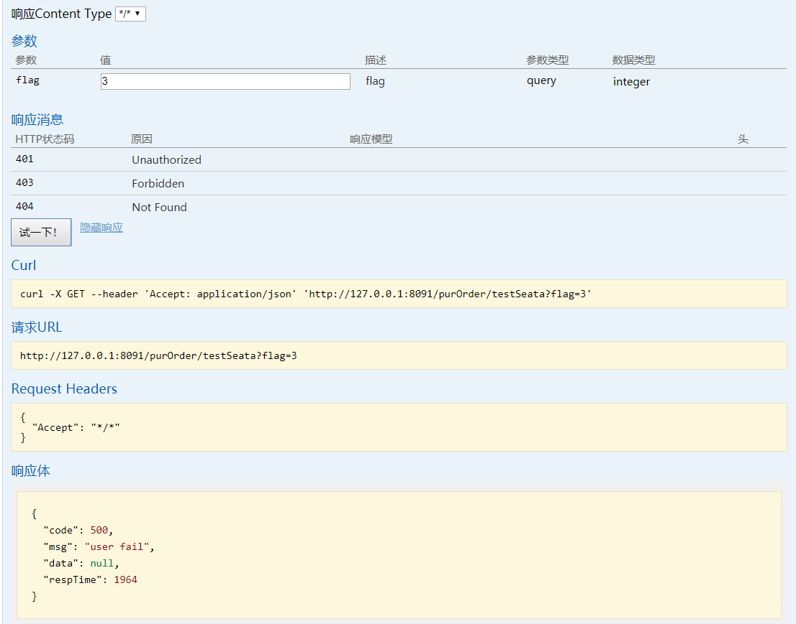

查看数据库对应表结构：

usc库：

iqs库：

#### 模拟成功
使用swagger2调用

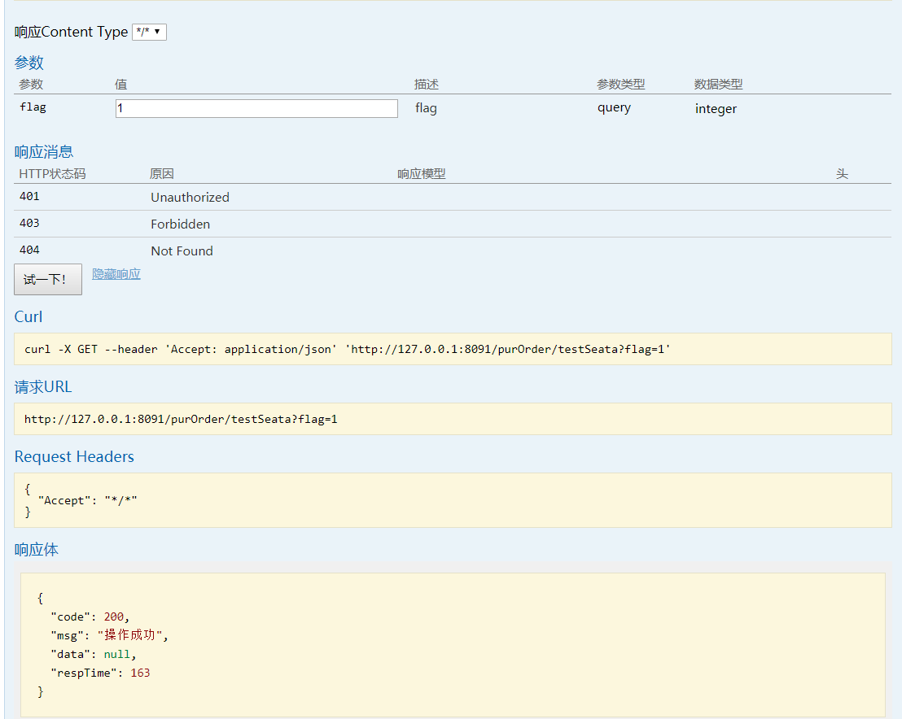

查看数据库对应表结构：

usc库：

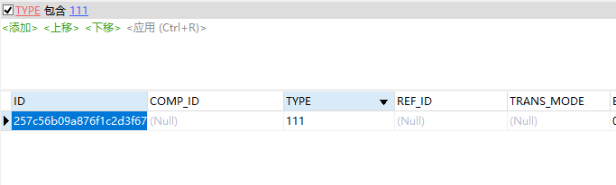

iqs库：

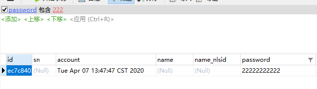

> 本文到此结束了，后续文章会陆续更新，文档会同步在CSDN和GitHub保持同步更新。有问题请留言 
> CSDN：https://blog.csdn.net/qq_34988304/category_8820134.html  
> Github文档：https://github.com/hack-feng/Java-Notes/tree/master/src/note/SpringCloud  
> GitHub源码：https://github.com/hack-feng/Spring-Cloud-Edgware.git  

