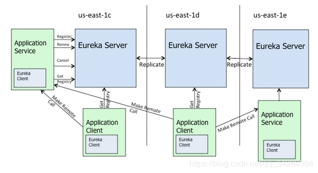
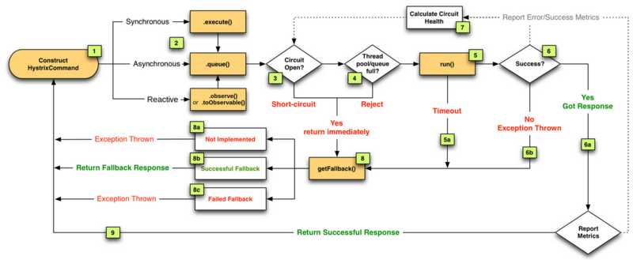

    悠悠岁月，漫漫红尘，欢迎来到SpringCloud江湖。在这里我们将揭开到SpringCloud的神秘面纱，来一场潇洒的爱恨情仇的学习。
### 本系列持续更新中...

    本文将以一个江湖的形式，更加形象的将SpringCloud拆分成江湖的对应的场所，帮助同学们更生动形象的学习SpringCloud。
> 文章中设计到的项目源码，会逐步整理到GitHub上。GitHub除了本系列文章设计到的源码信息，还有Spring Cloud整合的项目框架。有同样正在学习Spring Cloud的小伙伴可以加我一起学习交流。

# 1、什么是微服务（Microservice）
    话说，什么是微服务，直白点说微服务就像一个将我们的江湖拆分成酒馆、驿站、春楼、衙门。他们之间独立运作，各司其能；又千丝万缕的联系在一起，形成了我们所在的江湖。

> 官方点说：微服务架构模式是将整个Web项目应用根据业务拆分为一系列的小的Web服务。这些小的Web服务可以独立的编译及部署，并各自暴露API接口相互通讯。它们之间相互协作，作为一个整体为用户提供功能，而且可以独立进行扩展。

### 微服务架构需要的功能或使用场景：

 1. 我们把整个系统根据业务拆分成几个子系统。

 2. 每个子系统可以部署多个应用，多个应用之间使用负载均衡。

 3. 需要一个服务注册中心，所有的服务都在注册中心注册，负载均衡也是通过在注册中心注册的服务来使用一定策略来实现。

 4. 所有的客户端都通过同一个网关地址访问后台的服务，通过路由配置，网关来判断一个URL请求由哪个服务处理。请求转发到服务上的时候也使用负载均衡。

 5. 服务之间有时候也需要相互访问。例如有一个用户模块，其他服务在处理一些业务的时候，要获取用户服务的用户数据。

 6. 需要一个断路器，及时处理服务调用时的超时和错误，防止由于其中一个服务的问题而导致整体系统的瘫痪。

 7. 还需要一个监控功能，监控每个服务调用花费的时间等。

# 2、SpringCloud项目简介
> SpringCloud为开发人员提供了快速构建分布式系统中一些常见模式的工具（例如配置管理、服务发现、断路器、智能路由、微代理、控制总线）。分布式系统的协调导致了样板mosh模式，使用Spring Cloud开发人员可以快速的支持实现这些木事的服务和应用程序。他们将在任何分布式环境中良好运行，ba包括开发人员自己的笔记本电脑，裸机数据中心，以及Cloud Foundry托管平台。

### SpringCloud特性：

* Spring Cloud专注于提供良好的开箱即用经验的典型用例和可扩展性机制覆盖
* 分布式/版本化管理
* 服务注册与发现
* 路由
* service - to - service
* 负载均衡
* 断路器
* 分布式消息传递

### Spring Cloud框架结构
>* 服务发现（Eureka）
>* 配置中心（Config）
>* 智能路由（Zuul）
>* 链路追踪（Zipkin）
>* 服务调用（Fegin）
>* 断路器（Hystrix）
>* 客户端负载均衡（Ribbon）等。

    SpringCloud江湖中存在着不同的机构，例如人，扮演者User的一个服务；酒馆，扮演者花天酒地的服务；春楼，扮演着一个荷尔蒙爆棚的服务。人可以去酒馆排忧，去春楼邂逅。
    Eureka就像是户部，每个人去户部需要去注册身份，酒馆也需要去户部备案。通过Eureka可以找到对应注册的酒馆。酒馆关闭后，Eureka会记录酒馆下线。
    Config就像军需处，记录着不同服务的所需要的配置。

 ### Eureka（服务注册与发现）
> 一个RESTful服务，用来定位运行在AWS地区（Region）中的中间层服务。由两个组件组成：Eureka服务器和Eureka客户端。Eureka服务器用作服务注册服务器。提供在分布式环境下的服务发现，服务注册的功能。Eureka客户端是一个java客户端，用来简化与服务器的交互、作为轮询负载均衡器，并提供服务的故障切换支持。Netflix在其生产环境中使用的是另外的客户端，它提供基于流量、资源利用率以及出错状态的加权负载均衡。

Ribbon客户端组件提供一系列完善的配置选项，比如连接超时、重试、重试算法等。Ribbon内置可插拔、可定制的负载均衡组件。下面是用到的一些负载均衡策略：
* 简单轮询负载均衡
* 加权响应时间负载均衡
* 区域感知轮询负载均衡
* 随机负载均衡

Ribbon中还包括以下功能：
* 易于与服务发现组件（比如Netflix的Eureka）集成
* 使用Archaius完成运行时配置
* 使用JMX暴露运维指标，使用Servo发布
* 多种可插拔的序列化选择

### Spring cloud Hystrix 熔断器
> 断路器(Cricuit Breaker)是一种能够在远程服务不可用时自动熔断(打开开关)，并在远程服务恢复时自动恢复(闭合开关)的设施，Spring Cloud通过Netflix的Hystrix组件提供断路器、资源隔离与自我修复功能。

### Spring Cloud Zuul（服务网关）
类似nginx，反向代理的功能，不过netflix自己增加了一些配合其他组件的特性。

### Spring Cloud Config（配置中心）
> Spring Cloud Config 是用来为分布式系统中的基础设施和微服务应用提供的集中化的外部配置支持。分为服务端和客户端两个部分。其中服务端也称为分布式配置中心，它是一个独立的微服务应用，用来连接配置仓库并为客户端提供获取配置信息。实现了对服务器端和客户端中环境变量和属性配置的抽象映射。
  
> 说直白一点：就是把springboot项目中的application.yml配置文件抽取出来，放在一起统一管理。
  可以将配置信息放在git，svn或本地化的文件系统。
  

> 本文到此结束了，后续文章会陆续更新，文档会同步在CSDN和GitHub保持同步更新。 
> CSDN：https://blog.csdn.net/qq_34988304/category_8820134.html  
> Github文档：https://github.com/hack-feng/Java-Notes/tree/master/src/note/SpringCloud  
> GitHub源码：https://github.com/hack-feng/Spring-Cloud-Edgware.git  