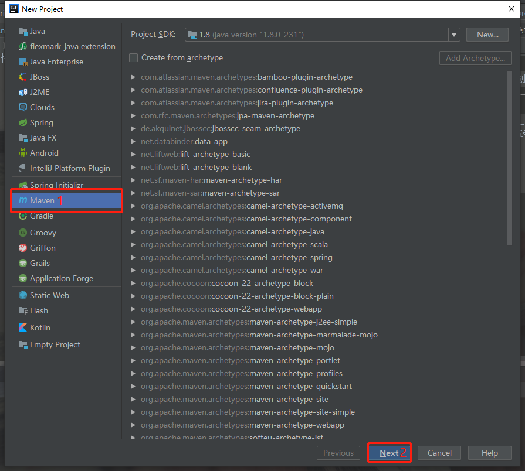
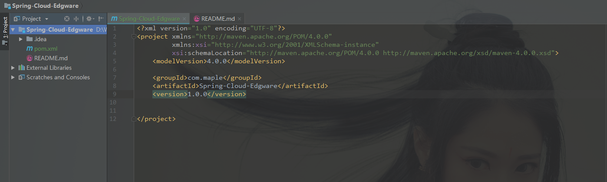
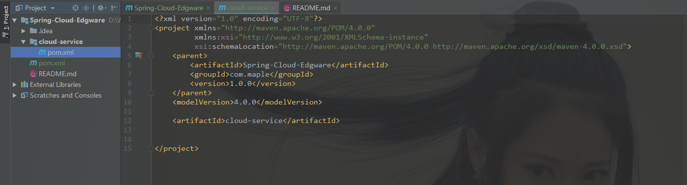
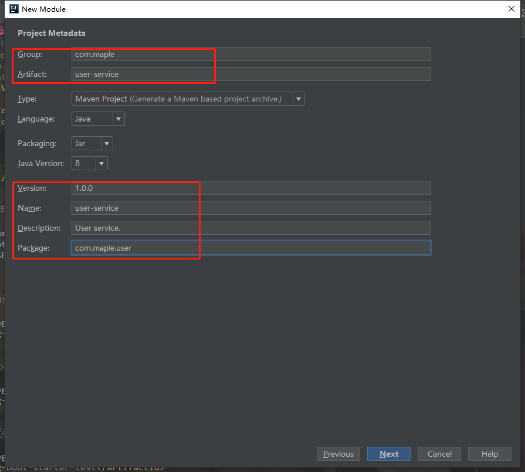
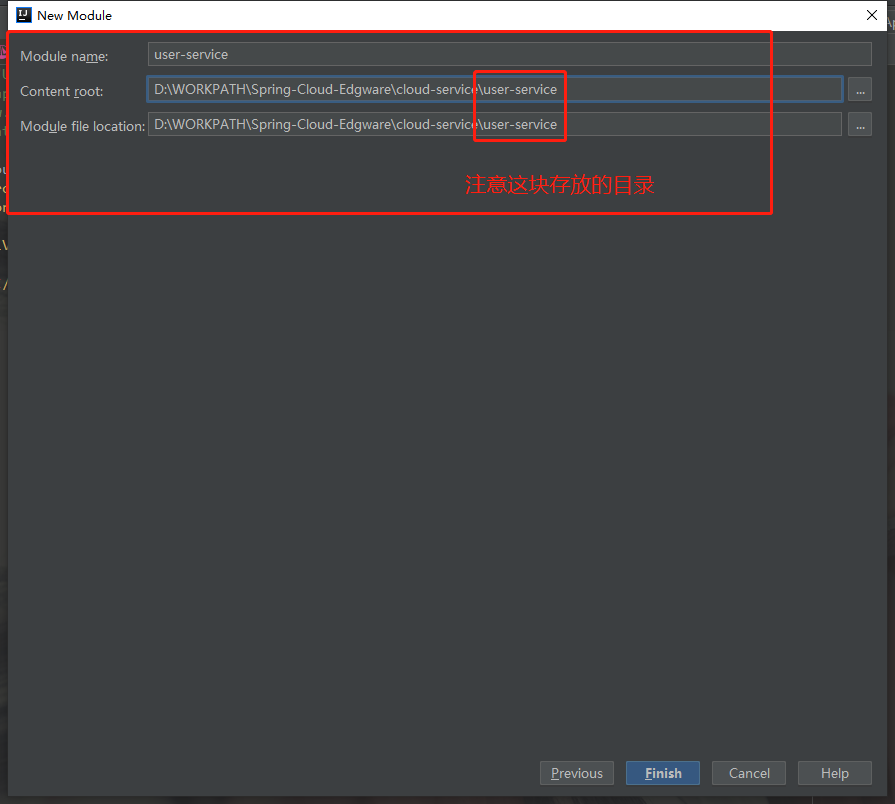
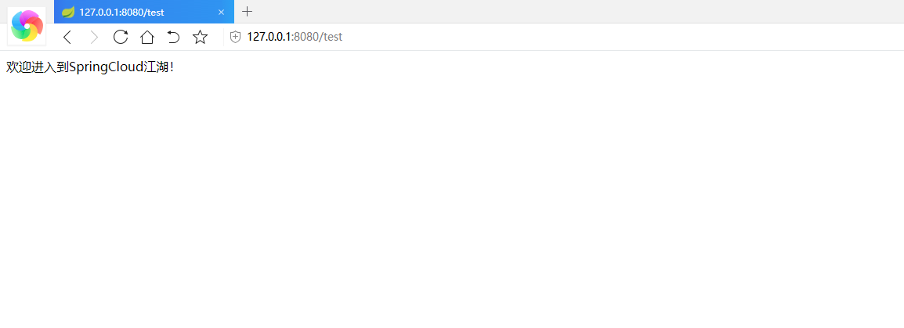

    欢迎来到SpringCloud的江湖，在本章中，我们将向大家传授如何创建SpringCloud的父子项目架构。知识无止境，故事有好坏，文章纯属虚构，欢迎大家吐槽。
    行走江湖，没点伎俩傍身怎么能行。本章牵扯到的技术以及工具如下：
    Intellij Idea 2018.1
    JDK 8
    MAVEN 3.2.2
    SpringBoot 1.5.13.RELEASE
    Spring-Cloud-Edgware

### 创建Maven顶级项目

> 什么？你不知道Maven是什么？你是我们江湖的常驻人口吗？赶紧点开下面这篇文章科普一下。
> [Maven基础理论知识整理](https://blog.csdn.net/qq_34988304/article/details/88546757)

1. 使用Idea，点击File->New->Project，选择Maven，点击Next。如下图所示：

> * groupId: com.maple
> * artifactId: Spring-Cloud-Edgware
> * version: 1.0.0
    
    然后一路向下，去大理~~~

创建好之后，我们把一些江湖中的小虾米去掉，保留住原始的清纯。我们需要删除整个src目录。

删除后如下图所示:

这样一个最顶级的Maven项目就创建完成了。

### 创建Maven父级模块

2. 温故而知新，然后我们在顶级的项目下面创建一个存放普通服务的父级项目

在Spring-Cloud-Edgware项目上右击，New->Module，选择Maven，点击Next。

> * artifactId: cloud-service

然后填写对应的信息，创建完成后删除src目录。这样一个父级的模块项目创建完成。如下图所示：

在顶级项目中的pom.xml中会增加一个Models的节点，证明cloud-service是Spring-Cloud-Edgware的一个模块
~~~
<modules>
    <module>cloud-service</module>
</modules>
~~~

### 添加Maven依赖

这样一个父子Maven项目就基本成型了。接下来，我们引入SpringBoot和SpringCloud的需要的一些依赖。

修改Spring-Cloud-Edgware的pom.xml文件：
~~~xml
<?xml version="1.0" encoding="UTF-8"?>
<project xmlns="http://maven.apache.org/POM/4.0.0"
         xmlns:xsi="http://www.w3.org/2001/XMLSchema-instance"
         xsi:schemaLocation="http://maven.apache.org/POM/4.0.0 http://maven.apache.org/xsd/maven-4.0.0.xsd">
    <modelVersion>4.0.0</modelVersion>

    <groupId>com.maple</groupId>
    <artifactId>Spring-Cloud-Edgware</artifactId>
    <packaging>pom</packaging>
    <version>1.0.0</version>

    <modules>
        <module>cloud-service</module>
    </modules>

    <!-- 引入SpringBoot依赖版本号 -->
    <parent>
        <groupId>org.springframework.boot</groupId>
        <artifactId>spring-boot-starter-parent</artifactId>
        <version>1.5.13.RELEASE</version>
    </parent>

    <dependencies>
        <!-- 引入SpringBoot启动依赖 -->
        <dependency>
            <groupId>org.springframework.boot</groupId>
            <artifactId>spring-boot-starter</artifactId>
        </dependency>

        <!-- 引入Web项目依赖 -->
        <dependency>
            <groupId>org.springframework.boot</groupId>
            <artifactId>spring-boot-starter-web</artifactId>
        </dependency>

        <!-- 引入SpringBoot测试类依赖 -->
        <dependency>
            <groupId>org.springframework.boot</groupId>
            <artifactId>spring-boot-starter-test</artifactId>
            <scope>test</scope>
        </dependency>

    </dependencies>

    <!--引入SpringCloud框架的依赖-->
    <dependencyManagement>
        <dependencies>
            <!-- 引入SpringCloud依赖的版本号-->
            <dependency>
                <groupId>org.springframework.cloud</groupId>
                <artifactId>spring-cloud-dependencies</artifactId>
                <version>Edgware.SR3</version>
                <type>pom</type>
                <scope>import</scope>
            </dependency>

        </dependencies>
    </dependencyManagement>

</project>
~~~
引入过程中Maven需要从仓库中拉取依赖，故需要等待一些时候

### 创建一个简单的user服务

接下来创建一个简单的user-service服务。

在cloud-service项目上右击，New->Module，选择Spring Initializr，点击Next。

注意服务存放的目录

修改user-service的pom.xml文件如下：
~~~xml
<?xml version="1.0" encoding="UTF-8"?>
<project xmlns="http://maven.apache.org/POM/4.0.0" xmlns:xsi="http://www.w3.org/2001/XMLSchema-instance"
         xsi:schemaLocation="http://maven.apache.org/POM/4.0.0 https://maven.apache.org/xsd/maven-4.0.0.xsd">
    <modelVersion>4.0.0</modelVersion>
    <parent>
        <groupId>com.maple</groupId>
        <artifactId>cloud-service</artifactId>
        <version>1.0.0</version>
        <relativePath/> <!-- lookup parent from repository -->
    </parent>
    <artifactId>user-service</artifactId>
    <name>user-service</name>
    <description>User service.</description>
    <packaging>jar</packaging>

    <properties>
        <java.version>1.8</java.version>
    </properties>

    <build>
        <plugins>
            <plugin>
                <groupId>org.springframework.boot</groupId>
                <artifactId>spring-boot-maven-plugin</artifactId>
            </plugin>
        </plugins>
    </build>

</project>
~~~

在cloud-service的pom.xml中添加Modules，如下：
~~~xml
<?xml version="1.0" encoding="UTF-8"?>
<project xmlns="http://maven.apache.org/POM/4.0.0"
         xmlns:xsi="http://www.w3.org/2001/XMLSchema-instance"
         xsi:schemaLocation="http://maven.apache.org/POM/4.0.0 http://maven.apache.org/xsd/maven-4.0.0.xsd">
    <parent>
        <artifactId>Spring-Cloud-Edgware</artifactId>
        <groupId>com.maple</groupId>
        <version>1.0.0</version>
    </parent>
    <modelVersion>4.0.0</modelVersion>
    <artifactId>cloud-service</artifactId>

    <modules>
        <module>user-service</module>
    </modules>
</project>
~~~

这样user-service的服务就创建完成了。下面我们验证一下user-service服务。

修改UserServiceApplication.java文件：
~~~java
@RestController
@SpringBootApplication
public class UserServiceApplication {

    public static void main(String[] args) {
        SpringApplication.run(UserServiceApplication.class, args);
        System.out.println("项目启动成功了...");
    }

    @GetMapping("/test")
    public String test(){
        return "欢迎进入到SpringCloud江湖！";
    }
}
~~~

启动项目后，在浏览器访问：http://127.0.0.1:8080/test

> 本文到此结束了，后续文章会陆续更新，文档会同步在CSDN和GitHub保持同步更新。 
> CSDN：https://blog.csdn.net/qq_34988304/category_8820134.html  
> Github文档：https://github.com/hack-feng/Java-Notes/tree/master/src/note/SpringCloud  
> GitHub源码：https://github.com/hack-feng/Spring-Cloud-Edgware.git  

    