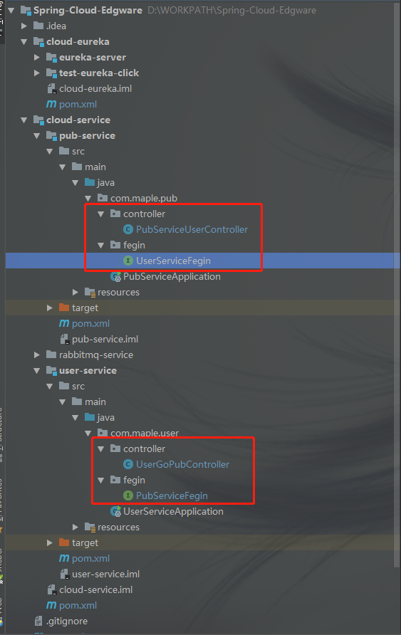
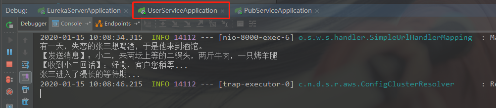
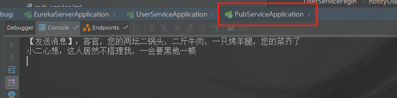
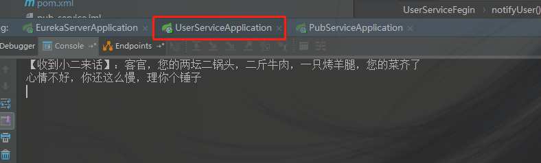

    欢迎来到SpringCloud的江湖，在本章中，我们将向大家传授如何创建SpringCloud的父子项目架构。
    知识无止境，故事有好坏，文章纯属虚构，欢迎大家吐槽。
    行走江湖，没点伎俩傍身怎么能行。本章牵扯到的技术以及工具如下：
    Intellij Idea 2018.1
    JDK 8
    MAVEN 3.2.2
    SpringBoot 1.5.13.RELEASE
    Spring-Cloud Edgware.SR3
    Eureka注册中心
    Fegin声明式调用
    
> 上一篇讲到了Eureka注册中心，我们将服务都注册到Eureka Server上。那么问题来了，我们有多个服务，都注册到Eureka Server上了，那么它们之间怎么项目调用呢？比如张三想去酒馆喝酒，张三怎么找到酒馆呢？带着问题我们往下分析。

> 有的同学想到了，我们可以使用RestTemplate，让用户去调用酒馆的服务，这样固然可以，但有的同学又说了，这样每次都要拼长长的url，有没有什么更简单的方法呢。Spring Cloud里面已经集成了解决方案，那么有请我们的Fegin（声明式调用）闪亮登场。

### 什么是Fegin?
Feign是一个声明式的Web Service客户端，它的目的就是让Web Service调用更加简单。Feign提供了HTTP请求的模板，通过编写简单的接口和插入注解，就可以定义好HTTP请求的参数、格式、地址等信息。

而Feign则会完全代理HTTP请求，我们只需要像调用方法一样调用它就可以完成服务请求及相关处理。Feign整合了Ribbon和Hystrix(关于Hystrix我们后面再讲)，可以让我们不再需要显式地使用这两个组件。

### Fegin有什么特性?
* 可插拔的注解支持，包括Feign注解和JAX-RS注解;
* 支持可插拔的HTTP编码器和解码器;
* 支持Hystrix和它的Fallback;
* 支持Ribbon的负载均衡;
* 支持HTTP请求和响应的压缩。

### 使用Fegin引用依赖及基础配置
接下来，我们便以张三去酒馆喝酒的例子来介绍Fegin的使用。

首先我们先要创建用户和酒馆两个服务。先来回顾一下这两个服务如何创建。

[探秘SpringCloud系列《第一篇章：创建Spring Cloud的Maven江湖》](https://blog.csdn.net/qq_34988304/article/details/103886568)

准备好pub-service和user-service两个服务。然后把它们注册到Eureka Server里面。因为我们新创建的服务都需要引用Eureka Click的依赖，因为pom文件支持继承的特性，所以我们便把它放在顶级的pom.xml中引用。既然要使用fegin，我们需要在pom.xml添加Fegin的依赖。同样也可以放在顶级pom.xml中。

1. 修改Spring-Cloud-Edgware的pom.xml文件，添加Eureka Click和Fegin的依赖，修改后如下：
~~~
    <!-- 添加Eureka Click的依赖 -->
    <dependency>
        <groupId>org.springframework.cloud</groupId>
        <artifactId>spring-cloud-starter-eureka</artifactId>
    </dependency>
    
    <!-- 添加Fegin服务调用依赖 -->
    <dependency>
        <groupId>org.springframework.cloud</groupId>
        <artifactId>spring-cloud-starter-feign</artifactId>
    </dependency>
~~~

2. 修改user-service的application.yml文件，如下：
~~~yml
server:
  port: 8000
spring:
  application:
    name: user-service

#注册服务到eureka-server
eureka:
  client:
    service-url:
      defaultZone: http://127.0.0.1:8761/eureka/
~~~

3. 修改user-service的UserServiceApplication.java，添加Eureka Click的注解@EnableDiscoveryClient和Fegin服务调用的注解@EnableFeignClients
~~~java
package com.maple.user;

import org.springframework.boot.SpringApplication;
import org.springframework.boot.autoconfigure.SpringBootApplication;
import org.springframework.cloud.client.discovery.EnableDiscoveryClient;
import org.springframework.cloud.netflix.feign.EnableFeignClients;
import org.springframework.web.bind.annotation.GetMapping;
import org.springframework.web.bind.annotation.RestController;

/**
 * @author Hack-Feng
 */
@RestController
@EnableFeignClients
@EnableDiscoveryClient
@SpringBootApplication
public class UserServiceApplication {

    public static void main(String[] args) {
        SpringApplication.run(UserServiceApplication.class, args);
        System.out.println("项目启动成功了...");
    }

    @GetMapping("/test")
    public String test(){
        return "欢迎进入到SpringCloud江湖！";
    }
}
~~~

4. 同样，修改pub-service的application.yml文件和PubServiceApplication.java
~~~yml
server:
  port: 8001
spring:
  application:
    name: pub-service

#注册服务到eureka-server
eureka:
  client:
    service-url:
      defaultZone: http://127.0.0.1:8761/eureka/

~~~

### 模拟Fegin之间的调用

这样，我们的两个服务就创建好了，接下来让我们愉快的测试一下吧。
测试用例：

> 1. 用户服务消费酒馆服务，张三到酒馆去喝酒，然后吆喝小二点菜。
> 2. 酒馆服务消费用户服务，小二给张三上菜。

1. 创建用户服务用到的RestApi

> 添加Controller: UserGoPubController.java
~~~java
package com.maple.user.controller;

import com.maple.user.fegin.PubServiceFegin;
import org.springframework.beans.factory.annotation.Autowired;
import org.springframework.web.bind.annotation.GetMapping;
import org.springframework.web.bind.annotation.PostMapping;
import org.springframework.web.bind.annotation.RequestMapping;
import org.springframework.web.bind.annotation.RestController;

/**
 * 用户去酒馆消费Controller
 * @author ZhangFZ
 * @date 2020-1-14 17:24
 */
@RestController
@RequestMapping("/userGoPub")
public class UserGoPubController {

    private final PubServiceFegin pubServiceFegin;

    @Autowired
    public UserGoPubController(PubServiceFegin pubServiceFegin) {
        this.pubServiceFegin = pubServiceFegin;
    }

    /**
     * 去酒馆
     */
    @GetMapping("/goPub")
    public void goPub(){
        System.out.println("有一天，失恋的张三想喝酒，于是他来到酒馆。");
        String speak = "小二，来两坛上等的二锅头，两斤牛肉，一只烤羊腿";
        System.out.println("【发送消息】：" + speak);
        String result = pubServiceFegin.serviceUser(speak);
        System.out.println("【收到小二回话】：" + result);
        System.out.println("张三进入了漫长的等待期...");
    }

    /**
     * 小二通知上菜
     */
    @PostMapping("/notifyUser")
    public String notifyUser(String speak){
        System.out.println("【收到小二来话】：" + speak);
        System.out.println("心情不好，回你个''");
        return "";
    }
}
~~~

> 添加Fegin服务:PubServiceFegin.java
~~~java
package com.maple.user.fegin;

import org.springframework.cloud.netflix.feign.FeignClient;
import org.springframework.web.bind.annotation.GetMapping;
import org.springframework.web.bind.annotation.RequestParam;

/**
 * @author ZhangFZ
 * @date 2020-1-14 17:38
 */
@FeignClient(name = "pub-service")
public interface PubServiceFegin {

    /**
     * fegin调用pub-service
     * @param speak 招呼小二
     * @return 小二返回的话语
     */
    @GetMapping("/pubServiceUser/serviceUser")
    String serviceUser(@RequestParam("speak") String speak);
}
~~~

2. 创建酒馆服务用到的RestApi

> 添加Controller：PubServiceUserController.java
~~~java
package com.maple.pub.controller;

import com.maple.pub.fegin.UserServiceFegin;
import org.apache.commons.lang.StringUtils;
import org.springframework.beans.factory.annotation.Autowired;
import org.springframework.web.bind.annotation.GetMapping;
import org.springframework.web.bind.annotation.RequestMapping;
import org.springframework.web.bind.annotation.RestController;

/**
 * 酒馆服务用户Controller
 * @author ZhangFZ
 * @date 2020-1-14 17:26
 */
@RestController
@RequestMapping("/pubServiceUser")
public class PubServiceUserController {

    private final UserServiceFegin userServiceFegin;

    @Autowired
    public PubServiceUserController(UserServiceFegin userServiceFegin) {
        this.userServiceFegin = userServiceFegin;
    }

    /**
     * 招呼用户
     * @param speak 用户的招呼
     * @return 返回用户的招呼
     */
    @GetMapping("/serviceUser")
    public String serviceUser(String speak){
        System.out.println("【小二收到张三的招呼】：" + speak);
        return "好嘞，客户您稍等...";
    }

    /**
     * 小二上菜
     */
    @GetMapping("/orderUp")
    public void orderUp(){
        String notifySpeak = "客官，您的两坛二锅头，二斤牛肉，一只烤羊腿，您的菜齐了";
        System.out.println("【发送消息】：" + notifySpeak);
        String result = userServiceFegin.notifyUser(notifySpeak);
        if(StringUtils.isBlank(result)){
            System.out.println("小二心想：这人居然不搭理我，一会要黑他一顿");
        }else{
            System.out.println("【小二收到张三的回话】：" + result);
        }
    }
}
~~~

> 添加Fegin服务:UserServiceFegin.java
~~~java
package com.maple.pub.fegin;

import org.springframework.cloud.netflix.feign.FeignClient;
import org.springframework.web.bind.annotation.PostMapping;

/**
 * @author ZhangFZ
 * @date 2020-1-14 17:37
 */
@FeignClient(name = "user-service")
public interface UserServiceFegin {

    /**
     * 小二通知用户上菜
     */
    @PostMapping("/userGoPub/notifyUser")
    String notifyUser(@RequestParam("notifySpeak") String notifySpeak);
}
~~~

项目目录如下：

### Fegin调用测试

我们依次启动eureka-server、user-service、pub-service

使用浏览器或post man工具，后面我们讲述通过Swagger2进行接口测试和文档管理

* 模拟张三去酒店

Get请求：http://127.0.0.1:8000/userGoPub/goPub

张三视角:

小二视角：

* 模拟小二上菜

Get请求：http://127.0.0.1:8001/pubServiceUser/orderUp

小二视角：

张三视角:

通过测试结果，我们可以看到，已经完成了服务间的声明式调用。

> 本章到此结束，具体的调用原理，我们下回再说。后续文章会陆续更新，文档会同步在CSDN和GitHub保持同步更新。 
> CSDN：https://blog.csdn.net/qq_34988304/category_8820134.html  
> Github文档：https://github.com/hack-feng/Java-Notes/tree/master/src/note/SpringCloud  
> GitHub源码：https://github.com/hack-feng/Spring-Cloud-Edgware.git  
