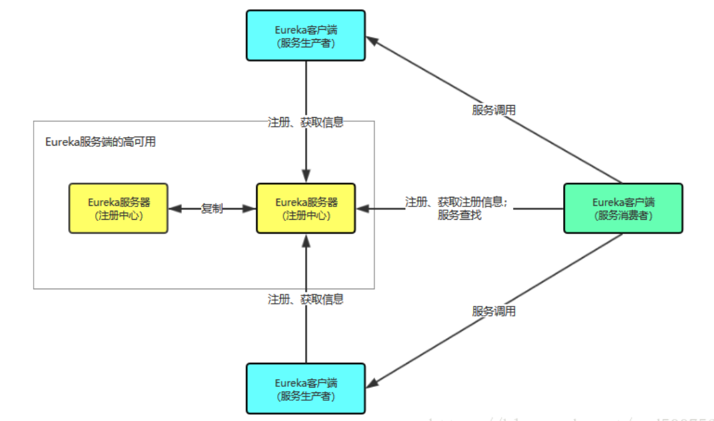

> 上一回说到如何使用Maven创建一个SpringCloud江湖，这一回我们便聊一聊如何创建户部这个部门，让它来对我们服务的生老病死进行管理。需求出来了，那就欢迎我们的Eureka闪亮登场。

### 什么是Eureka
> EurekaEureka是Netflix出品的用于实现服务注册和发现的工具。Spring Cloud集成了Eureka，并提供了开箱即用的支持。Netflix在设计Eureka时遵循着A（可用性）P（分区容错性）原则，它是基于REST的服务，用于定位服务，以实现云端中间层服务发现和故障转移。

Eureka采用C-S的设计架构，即包括了Eureka Server(服务端)，Eureka Client(客户端)。

Eureka Server提供服务注册，各个节点启动后，在Eureka Server中进行注册

Eureka Client是一个Java客户端，用于和服务端进行交互，同时客户端也是一个内置的默认使用轮询负载均衡算法的负载均衡器。在应用启动后，会向Eureka Server发送心跳（默认30s）。如果Eureka Server在多个心跳周期内没有接受到某个节点的心跳，Eureka Server将会从服务注册表中将这个服务取出（默认90s）

> 通俗点讲，有一天，你要去网吧上网，首先网吧要有一个控制所有的电脑的系统（网管机），这就Eureka server，每一台受控制的电脑就是Eureka Client。
> * 服务注册：你初到网吧，拿着身份证去开机器，这台机器就是Eureka click；付过10块钱后，网管一顿猛操作，Eureka server收到了你要开的电脑的服务注册，这时，你便可以开心去玩耍了。
> * 服务续约：撸了两把LOL，感觉还没尽兴，于是你又去网管那加了十块钱，这便是服务续约。
> * 注册列表信息：你看见电脑桌面有一个网吧在线排行榜，在榜尾出找到了自己，线排行榜就是服务注册列表信息。
> * 服务间通信：你想让榜首的大神带带你，于是给大神发信息，结果大神回复你：菜鸡，一边玩去...这就是服务间通信。
> * 服务剔除：打的正尽兴，突然电脑屏幕黑了，你去找网管理论，原来是到时间了，这就是服务剔除。于是，你又重新开了一台机器。
> * 服务下线：刚又打完一局，突然想起和女朋友的约会就到时间了，你去找网管下机，这就是服务下线。
> * 于是你开心的拿着网管退回的五角钱，蹦蹦跳跳去找女朋友了，这就是Eureka的核心基础的流程。

### Eureka的常见问题