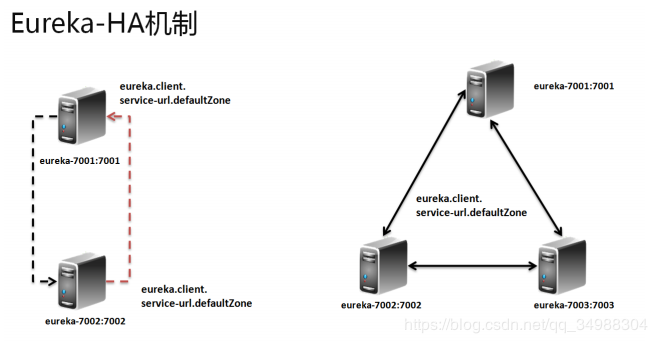

> 会不会有小伙伴有疑问，我们将服务都注册到了Eureka Server上，如果Eureka Server挂掉了怎么办？
> 带着这个疑问，我们来学习一下Eureka Server的高可用。

### Eureka-HA(高可用) 机制
现在已经成功的实现了一个 Eureka 服务器，但是现在属于单节点的服务运行过程，如果说现在单节点的 Eureka 出现了错误， 导致无法使用，那么对于所有的微服务的架构就将出现整体的瘫痪，就需要进行 Eureka 集群搭建，同时利用集群可以有效的实现 HA 的处理机制，如果要进行集群的搭建一定要选择两台或以上的电脑完成，而基本的流程如下：

创建eureka-server1、eureka-server2项目。方式如eureka-server。

修改application.yml文件如下：

eureka-server
~~~
server:
  # 服务注册中心端口号
  port: 8761

spring:
  application:
    # 项目名
    name: eureka-server

eureka:
  instance:
    # 注册中心主机名
    hostname: localhost
    prefer-ip-address: true
  client:
    # false表示不向注册中心注册自己。
    registerWithEureka: false
    # false表示自己端就是注册中心，我的职责就是维护服务实例，并不需要去检索服务
    fetchRegistry: false
    serviceUrl:
      # 设置与Eureka Server交互的地址查询服务和注册服务都需要依赖这个地址
      defaultZone: http://127.0.0.1:8060/eureka/,http://127.0.0.1:8059/eureka/
~~~

eureka-server1
~~~
server:
  # 服务注册中心端口号
  port: 8760

spring:
  application:
    # 项目名
    name: eureka-server1

eureka:
  instance:
    # 注册中心主机名
    hostname: localhost
    prefer-ip-address: true
  client:
    # false表示不向注册中心注册自己。
    registerWithEureka: false
    # false表示自己端就是注册中心，我的职责就是维护服务实例，并不需要去检索服务
    fetchRegistry: false
    serviceUrl:
      # 单机设置与Eureka Server交互的地址查询服务和注册服务都需要依赖这个地址
      defaultZone: http://127.0.0.1:8061/eureka/,http://127.0.0.1:8059/eureka/
~~~

eureka-server2
~~~
server:
  # 服务注册中心端口号
  port: 8759

spring:
  application:
    # 项目名
    name: eureka-server2

eureka:
  instance:
    # 注册中心主机名
    hostname: localhost
    prefer-ip-address: true
  client:
    # false表示不向注册中心注册自己。
    registerWithEureka: false
    # false表示自己端就是注册中心，我的职责就是维护服务实例，并不需要去检索服务
    fetchRegistry: false
    serviceUrl:
      # 单机设置与Eureka Server交互的地址查询服务和注册服务都需要依赖这个地址（单机
      defaultZone: http://127.0.0.1:8061/eureka/,http://127.0.0.1:8060/eureka/
~~~

依次启动eureka-server、eureka-server1、eureka-server2程序。

修改Eureka Click的application.yml配置文件的eureka.client.service-url.defaultZon属性
eureka.client.service-url.defaultZone=http://127.0.0.1:8061/eureka/,http://127.0.0.1:8060/eureka/,http://127.0.0.1:8059/eureka/

这样eureka的高可用服务就搭建好了。