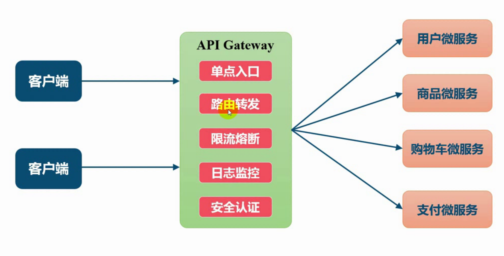

    欢迎来到SpringCloud的江湖，在本章中，我们将向大家传授如何创建SpringCloud的父子项目架构。
    知识无止境，故事有好坏，文章纯属虚构，欢迎大家吐槽。
    行走江湖，没点伎俩傍身怎么能行。本章牵扯到的技术以及工具如下：
    Intellij Idea 2018.1
    JDK 8
    MAVEN 3.2.2
    SpringBoot 1.5.13.RELEASE
    Spring-Cloud Edgware.SR3
    Zuul网关

### 为什么使用服务网关
假设张三去酒馆这个例子，首先需要调用用户微服务获取张三的信息，然后需要调用酒馆微服务获取酒馆的信息。
* 这样就需要调用两个微服务，如果业务更加复杂，那么需要调用的微服务会更多。增加了客户端的复杂性。
* 如果存在跨域请求，在一定的场景下处理相对复杂
* 系统需要认证时，每个微服都需要进行单独的服务认证。
* 不利于后期重构，如果客户端直接与微服务通信，那么重构将会相对复杂。
* ......

使用网关后，客户端与微服务间的架构变为如下：

这样客户端访问网关，然后通过网关调用服务。
* 易于监控，外部所有的调用都通过网关，易于手机监控数据
* 易于认证，可在微服务网关上进行安全认证，无需在每个微服务上进行认证
* 动态路由，动态的将请求转发到对应的微服务上
* 限流熔断，可以对请求进行限流熔断控制
* ....

### 创建zuul服务
然后在Spring-Cloud-Edgware项目上右击，New->Module，选择Spring Initializr，点击Next。

注意在Spring-Cloud-Edgware的pom.xml添加该子模块：<module>cloud-zuul</module>
> * groupId: com.maple
> * artifactId: cloud-zuul
> * version: 1.0.0

创建完成后，修改pom.xml文件
~~~xml
<?xml version="1.0" encoding="UTF-8"?>
<project xmlns="http://maven.apache.org/POM/4.0.0" xmlns:xsi="http://www.w3.org/2001/XMLSchema-instance"
         xsi:schemaLocation="http://maven.apache.org/POM/4.0.0 https://maven.apache.org/xsd/maven-4.0.0.xsd">
    <modelVersion>4.0.0</modelVersion>
    <parent>
        <artifactId>cloud-eureka</artifactId>
        <groupId>com.maple</groupId>
        <version>1.0.0</version>
    </parent>
    <artifactId>cloud-zuul</artifactId>
    <version>1.0.0</version>
    <name>cloud-zuul</name>
    <description>zuul demo.</description>

    <dependencies>
        <dependency>
            <groupId>org.springframework.cloud</groupId>
            <artifactId>spring-cloud-starter-zuul</artifactId>
        </dependency>
    </dependencies>

    <build>
        <plugins>
            <plugin>
                <groupId>org.springframework.boot</groupId>
                <artifactId>spring-boot-maven-plugin</artifactId>
            </plugin>
        </plugins>
    </build>
</project>
~~~

修改application.proprice为application.yml，并添加以下配置
~~~
server:
  port: 9521

#注册服务到eureka-server
eureka:
  client:
    service-url:
      defaultZone: http://127.0.0.1:8761/eureka/
~~~

修改CloudZuulApplication.java添加@EnableDiscoveryClient、@EnableZuulProxy注解
~~~java
package com.maple.zuul;

import org.springframework.boot.SpringApplication;
import org.springframework.boot.autoconfigure.SpringBootApplication;
import org.springframework.cloud.client.discovery.EnableDiscoveryClient;
import org.springframework.cloud.netflix.zuul.EnableZuulProxy;

@SpringBootApplication
@EnableDiscoveryClient
@EnableZuulProxy
public class CloudZuulApplication {

    public static void main(String[] args) {
        SpringApplication.run(CloudZuulApplication.class, args);
    }
}
~~~

### 测试zuul的路由跳转
依次启动eureka-server、cloud-zuul、user-service、pub-service程序。

然后在浏览器访问：http://127.0.0.1:9521/user-service/userGoPub/goPub

访问结果如下：

这样zuul的基本使用就完成了。

### zuul的动态路由

1. 自定义指定为服务的访问路径
    
> 配置zuul.route.指定微服务的serviceId = 指定路径个即可。例如：
 ~~~
zuul:
  routes:
    user-service: /user/**
 ~~~
完成设置后，user-service微服务就会被映射到/user/**路径。

2. 忽略指定微服务
~~~
zuul:
  ignored-services: user-service,pub-service
~~~
这样zuul就忽略了user-service和pub-service微服务，只代理其他微服务。

3. 忽略所有微服务，只路由指定服务
~~~
zuul:
  ignored-services: '*' # ‘*’代表所有微服务
  routes:
    user-service: /user/**
~~~
这样zuul只路由user-service微服务。

4. 同时指定微服务的serviceId和对应路径。例如：
~~~
zuul:
  routes:
    user-route:     # 该配置只是一个别名，可以任意起名
      service-id: user-service
      path: /user/**     # service-id对应的路径
~~~

5. 同时指定path和URL，例如：
~~~
zuul:
  routes:
    user-route:     # 该配置只是一个别名，可以任意起名
      url: http://127.0.0.1:8080 指定url
      path: /user/**     # service-id对应的路径
~~~
此方式不会使用Ribbon来负载均衡多个URL。

6. 同时指定path和URL，并且不破坏Zuul的Hystrix、Ribbon的特性
~~~
zuul:
  routes:
    user-route:     # 该配置只是一个别名，可以任意起名
      path: /user/**     # service-id对应的路径
      service-id: user-service
ribbon:
  eureka:
    enabled: false # 为Ribbon禁用Eureka
user-service:
  ribbon:
    listOfServers: http://127.0.0.1:8080,http://127.0.0.1:8081
~~~

7、路由前缀
示例1：
~~~
zuul:
 prefix: /api
 strip-prefix: false
 routes:
   user-service: /user/**
~~~
这样访问Zuul的/api/user-service/1路径，请求将转发到user-service的/api/1上。

示例2：
~~~
zuul:
  routes:
    user-service:
      path: /user/**
      strip-prefix: false
~~~
这样访问Zuul的/user/1路径，请求将转发到user-service的/user/1上

8、本地转发
~~~
zuul:
  routes:
    route-name:
      path: /path-a/**
      url: forward:/path-b
~~~
这样，访问zuul的/path-a/**路径，将转发到Zuul的/path-b/**上。

> 本章到此结束。后续文章会陆续更新，文档会同步在CSDN和GitHub保持同步更新。 
> CSDN：https://blog.csdn.net/qq_34988304/category_8820134.html  
> Github文档：https://github.com/hack-feng/Java-Notes/tree/master/src/note/SpringCloud  
> GitHub源码：https://github.com/hack-feng/Spring-Cloud-Edgware.git  
