    欢迎来到SpringCloud的江湖，在本章中，我们将向大家传授如何创建SpringCloud的父子项目架构。
    知识无止境，故事有好坏，文章纯属虚构，欢迎大家吐槽。
    行走江湖，没点伎俩傍身怎么能行。本章牵扯到的技术以及工具如下：
    Intellij Idea 2018.1
    JDK 8
    MAVEN 3.2.2
    SpringBoot 1.5.13.RELEASE
    Spring-Cloud Edgware.SR3
    Fegin声明式调用
    Ribbon负载均衡
    RestTemplate服务调用

> 上一回说到Feign，Fegin的底层使用了Http请求，Ribbon做负载均衡。那么本篇就验证下Fegin是否使用了负载均衡。然后讲解使用RestTemplate的请求服务的时候，如何使用Ribbon负载均衡。

本文基于[探秘SpringCloud系列《第三篇章：使用Fegin声明式服务调用》](https://blog.csdn.net/qq_34988304/article/details/103984893)一文继续延伸。

### Ribbon的概念

Ribbon是一个客户端负载均衡器，它可以很好的控制HTTP和TCP客户端的行为。Feign已经使用Ribbon，所以如果您使用@FeignClient，则本篇也适用。
Ribbon中的中心概念是指定客户端的概念。每个负载均衡器都是这个组件的一部分，它们一起工作来连接到服务器，
并且它们全体都有一个给定的名字。

SpringCloud使用RibbonClientConfguration在ApplicationContext中创建一个新的全体，这包含ILoadBalancer,RestClient和ServerListFilter。

### 测试Fegin调用使用了负载均衡

1. 在user-service模拟循环调用pub-service的服务。

添加MoreUserGoPubController.java
~~~java
package com.maple.user.controller;

import com.maple.user.fegin.PubServiceFegin;
import org.springframework.beans.factory.annotation.Autowired;
import org.springframework.web.bind.annotation.GetMapping;
import org.springframework.web.bind.annotation.RequestMapping;
import org.springframework.web.bind.annotation.RestController;

/**
 * 模拟大量用户去酒馆消费
 * @author ZhangFZ
 * @date 2020-1-15 19:39
 */
@RestController
@RequestMapping("/moreUserGoPubController")
public class MoreUserGoPubController {

    private final PubServiceFegin pubServiceFegin;

    @Autowired
    public MoreUserGoPubController(PubServiceFegin pubServiceFegin) {
        this.pubServiceFegin = pubServiceFegin;
    }

    @GetMapping("/moreUserGoPub")
    public void moreUserGoPub(){
        for (int i = 0; i < 10; i++) {
            String speak = "小二，来两坛上等的" + i + "锅头，两斤牛肉，一只烤羊腿";
            System.out.println("【发送消息】：" + speak);
            String result = pubServiceFegin.serviceUser(speak);
            System.out.println("【收到小二回话】：" + result);
        }
    }
}
~~~

2. 将pub-service启动两个服务，修改application.yml的server.port分别为8001和8002

> 如何在同一个idea里面同一个服务同时启动多次

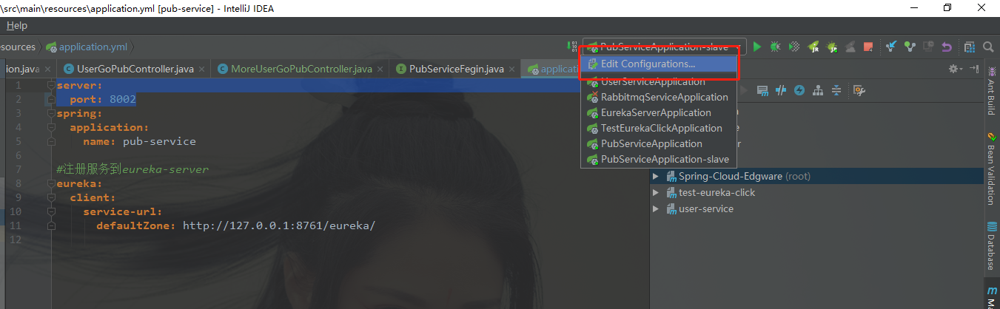

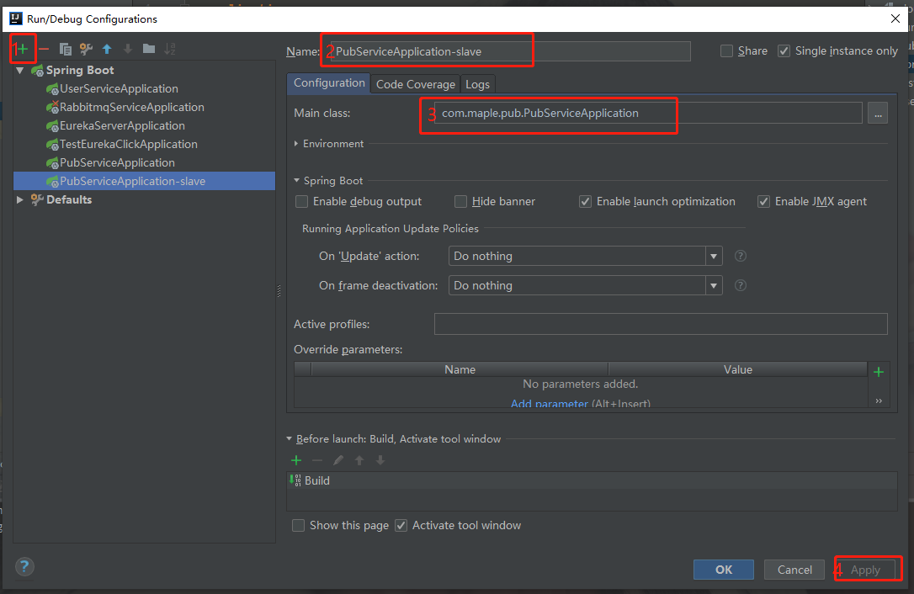

启动eureka-server、user-service、pub-service

修改pub-service的application.yml中的server.port分别为8002，PubServiceApplication-slave

浏览器Get请求：http://127.0.0.1:8000/moreUserGoPubController/moreUserGoPub

测试结果如下：

user-service视角：

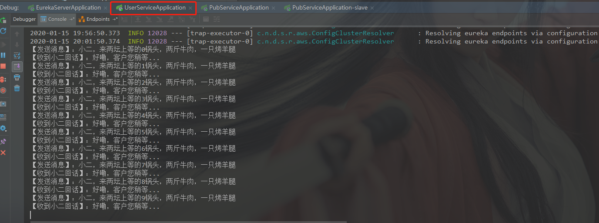

pub-service视角：

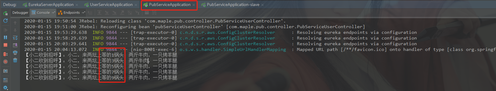

pub-service-slave视角：

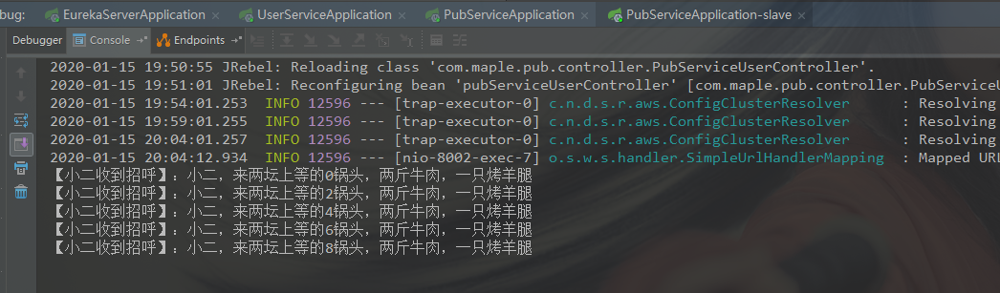

由测试结果可知，user-service在使用Fegin调用pub-service时，轮询调用。可见，Fegin使用了负载均衡。

感兴趣的同学可以查阅Fegin的源码，看一下Fegin是怎么结合Ribbon进行负载均衡调用的。

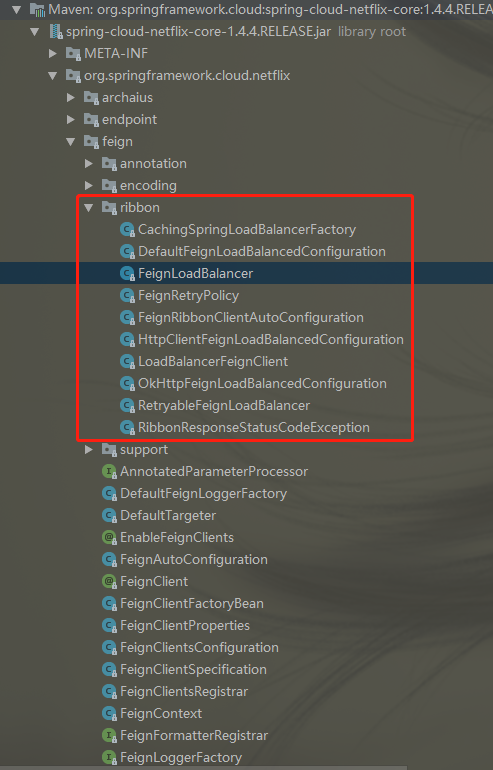

### RestTemplate进行服务间调用使用Ribbon

上面演示了Fegin调用时使用了Ribbon负载均衡，那么RestTemplate调用服务时怎么使用Ribbon呢？下面让我们一起体验一下。

RestTemplate使用Ribbon很简单，只需要在RestTemplate配置处添加@LoadBalanced注解即可，然后请求的时候使用注册在Eureka服务名进行请求。

首先配置RestTemplate，在user-service添加config目录，添加RestTemplateConfig.java
~~~java
package com.maple.user.config;

import org.springframework.cloud.client.loadbalancer.LoadBalanced;
import org.springframework.context.annotation.Bean;
import org.springframework.context.annotation.Configuration;
import org.springframework.http.client.ClientHttpRequestFactory;
import org.springframework.http.client.SimpleClientHttpRequestFactory;
import org.springframework.web.client.RestTemplate;

/**
 * @author ZhangFZ
 * @date 2020-1-16 10:32
 */
@Configuration
public class RestTemplateConfig {

    /**
     * 注解：@LoadBalanced配置启用Ribbon负载均衡
     */
    @Bean
    @LoadBalanced
    public RestTemplate restTemplate(ClientHttpRequestFactory factory) {
        return new RestTemplate(factory);
    }

    @Bean
    public ClientHttpRequestFactory factory() {
        SimpleClientHttpRequestFactory factory = new SimpleClientHttpRequestFactory();
        //单位为ms
        factory.setReadTimeout(15000);
        //单位为ms
        factory.setConnectTimeout(15000);
        return factory;
    }
}
~~~

在MoreUserGoPubController.java添加通过RestTemplate调用pub-service的方法

~~~java
package com.maple.user.controller;

import com.maple.user.fegin.PubServiceFegin;
import org.springframework.beans.factory.annotation.Autowired;
import org.springframework.web.bind.annotation.GetMapping;
import org.springframework.web.bind.annotation.RequestMapping;
import org.springframework.web.bind.annotation.RestController;
import org.springframework.web.client.RestTemplate;

import java.util.HashMap;
import java.util.Map;

/**
 * 模拟大量用户去酒馆消费
 * @author ZhangFZ
 * @date 2020-1-15 19:39
 */
@RestController
@RequestMapping("/moreUserGoPubController")
public class MoreUserGoPubController {

    private final RestTemplate restTemplate;

    @Autowired
    public MoreUserGoPubController(RestTemplate restTemplate) {
        this.restTemplate = restTemplate;
    }

    /**
     * 模拟RestTemplate大量用户去酒馆
     */
    @GetMapping("/moreUserGoPubRest")
    public void moreUserGoPubRest(){
        for (int i = 0; i < 10; i++) {
            String speak = "通过RestTemplate传音----> 小二，来两坛上等的" + i + "锅头，两斤牛肉，一只烤羊腿";
            System.out.println("【发送消息】：" + speak);
            //调用在Eureka注册的实例，对应调用的spring.application.name，不区分大小写
            String url = "http://PUB-SERVICE/pubServiceUser/serviceUser?speak={speak}";
            Map<String, Object> map = new HashMap<>(16);
            map.put("speak", speak);
            String result = restTemplate.getForEntity(url, String.class, map).getBody();
            System.out.println("【收到小二回话】：" + result);
        }
    }
}
~~~

这样就可以了，让我们一起看一下测试结果

user-service视角：

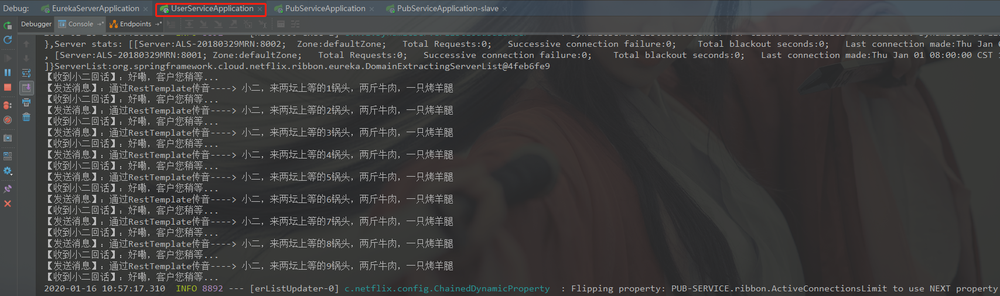

pub-service视角：

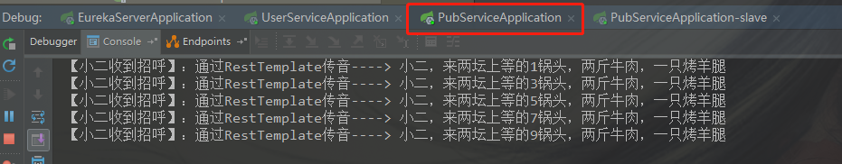

pub-service-slave视角：

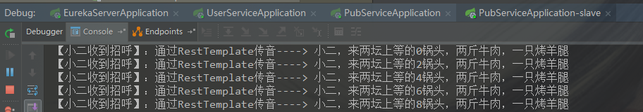

有的同学会有疑问，你怎么知道是`@LoadBalanced`注解起的作用呢？

我们把`@LoadBalanced`注解去掉试一下。请求找不到服务信息。

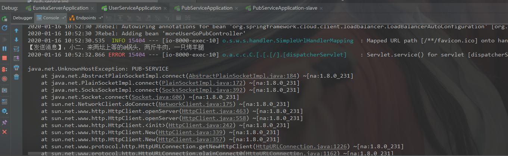

爱提问题的同学又来了，那你怎么知道`@LoadBalanced`使用的是Ribbon?

我们一起看一下`@LoadBalanced`的源码

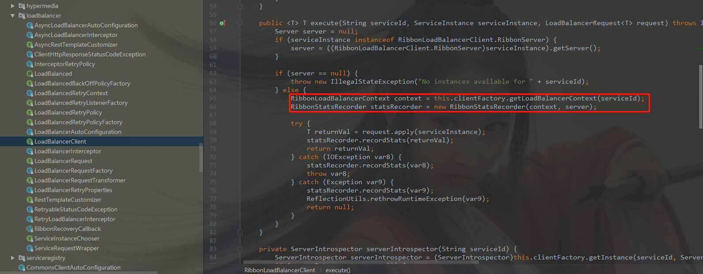

> 本章到此结束。后续文章会陆续更新，文档会同步在CSDN和GitHub保持同步更新。 
> CSDN：https://blog.csdn.net/qq_34988304/category_8820134.html  
> Github文档：https://github.com/hack-feng/Java-Notes/tree/master/src/note/SpringCloud  
> GitHub源码：https://github.com/hack-feng/Spring-Cloud-Edgware.git  
