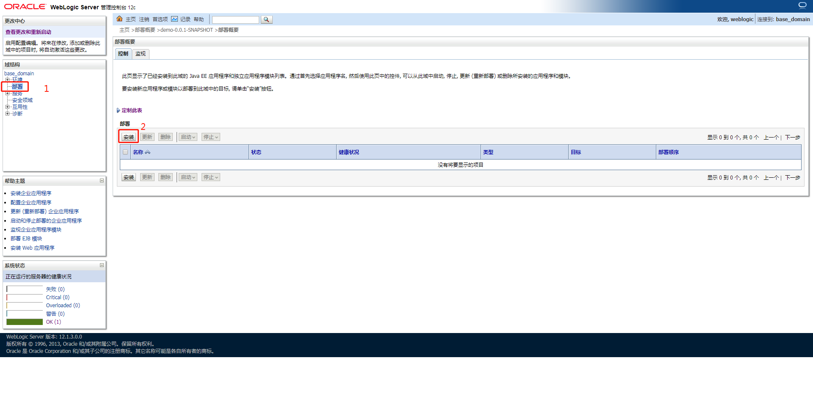
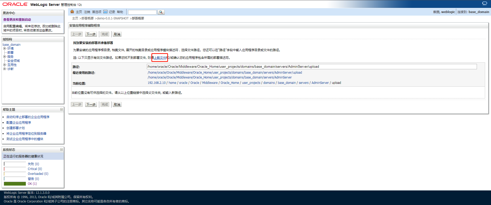
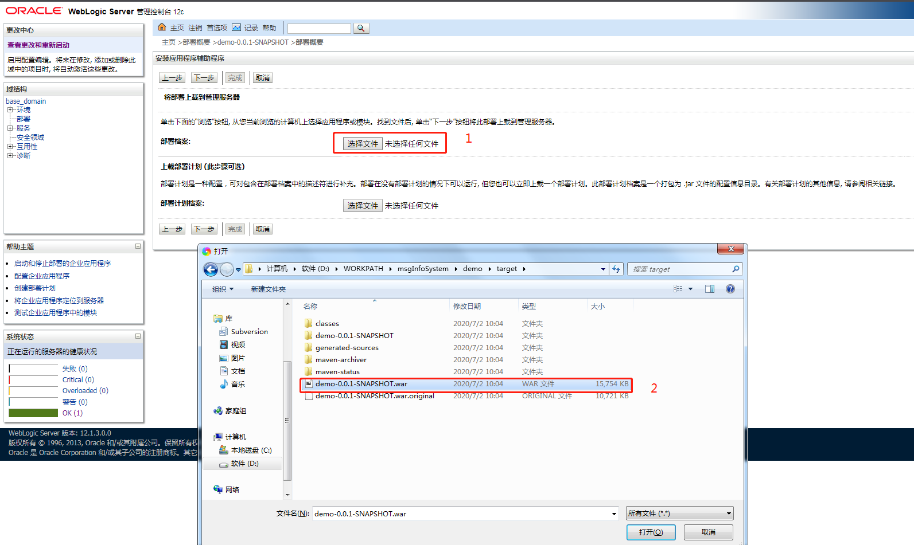
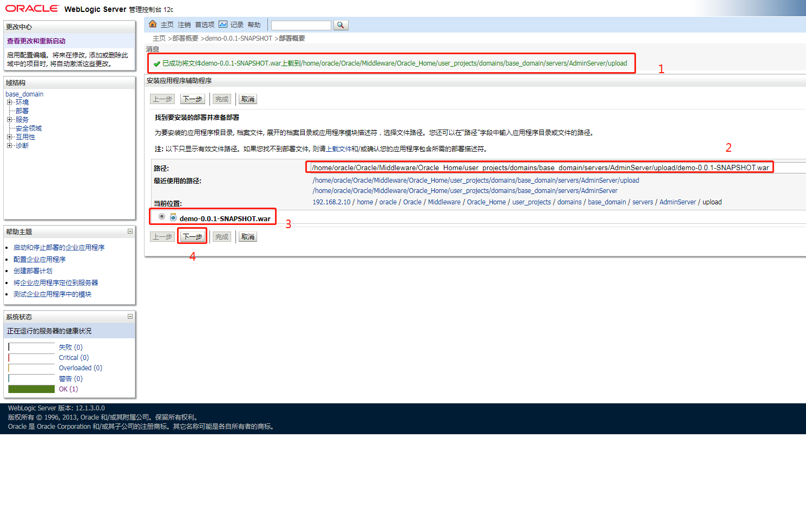
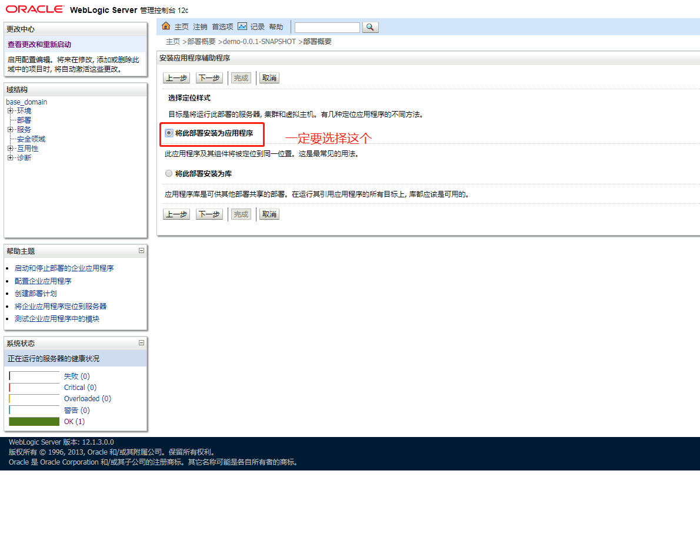
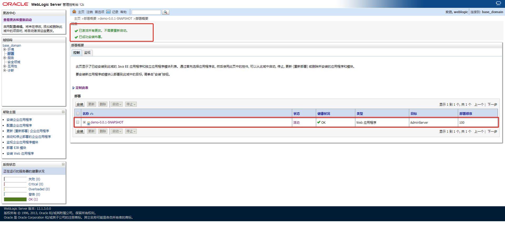
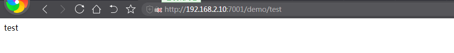

### Tomcat迁移weblogic的填坑之旅

在web.xml同级目录添加weblogic.xml文件配置
* 解决jar包冲突
~~~
<container-descriptor>
        <!-- 设置为true会优先加载项目配置，但启动报错，暂未找到原因，故设为false，手动添加优先加载的jar包 -->
        <prefer-web-inf-classes>false</prefer-web-inf-classes>
        <!--<prefer-application-packages>-->
            <!--<package-name>org.springframework.ws.*</package-name>-->
            <!--<package-name>org.joda.time.*</package-name>-->
            <!--<package-name>javassist</package-name>-->
            <!--<package-name>org.hibernate.*</package-name>-->
            <!--<package-name>javax.persistence.*</package-name>-->
            <!--<package-name>antlr.*</package-name>-->
        <!--</prefer-application-packages>-->

        <prefer-application-packages>

            <package-name>org.apache.commons.io.*</package-name>
            <package-name>org.springframework.*</package-name>
            <package-name>javax.validation.*</package-name>
            <package-name>javax.validation.bootstrap.*</package-name>
            <package-name>javax.validation.constraints.*</package-name>
            <package-name>javax.validation.groups.*</package-name>
            <package-name>javax.validation.metadata.*</package-name>
            <package-name>javax.validation.spi.*</package-name>
            <package-name>javax.validation.spi.*</package-name>
            <package-name>javassist</package-name>
            <package-name>javax.persistence.*</package-name>
            <package-name>org.hibernate.*</package-name>
            <package-name>hibernate-jpa-2.1-api</package-name>
            <package-name>org.joda.time.*</package-name>
        </prefer-application-packages>

        <prefer-application-resources>
            <resource-name>javax.faces.*</resource-name>
            <resource-name>org.apache.taglibs.*</resource-name>
            <resource-name>org.springframework.*</resource-name>
            <resource-name>javax.persistence.*</resource-name>
            <resource-name>javax.validation.*</resource-name>
            <resource-name>org.hibernate.*</resource-name>
            <resource-name>org.joda.time.*</resource-name>
            <resource-name>org.apache.commons.io.*</resource-name>
        </prefer-application-resources>
        <show-archived-real-path-enabled>true</show-archived-real-path-enabled>
    </container-descriptor>
~~~

* 配置虚拟路径，映射
~~~
<virtual-directory-mapping>
    <local-path>/weblogic/application/railwayWebsite/</local-path>
    <url-pattern>/upload/*</url-pattern>
</virtual-directory-mapping>
~~~

* 对应tomcat的配置为：
~~~
<Content docBase="/data/railwaywebsite_tomcat7/webapps/railwayWebsite/" path="/" reloadable="true" />
~~~

* 百度富文本（ueditor）上传图片附件失效
~~~
1、weblogic与jsp发生冲突，导致controller.jsp报错
<%@ page trimDirectiveWhitespaces="true" %>
2、后台ConfigManager配置在weblogic服务器上找不到路径，修改ConfigManager.java的文件目录配置
private ConfigManager ( String rootPath, String contextPath, String uri ) throws FileNotFoundException, IOException {
    rootPath = rootPath.replace( "\\", "/" );
    this.contextPath = contextPath;
    if ( contextPath.length() > 0 ) {
        if((rootPath.endsWith(contextPath)) || (rootPath.endsWith(contextPath + "/"))){
            this.rootPath = rootPath.substring(0, rootPath.length() - contextPath.length());
            this.originalPath = (this.rootPath + uri);
        }else {
            this.rootPath = rootPath;
            this.originalPath = (this.rootPath + uri.replace(contextPath, ""));
        }
    } else {
        this.rootPath = rootPath;
        this.originalPath = this.rootPath + uri;
    }
    this.initEnv();
}
~~~

### 超级详细讲解：SpringBoot部署在weblogic步骤详情

> SpringBoot版本：2.0.1.RELEASE 
> WebLogic版本：Weblogic 12c

本文为测试SpringBoot项目部署在Weblogic服务器上的测试项目。不牵扯到任何的业务逻辑。可以直接将本文重点标注的几个点移至您现有的项目。

#### SpringBoot项目的pom.xml文件：

其中需要添加的依赖为：
~~~
<dependency>
    <groupId>org.springframework.boot</groupId>
    <artifactId>spring-boot-legacy</artifactId>
    <version>2.0.0.RELEASE</version>
</dependency>
<dependency>
    <groupId>org.springframework.boot</groupId>
    <artifactId>spring-boot-starter-tomcat</artifactId>
    <scope>provided</scope>
</dependency>
~~~

打成war包文件：`<packaging>war</packaging>`

完整文件如下：
~~~xml
<?xml version="1.0" encoding="UTF-8"?>
<project xmlns="http://maven.apache.org/POM/4.0.0" xmlns:xsi="http://www.w3.org/2001/XMLSchema-instance"
         xsi:schemaLocation="http://maven.apache.org/POM/4.0.0 https://maven.apache.org/xsd/maven-4.0.0.xsd">
    <modelVersion>4.0.0</modelVersion>
    <parent>
        <groupId>org.springframework.boot</groupId>
        <artifactId>spring-boot-starter-parent</artifactId>
        <version>2.0.1.RELEASE</version>
        <relativePath/> <!-- lookup parent from repository -->
    </parent>
    <groupId>com.example</groupId>
    <artifactId>demo</artifactId>
    <version>0.0.1-SNAPSHOT</version>
    <name>demo</name>
    <description>Springboot project run on weblogic.</description>
    <packaging>war</packaging>

    <properties>
        <java.version>1.8</java.version>
    </properties>

    <dependencies>
        <dependency>
            <groupId>org.springframework.boot</groupId>
            <artifactId>spring-boot-starter</artifactId>
        </dependency>

        <dependency>
            <groupId>org.springframework.boot</groupId>
            <artifactId>spring-boot-starter-web</artifactId>
        </dependency>

        <!-- 部署weblogic需要 -->
        <dependency>
            <groupId>org.springframework.boot</groupId>
            <artifactId>spring-boot-legacy</artifactId>
            <version>2.0.0.RELEASE</version>
        </dependency>
        <dependency>
            <groupId>org.springframework.boot</groupId>
            <artifactId>spring-boot-starter-tomcat</artifactId>
            <scope>provided</scope>
        </dependency>
    </dependencies>

    <build>
        <plugins>
            <plugin>
                <groupId>org.springframework.boot</groupId>
                <artifactId>spring-boot-maven-plugin</artifactId>
            </plugin>
        </plugins>
    </build>
</project>
~~~

#### 添加web.xml和weblogic.xml文件

在main目录下创建webapp目录，和java、resources同级。
在webapp目录下添加WEB-INF目录，在WEB-INF目录下创建web.xml和weblogic.xml文件。

web.xml和weblogic.xml文件内容如下：

web.xml，其中`com.example.demo.DemoApplication`为你项目的启动类文件的目录。

~~~xml
<?xml version="1.0" encoding="UTF-8"?>
<!DOCTYPE web-app PUBLIC "-//Sun Microsystems, Inc.//DTD Web Application 2.3//EN" "http://java.sun.com/dtd/web-app_2_3.dtd">
<web-app>
    <context-param>
        <param-name>contextConfigLocation</param-name>
        <param-value>com.example.demo.DemoApplication</param-value>
    </context-param>

    <listener>
        <listener-class>org.springframework.boot.legacy.context.web.SpringBootContextLoaderListener</listener-class>
    </listener>

    <servlet>
        <servlet-name>appServlet</servlet-name>
        <servlet-class>org.springframework.web.servlet.DispatcherServlet</servlet-class>
        <init-param>
            <param-name>contextAttribute</param-name>
            <param-value>org.springframework.web.context.WebApplicationContext.ROOT</param-value>
        </init-param>
        <load-on-startup>1</load-on-startup>
    </servlet>

    <servlet-mapping>
        <servlet-name>appServlet</servlet-name>
        <url-pattern>/</url-pattern>
    </servlet-mapping>
</web-app>
~~~

weblogic.xml，其中`<context-root>/demo</context-root>`为项目启动后的访问路径。如果不需要，直接改为`<context-root>/</context-root>`即可
~~~xml
<?xml version='1.0' encoding='UTF-8'?>
<weblogic-web-app xmlns="http://xmlns.oracle.com/weblogic/weblogic-web-app"
                  xmlns:xsi="http://www.w3.org/2001/XMLSchema-instance"
                  xsi:schemaLocation="http://xmlns.oracle.com/weblogic/weblogic-web-app http://xmlns.oracle.com/weblogic/weblogic-web-app/1.3/weblogic-web-app.xsd">

    <container-descriptor>

        <prefer-application-packages>
            <package-name>org.slf4j</package-name>
            <package-name>javax.validation.*</package-name>
            <package-name>org.hibernate.*</package-name>
            <package-name>javax.el.*</package-name>
            <package-name>org.springframework.*</package-name>
        </prefer-application-packages>
    </container-descriptor>
    <context-root>/demo</context-root>
</weblogic-web-app>
~~~

#### 项目启动类：DemoApplication.java
注意将启动类继承`SpringBootServletInitializer`, 实现`WebApplicationInitializer`

~~~java
package com.example.demo;

import org.springframework.boot.SpringApplication;
import org.springframework.boot.autoconfigure.SpringBootApplication;
import org.springframework.boot.builder.SpringApplicationBuilder;
import org.springframework.boot.web.servlet.support.SpringBootServletInitializer;
import org.springframework.web.WebApplicationInitializer;
import org.springframework.web.bind.annotation.GetMapping;
import org.springframework.web.bind.annotation.RestController;

@RestController
@SpringBootApplication
public class DemoApplication extends SpringBootServletInitializer implements WebApplicationInitializer {
    @Override
    protected SpringApplicationBuilder configure(SpringApplicationBuilder application) {
        return application.sources(DemoApplication.class);
    }
    public static void main(String[] args) {
        SpringApplication.run(DemoApplication.class, args);
    }

    @GetMapping("/test")
    public String test(){
        return "test";
    }
}
~~~

以上项目配置完成，执行mvn clean package打成war文件。可以直接使用idea的maven打包。

#### 部署项目到weblogic
详细步骤如下图：

显示部署成功后，在浏览器输入地址访问：http://192.168.2.10:7001/demo/test

#### 系统测试
显示结果如下图：

