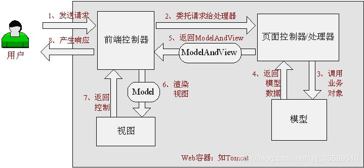
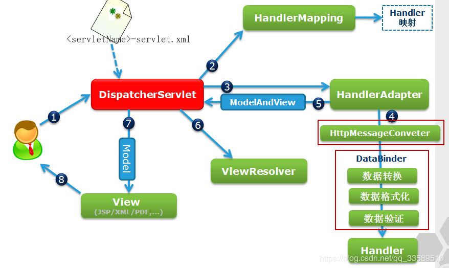

### 基础介绍
SpringMVC主要是通过前端控制器controller中的注解来完成请求处理的。
前段请求从web.xml中servlet的配置开始，根据servlet拦截的url-parttern，来进行请求转发控制。

### 处理请求的流程

 

1. 首先用户发送请求————>前端控制器，前端控制器根据请求信息（如URL）来决定选择哪一个页面控制器进行处理并把请求委托给它，即以前的控制器的控制逻辑部分；

2. 页面控制器接收到请求后，进行功能处理，首先需要收集和绑定请求参数到一个对象，这个对象在Spring Web MVC中叫命令对象，并进行验证，然后将命令对象委托给业务对象进行处理；处理完毕后返回一个ModelAndView（模型数据和逻辑视图名）；

3. 前端控制器收回控制权，然后根据返回的逻辑视图名，选择相应的视图进行渲染，并把模型数据传入以便视图渲染；

4. 前端控制器再次收回控制权，将响应返回给用户，图2-1中的步骤8；至此整个结束。

### Spring MVC工作流程
  

工作流程描述如下:

1. 用户向服务器发送请求，请求被Spring 前端控制Servelt DispatcherServlet捕获；

2. DispatcherServlet对请求URL进行解析，得到请求资源标识符（URI）。然后根据该URI，调用HandlerMapping获得该Handler配置的所有相关的对象（包括Handler对象以及Handler对象对应的拦截器），最后以HandlerExecutionChain对象的形式返回；

3. DispatcherServlet 根据获得的Handler，选择一个合适的HandlerAdapter。（附注：如果成功获得HandlerAdapter后，此时将开始执行拦截器的preHandler(…)方法）

4. 提取Request中的模型数据，填充Handler入参，开始执行Handler（Controller)。 在填充Handler的入参过程中，根据你的配置，Spring将帮你做一些额外的工作：
HttpMessageConveter： 将请求消息（如Json、xml等数据）转换成一个对象，将对象转换为指定的响应信息数据转换：对请求消息进行数据转换。如String转换成Integer、Double等数据根式化：对请求消息进行数据格式化。 如将字符串转换成格式化数字或格式化日期等数据验证： 验证数据的有效性（长度、格式等），验证结果存储到BindingResult或Error中.

5. Handler执行完成后，向DispatcherServlet 返回一个ModelAndView对象；

6. 根据返回的ModelAndView，选择一个适合的ViewResolver（必须是已经注册到Spring容器中的ViewResolver)返回给DispatcherServlet ；

7. ViewResolver 结合Model和View，来渲染视图

8. 将渲染结果返回给客户端。
